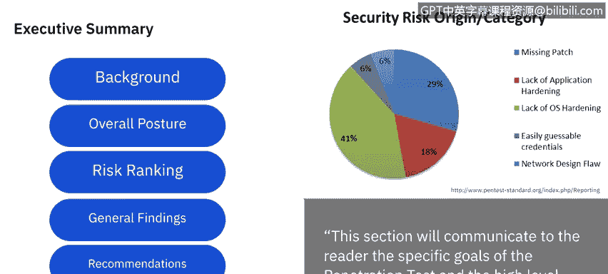

# 课程5：《渗透测试、事件响应与取证》：7：渗透测试报告撰写指南 📋

在本节课中，我们将学习如何撰写一份专业的渗透测试报告。报告是渗透测试工作的最终成果，它需要清晰地向客户传达测试目标、过程、发现的风险以及修复建议。我们将依据**渗透测试执行标准**，将报告拆解为两大主要部分：**执行摘要**和**技术报告**进行详细讲解。

## 执行摘要：高层概述

执行摘要旨在向读者传达渗透测试的具体目标和高层级的发现。你可以将其理解为测试的“谁、在何时、何地、做了什么”，而技术报告则负责解释“为什么”和“如何做”。

根据PTES标准，执行摘要可分解为以下六个主要类别：

以下是执行摘要的六个核心组成部分：

1.  **背景**：概述测试涉及的所有人员、时间框架、测试目标以及其他为渗透测试提供背景的细节。
2.  **整体态势**：以叙述形式说明测试的整体有效性，以及渗透测试人员实现规划阶段所设定目标的能力。可以简要描述遇到的问题以及是否成功克服并达成目标。
3.  **风险评级**：使用在规划阶段选定并涵盖的多种评分或评级方法。一般而言，风险等级从**低**到**极端**。根据你的发现，告知客户其当前所处的风险等级。
4.  **总体发现**：以基础的统计或图形格式，总结在渗透测试期间发现的问题。此外，应以易于阅读的格式呈现问题的根本原因，例如右侧的图表，它展示了被利用问题的根源。
5.  **建议**：顾名思义，这是你向公司提出的建议，告知他们需要采取哪些措施来解决你已利用的漏洞。
6.  **修复路线图**：将你的建议分解为一个**30/60/90天行动计划**，最关键的或高风险的行动项应优先处理。

正如前文所述，执行摘要涵盖了渗透测试的“谁、何时、何地、做了什么”。接下来，我们将转向技术报告，它将详细解释我们“为什么”以及“如何”执行这些操作。

## 技术报告：细节与原理

技术报告可以分解为六到七个不同的类别。引言部分会涵盖许多我们在执行摘要的背景部分已提及的内容，但技术报告不会总结，而是详细列出所有参与人员的姓名、联系信息、确切目标、测试范围（内/外）、采用的方法等。与技术报告相比，执行摘要更侧重于概述。

在技术报告中，你将详细审查信息收集的方式（无论是被动还是主动）、从公司或人员处获得的信息。然后进入漏洞评估与确认部分：对于评估，详细说明你用于评估的工具及发现；确认阶段则是测试或利用这些漏洞，以确认它们是否对公司构成风险。你还可以回顾时间线、选定的目标以及达成目标的步骤。

技术报告中最重要的部分是**后渗透阶段**。这意味着：我们发现了什么？这些是漏洞，我们是这样利用它们的。这是我们发现的漏洞所关联的实际风险。因此，我们将讨论所采取的不同权限提升路径、获取的关键信息、这些信息的价值等。你可以详细列出发现的所有内容。

将风险或暴露情况与这些发现关联起来，能将其带回对公司的现实应用层面。

## 课程总结

至此，我们完成了关于渗透测试的系列讲解。如果你想回顾任何要点，本视频以及**渗透测试执行标准**文档是极佳的复习资料。它概述了整个流程，而不过度深入细节，能帮助你按时间顺序重温渗透测试的所有主要组成部分。之后，你可以判断自己对哪些部分有信心，并可以随时重温我们在此为你发布的任何课程和额外材料。

我们下节课再见。