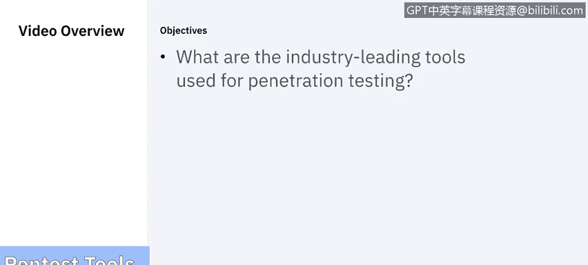
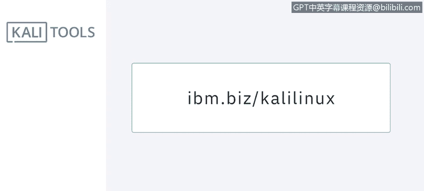
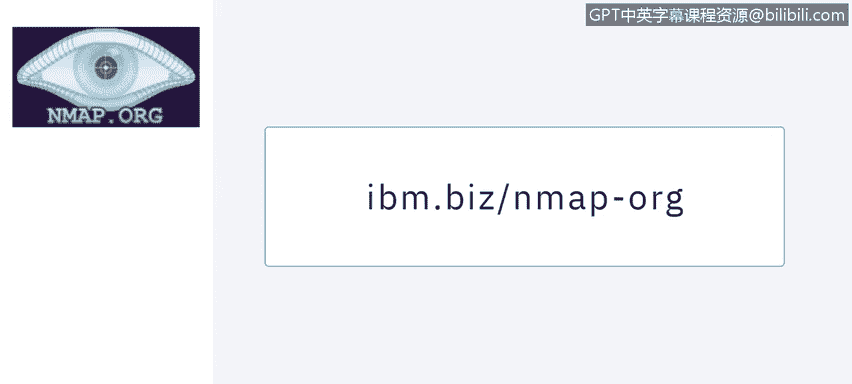
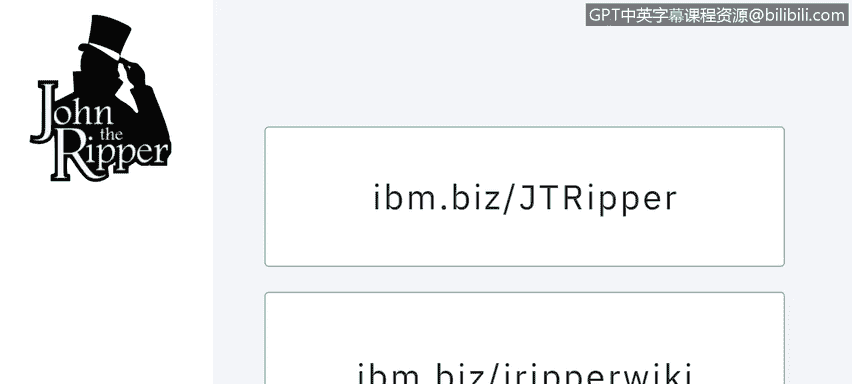
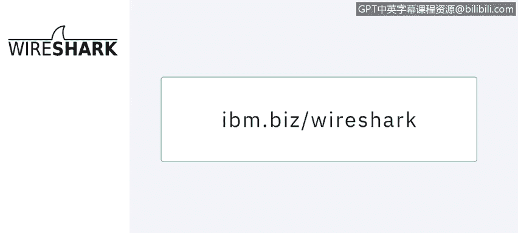
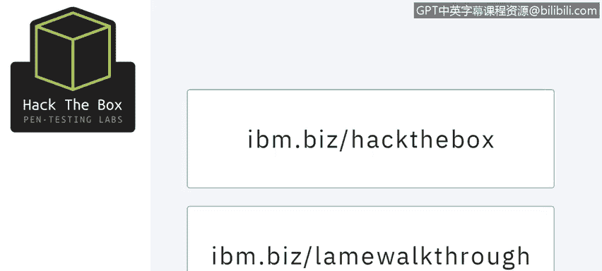

# 课程5：《渗透测试、事件响应与取证》：8：7_工具 🛠️

在本节课中，我们将学习渗透测试中常用的一些行业领先工具。课程将逐一介绍这些工具的核心功能与用途，并鼓励你访问其官方网站进行深入了解。

---

## Kali Linux：你的渗透测试工具箱 🧰

上一节我们介绍了课程概述，本节中我们来看看第一个核心工具：Kali Linux。

Kali Linux 是一个集成了数百种信息安全测试工具的一体化 Debian 派发 Linux 发行版。它就像一个工具箱，其工具主要面向安全研究、渗透测试、取证和逆向工程。

它是我在尝试获取认证时值得信赖的伙伴。它也是一个执行沙盒测试的绝佳工具，可以在安全环境中进行病毒研究。Kali Linux 拥有一个可以修补到任何级别的自定义内核，因此你可以尝试注入代码、进行 rootkit 分析、攻击它或与之进行练习。

建议至少在你的最新发行版上安装几个 Kali Linux 虚拟机，以便进行练习。

---

## Nmap：网络发现与安全审计 🔍

了解了综合性的 Kali Linux 后，我们来看看一个更具体的网络扫描工具：Nmap。

Nmap 是一个开源的网络扫描器，用于发现计算机网络上的主机和服务。如果你想通过认证道德黑客（CEH）考试，这是一个必备工具。

以下是 Nmap 的主要功能：
*   **被动扫描**：通过发送 Nmap 监听路由器分发的数据包，来探测网络中有哪些服务器。
*   **主动扫描**：主动扫描可以告诉你哪些端口是开放的，以及哪些服务正在被发布。

---

## John the Ripper：密码破解工具 🔑

网络扫描之后，如果获取了密码文件，就需要进行破解。John the Ripper 就是这样一个工具。

John the Ripper 要求你拥有一个密码文件或加密文件的转储，并希望将其破解为文本格式。历史上，它被用来破解和检测 Unix 密码。

我们可以使用 John the Ripper 尝试字典攻击，也可以用它来破解影子文件中的密码。这个工具功能非常强大。

---

## Metasploit：渗透测试框架 ⚔️

在掌握了信息收集和密码破解后，下一步就是利用漏洞进行攻击。Metasploit 项目是一个攻击代码库。

使用 Metasploit 应用程序，你可以根据目标的架构尝试大量攻击。如果你已经掌握了目标操作系统或应用程序的版本信息，例如一个旧的 FTP 服务，那么有 90% 的把握可以在 Metasploit 中找到对应的攻击模块，并将其应用到目标服务器上。

顺便一提，它也已经包含在 Kali Linux 的软件库中。

---

## Wireshark：网络协议分析器 📡

执行攻击时，了解网络流量至关重要。Wireshark 是一个数据包分析器，它会告诉你网络中正在发生什么。

它的前身是 Ethereal。如果你很久以前用过 Ethereal，Wireshark 与之差别不大，但现在更加优雅。它是跨平台的，意味着你可以在 Linux、Windows 和 Mac 上使用它。

安装 Wireshark 总是一个好主意，因为有时客户会希望发送数据包转储文件给我们进行分析，而 Wireshark 是完成这项任务的最佳工具。

---

## Hack The Box：在线渗透测试平台 🎯

最后，理论需要结合实践。Hack The Box 不是一个工具，而是一个非营利组织。

该组织创建了大量供你进行合法黑客攻击的 Linux 和 Windows 虚拟机（“盒子”）。尝试攻击这些盒子是完全合法的，并且可以免费进行练习。

他们也出售一些课程和指导。如果你从他们那里购买订阅服务，他们甚至会发送部分“盒子”的解决方案给你。

---

## 总结与探索建议

本节课中，我们一起学习了渗透测试中几个关键的行业工具：从综合性的 Kali Linux 工具箱，到具体的网络扫描器 Nmap、密码破解工具 John the Ripper、攻击框架 Metasploit，再到流量分析器 Wireshark，以及实践平台 Hack The Box。

需要强调的是，渗透测试工具非常多，这里展示的只是其中一部分。请积极研究其他工具，并选择你更喜欢和更适用的那些。

保重，我们下节课再见。