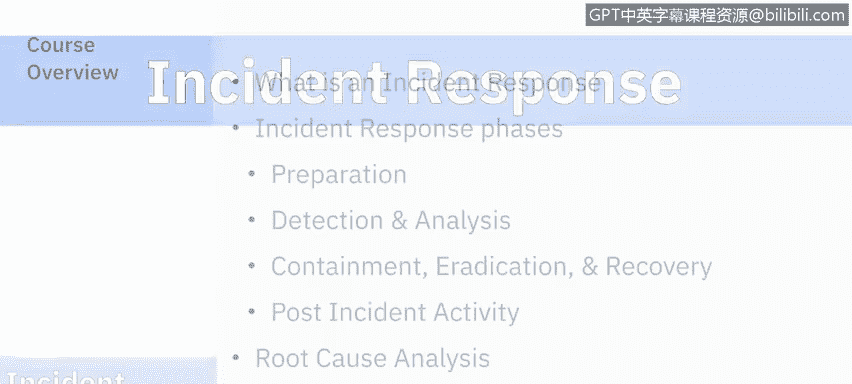
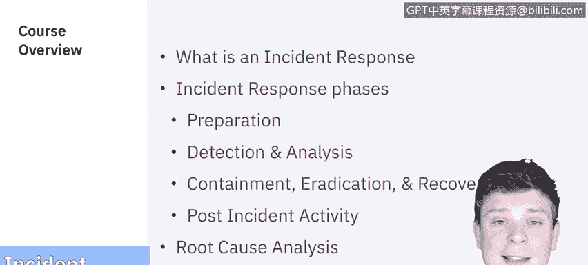

# 课程5：《渗透测试、事件响应与取证》：9：事件响应概述 🔍

在本节课中，我们将学习网络安全中的核心环节——事件响应。我们将了解什么是事件响应，并详细拆解构成事件响应的各个阶段。

---

## 什么是事件响应？ 🛡️

事件响应是针对已确认或正在发生的网络安全事件，所采取的一系列有计划、有组织的行动。其目标是控制事件影响、减少损失并恢复正常的业务运营。

上一节我们明确了事件响应的定义，接下来，我们将深入探讨其标准流程。

---

## 事件响应的阶段 📋

一个完整的事件响应流程通常包含六个关键阶段。以下是每个阶段的简要说明：

1.  **准备**：此阶段旨在建立事件响应能力。它包括制定响应计划、组建团队、准备工具并进行培训演练。
2.  **检测**：此阶段的目标是发现并确认安全事件。通过监控、告警和报告等手段识别潜在的异常活动。
3.  **分析**：在确认事件后，此阶段负责深入调查。分析旨在确定事件的性质、范围、影响和根本原因。
4.  **遏制**：此阶段的重点是阻止事件扩大。采取短期和长期措施隔离受影响系统，防止进一步损害。
5.  **根除与恢复**：此阶段致力于消除威胁并恢复正常。根除是指彻底清除事件根源（如恶意软件），恢复则是将系统和服务还原到安全状态。
6.  **事后活动**：这是流程的最后阶段，旨在总结经验教训。它包括撰写事件报告、进行回顾分析并改进未来的响应计划。

我们刚刚概述了事件响应的六个阶段。为了更有效地解决问题，我们还需要掌握一种重要的分析方法。

---

## 根本原因分析 🧩

根本原因分析是一种用于识别问题深层原因，而非仅仅处理表面症状的方法论。在事件响应中，它帮助团队理解事件为何发生，从而实施更有效的修复和预防措施。

一个常用的根本原因分析模型是“5个为什么”，即通过连续追问“为什么”来追溯问题的根源。

例如：
- **问题**：服务器宕机。
- **为什么？** 因为应用程序崩溃。
- **为什么？** 因为内存耗尽。
- **为什么？** 因为存在内存泄漏。
- **为什么？** 因为某段代码存在缺陷。
- **为什么？** 因为代码审查流程不严格。（**根本原因**）

了解理论后，通过实践能更好地掌握知识。因此，本系列课程将以一个具体的演示作为结尾。

---

## 事件响应演示 💻

在本系列课程的结尾，我们将通过一个实际演示，将上述所有阶段的理论知识应用于一个模拟的安全事件场景中。该演示将展示从检测到恢复的完整响应流程。

---

本节课中，我们一起学习了网络安全事件响应的基本概念、包含准备、检测、分析、遏制、根除与恢复及事后活动在内的六个核心阶段，并介绍了用于追溯问题源头的根本原因分析方法。掌握这些知识是有效管理安全事件的基础。