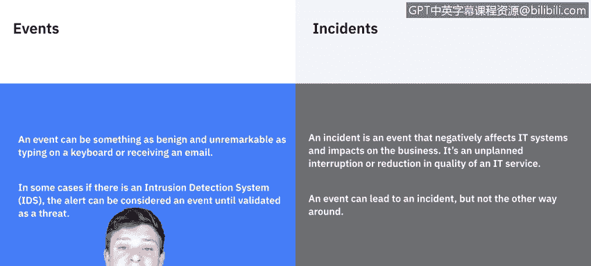
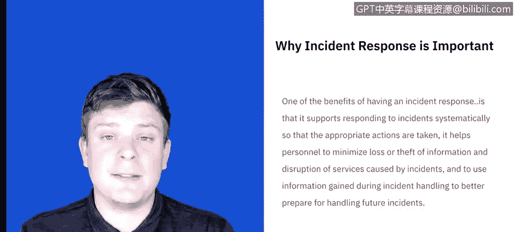
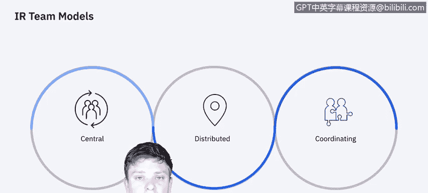
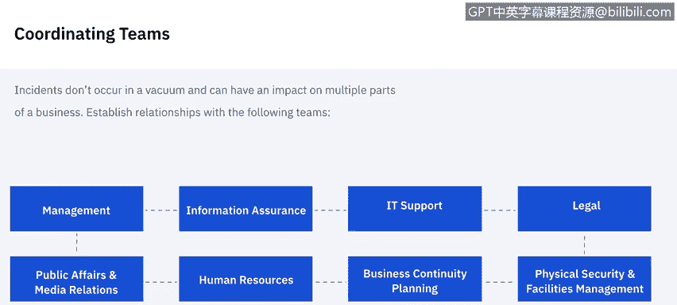

# 课程5：《渗透测试、事件响应与取证》：10：什么是事件响应 🔍

在本节课中，我们将学习事件响应的基本概念及其重要性。我们将探讨事件与安全事件的区别，并概览事件响应的不同阶段。最后，我们将介绍不同类型的事件响应团队以及他们需要协调的其他部门。

---

### **事件与安全事件的区别**

在定义事件响应之前，我们需要区分“事件”和“安全事件”。

一个“事件”可以是像敲击键盘或接收电子邮件这样普通且无异常的行为。很多时候，这些看似平常的事件，在特定情境下，可能演变为一个“安全事件”。

例如，一次按键、登录或接收邮件本身并不构成问题。但如果在一个很短的时间段内，发生了数十次、数百次此类事件，就会引发警报。这些警报通常由入侵检测系统或安全软件捕获。它们发出的警报在被事件响应团队验证前，仍被视为“事件”；一旦被验证为真实威胁，就升级为“安全事件”。

因此，我们现在知道，**安全事件**是已构成威胁的事件。它会对信息系统产生负面影响，并损害业务运营，属于IT服务的非计划性中断或质量下降。事件可以演变为安全事件，但反之则不成立。

---

### **什么是事件响应？**

既然我们了解了事件如何演变为安全事件，现在让我们来定义事件响应。

基于风险评估结果采取的预防性活动可以降低安全事件的数量，但并非所有事件都能被预防。因此，**事件响应**对于快速检测安全事件、最小化损失和破坏、修复被利用的漏洞以及恢复IT服务是必要的。

我们知道什么是安全事件，也知道需要响应这些事件。但为什么需要呢？

事件响应的好处在于：它支持系统性地响应事件，确保采取适当行动；帮助人员最小化信息丢失、盗窃以及服务中断造成的损失；最终，可以利用事件处理中获得的信息，为未来可能发生的事件做好更充分的准备。

---

### **事件响应团队的类型**

接下来，我们简要讨论一下现有的事件响应团队类型。团队内部包含许多角色，但这里仅作概览。

团队的组织方式主要有三种：

1.  **集中式事件响应团队**：可以想象成一个小公司，所有资源集中在一个区域。整个组织只有一个事件响应团队。
2.  **分布式事件响应团队**：想象一个大型公司，其技术资源和计算能力可能分布在全球。因此，可能每个地理位置、国家或站点都有一个事件响应团队，具体取决于计算能力的集中位置。尽管他们分布在不同地点，但保持协调努力至关重要，因为一个团队的发现将有益于其他团队。这本质上仍是同一个团队，只是分布在许多不同区域。
3.  **协调式团队**：这种团队我们不会深入探讨。你可以将其理解为一个向其他团队提供建议的事件响应团队，但对他们没有直接管理权。例如，一个部门级别的团队可能会协助其下属的各个机构团队。

你可以这样理解事件响应团队：他们是集中支持整个组织，还是分布在多个地点，或者是在协助其他团队的工作。

---

### **需要协调的团队**

事件响应并非在真空中运作。每个独立的安全事件或威胁都可能并很可能影响组织的其他领域。

因此，你需要与以下领域的个人建立工作关系。这样，在他们需要参与事件处理时，你可以事先获得他们的合作，而不是事后才去寻求。

以下是应寻求建立关系的一些主要领域：

*   **管理层**：管理层负责制定事件响应政策，并负责协调事件响应及向各利益相关方报告。这应该是你首先要接触的领域之一。
*   **信息安全保障**：信息安全人员可能需要在事件处理的某些阶段参与，例如修改网络安全控制措施或防火墙规则集。
*   **IT支持**：IT支持人员很可能参与其中。他们不仅具备协助所需的技能，通常还对他们日常管理的技术有更深入的了解。这在需要对接管系统采取适当行动（例如决定是否断开连接、重启或制作镜像）时非常有用。
*   **法律部门**：法律专家应审查事件响应计划、政策和程序，以确保其符合法律和联邦指导方针，包括隐私权。如果事件涉及敏感个人信息，法律部门很可能需要介入。
*   **公共关系与媒体联络**：考虑到事件影响的性质，你可能需要与媒体接触，或者如果事件泄露给了媒体，你需要有人来协调应对。
*   **人力资源**：如果员工涉及其中，无论是其信息被泄露，还是其行为导致了事件发生，都需要人力资源部门介入以协助处理。
*   **业务连续性规划**：每个业务都有许多环节在运行，一个事件可能影响所有这些不同的业务领域。因此，你需要引入业务连续性规划经理或负责日常运营的人员，让他们了解其服务可能受到的影响。
*   **物理安全与设施管理**：有些事件可能通过物理安全漏洞发生，并涉及物理攻击。事件响应团队可能需要访问相关设施，因此与这些团队建立关系非常重要。

---

### **常见的攻击向量**

虽然组织可能无法为每一种网络安全事件场景做好准备，但他们应该能够处理常见的攻击来源。

例如：

*   **外部可移动媒体**：如果未经授权或不熟悉的U盘、移动硬盘或光盘出现在网络或系统中，我们应该能够检测到。
*   **入侵攻击**：例如暴力破解密码攻击，我们应该能够检测到。
*   **来自网络或电子邮件的威胁**：我们应该能够检测到来自网络或电子邮件的任何威胁。
*   **冒充攻击**：如果有人冒充他人进行活动，并篡改信息传递（类似于中间人攻击），这是严重问题。
*   **物理设备的丢失和盗窃**：我们需要对物理设备进行清点并定期审计。

这些是常见的攻击向量。虽然这不是一个详尽的列表，但这些都是我们需要准备好去处理的事情。

---

### **事件响应文档要点**

我们将在后续课程中深入探讨事件响应所需记录的所有内容。这里是一个高级概述，我们需要能够回答以下问题。这些问题更像是如果现在必须面对媒体，我们知道些什么。这是我们的筛选标准。

我们需要知道：
*   谁攻击了我们？
*   为什么攻击？
*   何时发生？
*   如何发生？
*   是否因为我们的安全流程薄弱而导致？
*   影响范围有多广？
*   我们采取了哪些步骤来确定发生了什么，并防止未来再次发生？
*   事件的影响是什么？是否有个人身份信息被泄露（涉及公司、员工或其客户）？
*   此次事件的预估成本是多少？

这些只是一般性指导原则，用于自我核查：在继续之前，我们是否掌握了基本信息。

---

### **事件响应的阶段**

本视频最后要讨论的内容，实际上将引导我们进入本系列视频的其余部分：**事件响应的阶段有哪些？**

我们将带你了解以下阶段：
1.  准备
2.  检测与分析
3.  遏制
4.  根除与恢复
5.  事后活动

我们将在下一个视频中从“准备”阶段开始讲解。

---

**总结**

在本节课中，我们一起学习了事件响应的核心概念。我们明确了“事件”与“安全事件”的关键区别，理解了事件响应的定义、重要性及其带来的益处。我们还了解了集中式、分布式和协调式三种事件响应团队类型，以及事件响应过程中需要与哪些内部团队（如管理层、IT、法务等）进行协调。最后，我们列举了常见的攻击向量，概述了事件响应文档应涵盖的关键问题，并介绍了事件响应生命周期的五个主要阶段，为后续深入学习奠定了基础。