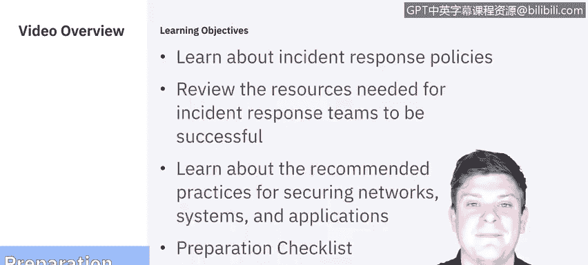
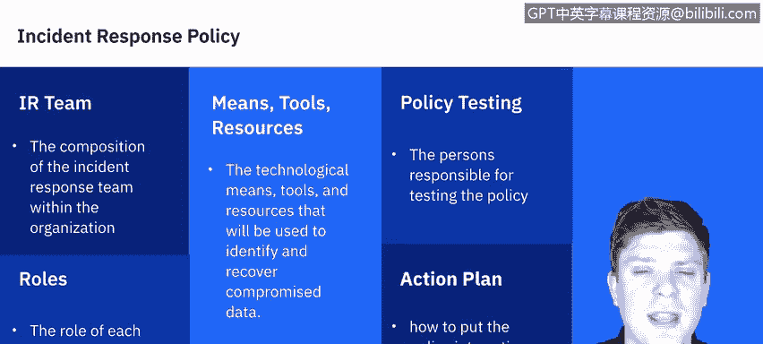
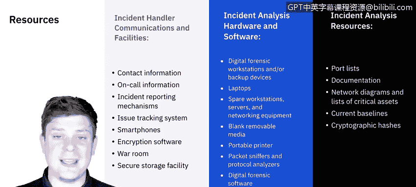
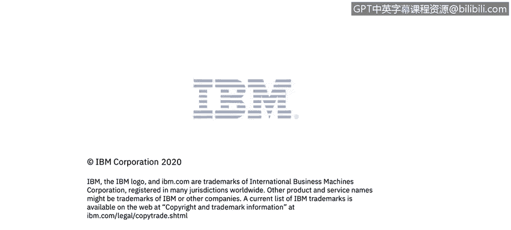

# 课程5：《渗透测试、事件响应与取证》：11：事件响应准备 🛡️

在本节课中，我们将要学习事件响应准备工作的核心要素。我们将了解事件响应策略的构成，探讨事件响应团队所需的资源，学习保护网络、系统和应用程序的推荐实践，并最终以一个准备清单结束。

## 事件响应策略 📜

上一节我们介绍了课程概述，本节中我们来看看事件响应策略。每一个成功的事件响应团队都需要一个成文的策略，用以决定由谁、在何时、何地、为何以及如何响应事件。

以下是策略需要涵盖的一些关键内容：
*   **团队构成与角色**：明确组织内的事件响应团队成员及其不同角色，这有助于确定团队中每个人的支持范围。
*   **工具与资源**：涵盖用于识别和恢复受损数据的方法、工具和资源。
*   **策略测试**：鉴于网络安全领域威胁的不断演变，定期测试策略至关重要。
*   **行动计划**：提供一个从开始到结束如何执行该计划的详细大纲。

## 事件响应资源 💼

了解了策略框架后，接下来我们详细探讨策略中提到的资源。资源可以大致分为三类。

以下是资源分类的详细列表：
*   **通信与设施**
    *   团队所有人员的联系信息以及非工作时间的待命信息。
    *   事件报告机制，如使用的软件、数据库、工单系统等。
    *   公司配发的智能手机，确保事件发生时可以随时联系。
    *   用于加密恢复或克隆数据的加密软件。
    *   供各方集中沟通的“作战室”。
    *   用于存放已恢复资产的安全存储设施。
*   **硬件与软件**
    *   数字取证工作站、备份设备。
    *   笔记本电脑、备用笔记本电脑、备用工作站服务器、网络设备或其虚拟机等效物。
    *   空白可移动介质，如外置硬盘、光盘、U盘。
    *   用于打印日志或证据的便携式打印机。
    *   数据包嗅探器、协议分析器，用于网络监控和分析。
    *   证据收集配件。
*   **事件分析材料**
    *   所有报告的清单。
    *   进行事件分析所需的适当文档。
    *   列出所有关键资产的网络拓扑图。
    *   网络和组织的当前基线状态，用于与事件发生后的状态进行对比。
    *   加密哈希值，用于验证数据完整性。

## 安全防护最佳实践 🛡️

事件响应团队任务繁重，管理其工作量的最佳方法之一是尽可能帮助预防事件发生。虽然预防事件通常不完全属于事件响应团队的职责范围，但他们可以提供建议。

以下是事件响应团队可以建议或传达给组织其他部门的关键防护措施：
*   **风险评估**：对系统和应用程序进行定期风险评估，以确定威胁和漏洞组合所带来的风险。
*   **主机与网络安全**：所有主机应使用标准配置进行适当加固，遵循严格的访问控制列表，并进行持续监控。网络边界应配置为**拒绝所有未明确允许的活动**。
*   **恶意软件防护**：部署能够检测和阻止恶意软件的优秀软件，并覆盖整个组织，确保端点安全。
*   **用户意识与培训**：使用户了解关于网络、系统和应用程序使用的不同政策和程序，尤其是在这些政策有变更时。

## 准备清单 ✅

最后，我们以一个由SANS研究所提供的优秀准备清单来结束准备工作部分。

以下是事件响应准备工作的关键检查项：
*   所有成员是否都了解组织的安全政策？
*   计算机事件响应团队的所有成员是否都知道需要联系谁？
*   所有事件响应人员是否都能访问日志和事件响应工具包以执行实际的事件响应流程？
*   所有成员是否都参与了事件响应演练，以实践事件响应流程并定期提高整体熟练度？

本节课中我们一起学习了事件响应准备的核心内容，包括制定策略、筹备资源、实施防护措施以及使用检查清单确保准备就绪。接下来，我们将进入检测与分析阶段的学习。