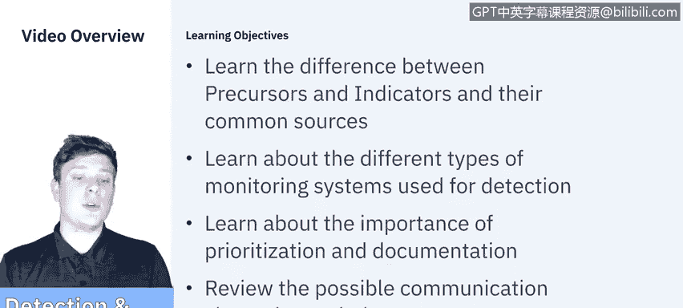
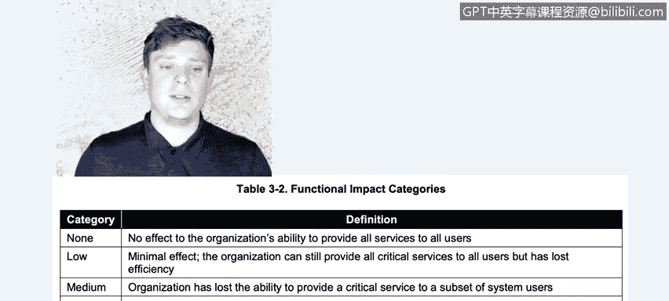
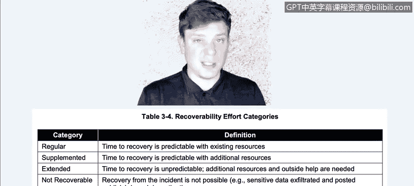
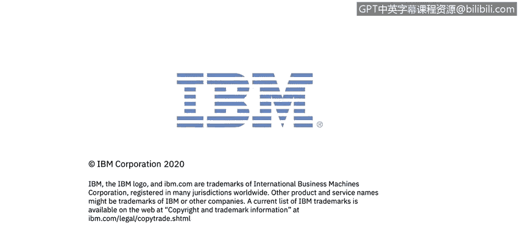

# 课程5：《渗透测试、事件响应与取证》：12：事件响应检测分析 🔍

在本节课中，我们将学习事件响应流程中的检测与分析阶段。我们将了解前兆与指标的区别及其常见来源，讨论用于检测的不同类型监控系统，并探讨事件优先级划分与文档记录的重要性。最后，我们将回顾检测后可能需要使用的沟通渠道。

## 前兆与指标

上一节我们介绍了事件响应的整体流程，本节中我们来看看检测阶段的核心概念：前兆与指标。

*   **前兆** 是指示未来可能发生事件的迹象。它为你提供了即将发生某事的预警。
*   **指标** 是指示事件已经发生或正在发生的迹象。它是你在当下注意到并判断某事正在发生或已经发生的信号。

以下是前兆与指标的具体示例：

**前兆示例：**
*   显示漏洞扫描器被使用的Web服务器日志条目。
*   针对组织邮件服务器漏洞的新漏洞利用程序的公告。
*   威胁组织声明将攻击该组织的直接威胁。

**指标示例：**
*   防病毒软件检测到主机感染恶意软件时发出的警报。
*   系统管理员发现文件名包含异常字符。
*   主机在其日志中记录审计配置更改。
*   应用程序记录来自陌生远程系统的多次失败登录尝试。
*   电子邮件管理员看到大量包含可疑内容的退回邮件。
*   网络管理员注意到与典型网络流量模式的异常偏差。

## 常见来源

了解了前兆与指标的区别后，我们来看看它们的常见来源。这些来源广泛多样，主要可以归为以下几类：

**警报**
*   入侵检测/防御系统（IDS/IPS）软件
*   安全信息与事件管理（SIEM）软件
*   防病毒/反垃圾邮件软件
*   文件完整性检查软件
*   第三方监控服务

**日志**
*   操作系统、服务和应用程序日志
*   网络设备日志
*   网络流数据

**公开信息**
*   新闻
*   国家漏洞数据库（NVD）等

**人员**
*   组织内部人员报告
*   来自其他组织（如技术支持、合作伙伴）的通知

## 监控系统类型

前面提到的许多警报来源于各类监控软件。接下来，我们简要了解一下几种关键的监控系统类型，它们对于早期检测至关重要。

**入侵检测系统与入侵预防系统**
*   **IDS** 是一种监控系统，主要负责收集信息。
*   **IPS** 是一种控制系统，会主动过滤不符合安全策略的数据包。

**数据防泄漏**
DLP是一套用于确保敏感数据不被丢失、滥用或未经授权访问的工具和流程，尤其关注数据的存储、传输和访问过程。

**安全信息与事件管理**
SIEM解决方案结合了实时分析日志数据的安全事件管理（SEM）和直接处理日志文件以生成事件或警报的安全信息管理（SIM），提供了一个整体的安全视图。

## 文档记录的重要性

无论使用何种监控系统，详尽的事件记录都至关重要。它不仅有助于处理当前事件，也对未来可能发生的所有事件有参考价值。以下是需要记录的核心信息：

*   **事件当前状态**：已发生、进行中或即将发生。
*   **事件摘要**：发生了什么、如何发生的、目前已知信息。
*   **相关指标**：如何发现该事件的线索。
*   **相关事件**：此事件是孤立的还是系列事件的一部分。
*   **处理人员操作记录**：所有事件处理人员采取的行动，类似于证据链。
*   **影响评估**：事件对组织造成的影响程度。
*   **相关方联系信息**。
*   **收集的证据列表**。
*   **处理人员评论**。
*   **后续步骤**。

## 影响优先级划分

在确定后续步骤之前，我们需要对事件的影响进行优先级划分。根据美国国家标准与技术研究院的框架，影响主要分为三类：

**1. 功能性影响**
评估事件对组织提供服务能力的影响。
*   **无影响**：对组织向所有用户提供服务的能力无影响。
*   **低影响**：有轻微影响，组织仍能向部分用户提供所有关键服务，但效率下降。
*   **中影响**：向部分用户群体失去了某些服务。
*   **高影响**：完全丧失向任何用户提供任何服务的能力。

**2. 信息影响**
评估事件对信息本身造成的影响类型。
*   **无影响**：信息未被窃取、更改、删除或以其他方式泄露。
*   **隐私泄露**：敏感的、个人可识别信息被访问或窃取。
*   **专有信息泄露**：未分类的专有信息（如受保护的关键基础设施信息）被访问或窃取。
*   **完整性损失**：敏感或专有信息被更改或删除。

**3. 可恢复性影响**
评估组织从事件中恢复的难易程度。
*   **常规**：利用现有资源，恢复时间可预测。
*   **补充**：恢复时间可预测，但需要额外资源帮助。
*   **扩展**：恢复时间不可预测，需要外部人员帮助。
*   **不可恢复**：无法从此事件中恢复（例如，敏感数据被窃取并公开）。

## 检测后沟通

在彻底记录事件并确定其对组织的影响后，我们需要通知所有相关或可能相关的人员和部门。有效的协调是事件响应团队的关键职责。

需要沟通的对象包括但不限于：
*   首席信息官
*   本地及总部信息安全负责人
*   组织内其他地点的响应团队
*   适当的外部响应团队
*   系统所有者
*   人力资源部门
*   公共关系部门（如需应对媒体）
*   法律部门
*   执法机构（如适用）

## 总结

本节课中，我们一起学习了事件响应中检测与分析阶段的核心内容。我们区分了**前兆**与**指标**，了解了它们的**常见来源**，并介绍了**IDS/IPS**、**DLP**和**SIEM**等关键监控系统。我们强调了**详尽文档记录**的重要性，并学习了如何根据**功能性**、**信息性**和**可恢复性**三个维度对事件影响进行**优先级划分**。最后，我们明确了检测后需要启动**沟通协调**，通知所有相关方以推动问题解决。在下一节视频中，我们将开始学习**遏制、根除与恢复**阶段。