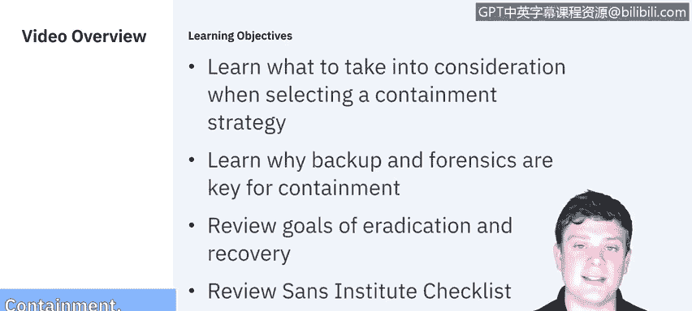
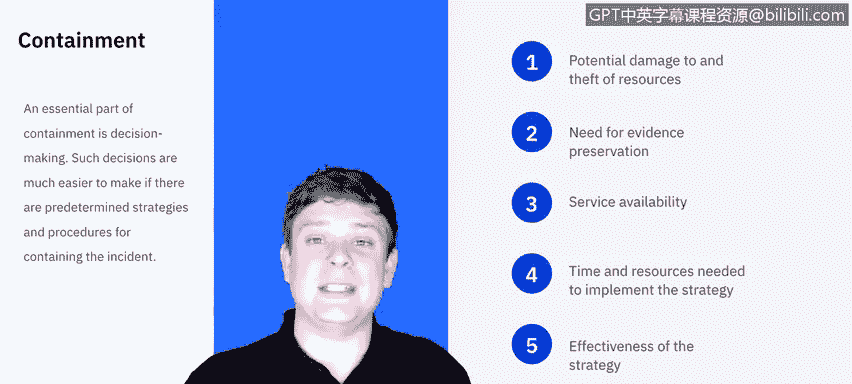
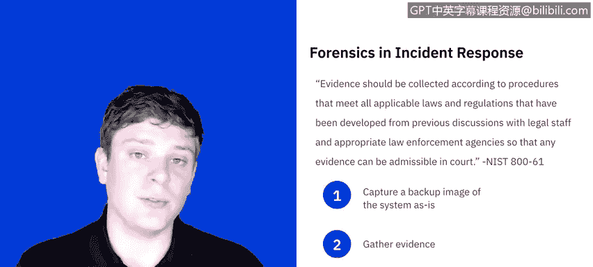
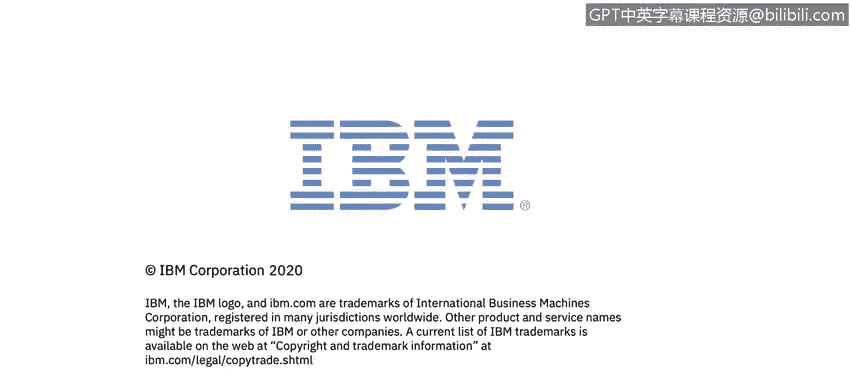

# 课程5：《渗透测试、事件响应与取证》：13：12_遏制清除恢复

在本节课中，我们将学习在选择遏制策略时需要考虑哪些因素。我们还将了解为什么备份和取证是遏制过程的一部分。之后，我们将回顾清除和恢复的目标，并查看SANS研究所为此阶段提供的检查清单。

## 🛡️ 遏制策略的考量因素

在事件耗尽资源或造成更大损害之前，遏制至关重要。遏制策略因事件类型而异。例如，遏制电子邮件传播的恶意软件感染与遏制基于网络的DDoS攻击的策略截然不同。

遏制的核心目标是阻止威胁并减轻进一步的损害。为了实现这一点，需要出色的决策能力。如果事先制定了遏制事件的策略和程序，决策就会更容易。

美国国家标准与技术研究院（NIST）列出了选择遏制策略时需要考虑的不同因素：

以下是需要考虑的关键点：
*   **潜在损害与资源窃取**：评估事件可能造成的损害和资源损失。
*   **证据保存需求**：是否需要为法律或调查目的保存证据？
*   **服务可用性**：如果服务受到影响，需要多快恢复？这对您来说是一个重要因素吗？
*   **实施策略所需的时间和资源**：是否需要与其他团队协调？是否有可用的资源？执行策略需要多长时间？
*   **策略的有效性**：该策略是否能解决问题，还是只是一个临时解决方案？投入的努力是否值得，考虑到它可能无法完全解决问题？
*   **解决方案的持续时间**：这是一个快速修复，还是一个需要后续数周或数月持续关注的长期方案？

## 🔍 取证与证据保存

上一节我们提到了保存证据的需求，这通过取证过程实现。证据应根据符合所有适用法律和法规的程序进行收集，这些程序应事先与法律人员和适当的执法机构讨论确定，以确保任何证据在法庭上都是可采纳的。

为了做到这一点，必须立即采取一些行动。以下是取证的关键步骤：
1.  **创建系统备份镜像**：在对系统进行任何更改之前，立即捕获系统的“原样”备份镜像。这意味着在任何人接触系统之前，先制作一个克隆副本，并仅在该克隆副本上开展工作，以确保原始证据不被篡改。
2.  **从镜像中收集证据**：将捕获的镜像导入一个安全环境，并从中分析发生了什么。
3.  **遵循监管链协议**：这是最重要的一步。这意味着证据会在不同人手中传递。必须仔细记录谁有权访问证据、谁在何时访问了它、如果它被移动，移动到了哪里、何时移动的以及如何被保护的。在任何时候，都应该有一份完整的纸质或电子记录，详细说明证据自捕获以来发生的一切。

我们将在下一课中更详细地探讨取证。但现在要知道，它在事件响应中扮演着至关重要的角色。

## 🧹 清除与恢复的目标

在事件被遏制之后，通常需要进行清除以消除事件的组成部分。NIST对此的总结是：清除可能包括删除恶意软件、禁用被入侵的用户账户，以及识别和缓解所有被利用的漏洞。

换句话说，我们的目标是：我已经检测到并遏制了威胁，现在需要彻底清除它。我需要清除这个威胁接触过的一切。

清除可以包括多种操作，例如系统重装、关闭访问权限、禁用服务等。具体方法取决于威胁的影响范围，这也将影响恢复过程。

因此，恢复可能涉及以下行动：
*   从干净的备份中恢复系统。
*   从头开始重建系统。
*   用干净版本替换被破坏的文件。
*   安装补丁。
*   更改密码。
*   加强网络边界安全，例如更新防火墙规则集、边界路由器访问控制列表等。

清除和恢复通常齐头并进，并且很少出现两次完全相同的情况。鉴于系统和事件的多样性，具体细节超出了本演示的范围。

## ✅ SANS检查清单

无论发生什么，通常都需要进行高水平的测试和监控，以确保恢复后的系统不再受事件影响。这可能需要数周甚至数月的时间，将受影响的系统分阶段重新投入生产，以便密切监控并确保一切正常运行。

最后，我想提一下SANS研究所的检查清单，它分解了遏制、清除和恢复阶段的一系列问题。

以下是SANS检查清单的核心问题：

**对于遏制：**
*   问题能否被隔离？
*   所有受影响的系统是否已与未受影响的系统隔离？
*   是否为深入分析创建了受影响系统的取证副本？
如果以上任何一项的答案为“否”，则需要深入探究原因。

**对于清除：**
*   系统是否可以重装映像，并通过打补丁和/或其他对策进行加固，以防止或降低攻击风险？
*   攻击者留下的所有恶意软件和其他痕迹是否已被移除？受影响的系统是否已针对进一步攻击进行了加固？

**对于恢复：**
*   您将使用什么工具来测试、监控和验证正在恢复生产的系统没有被导致原始事件的相同方法所入侵？

---

在本节课中，我们一起学习了事件响应中遏制、清除和恢复阶段的核心概念。我们探讨了选择遏制策略时的关键考量因素，理解了取证和证据保存的重要性，明确了清除威胁和恢复系统的目标，并最后回顾了SANS提供的实用检查清单。掌握这些步骤对于有效管理网络安全事件至关重要。