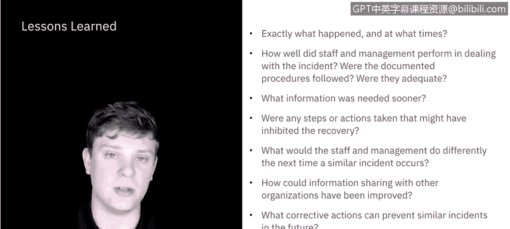

# 课程5：《渗透测试、事件响应与取证》：14：事件后活动 🧩

在本节课中，我们将学习网络安全事件响应流程的最后阶段——事件后活动。这一阶段的核心在于总结经验教训，并利用收集到的信息改进未来的响应工作。

上一节我们讨论了事件的恢复阶段，本节中我们来看看事件处理完毕后需要进行的收尾工作。

## 概述

事件后活动主要包含经验教训总结会议，以及一些根据具体情况开展的活动。这些活动对于提升安全措施和改进事件处理流程至关重要。

## 经验教训总结 📝

美国国家标准与技术研究院指出，在重大事件后与所有相关方举行经验教训总结会议，或在资源允许的情况下定期为较小事件举行此类会议，对于改进安全措施和事件处理流程本身非常有帮助。

经验教训总结本质上是一次回顾，旨在审视哪些方面可以做得更好，以便在未来迭代改进。

以下是需要在会议中提出的关键问题：

*   **事件详情**：具体发生了什么？发生在什么时间？
*   **人员表现**：员工和管理层在处理事件时表现如何？
*   **流程遵循**：是否遵循了已记录的流程？这些流程是否足够完善？如果遵循了流程，是否仍存在需要补充的空白？
*   **信息时效性**：哪些信息本应更早获得？如果在遏制、根除或恢复阶段能更早获得某些信息，是否能加快处理速度？
*   **阻碍因素**：是否有任何已采取的步骤或行动阻碍了恢复过程？
*   **未来改进**：如果未来发生类似事件，员工和管理层会采取哪些不同的做法？
*   **信息共享**：与其他组织的信息共享如何能得以改进？例如，与需要协作但未能及时联系上的人员的沟通，是否可以更高效、更及时？
*   **预防措施**：可以采取哪些纠正措施来预防未来发生类似事件？
*   **预警指标**：未来应关注哪些前兆或指标，以便检测类似事件？

这些问题只是通用指南，你需要根据具体的重大事件或一系列小事件中发现的趋势，提出更具体的问题。此处的另一个关键是**文档化**，将发现的所有问题记录并更新到文档中，以便为下一次事件做好准备。

## 其他情境活动 🔄

除了总结经验教训，根据具体情况还可以开展其他几项活动。

一项相当普遍的活动是**利用收集到的数据**。你可以收集各种数据，从响应时间、受影响的数据量，到问题解决时长、恢复时长等。每一个步骤都可以被衡量。你需要决定哪些指标对你的组织最有价值，并观察这些指标在类似事件中的长期趋势。

另一项值得提及的活动是**证据保留**。在整个过程中收集的所有信息和进行的取证分析，都需要以能够在法庭上使用的方式存储、归档和管理。我们之前讨论过使用证据监管链来确保所有证据的处理时间和方式都被正确记录，但证据保留计划本身也需要被纳入整体规划。

这也是一个**重新审视整个流程文档**的好时机。这包括你起草制定的**事件响应策略**、**事件处理文档**、**工单系统**以及**证据监管链**等所有内容。如果在此阶段发现任何文档缺口，现在就是弥补的时候。

## 总结

本节课中，我们一起学习了事件响应流程的最后阶段——事件后活动。我们重点探讨了如何通过经验教训总结会议来回顾和改进响应工作，并介绍了数据利用、证据保留和文档更新等其他重要活动。有效执行这些活动，是构建一个持续改进、日益强大的事件响应能力的关键。