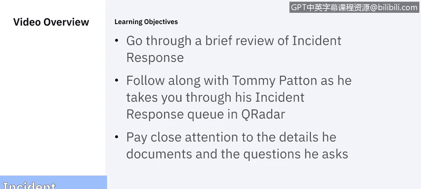
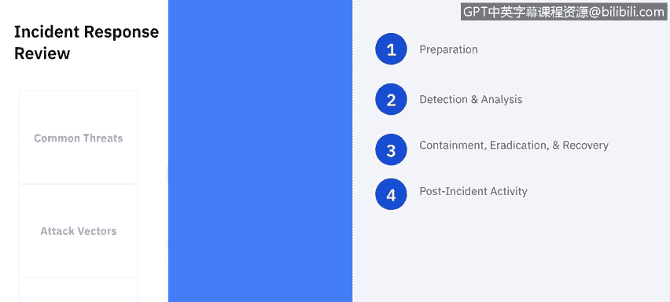
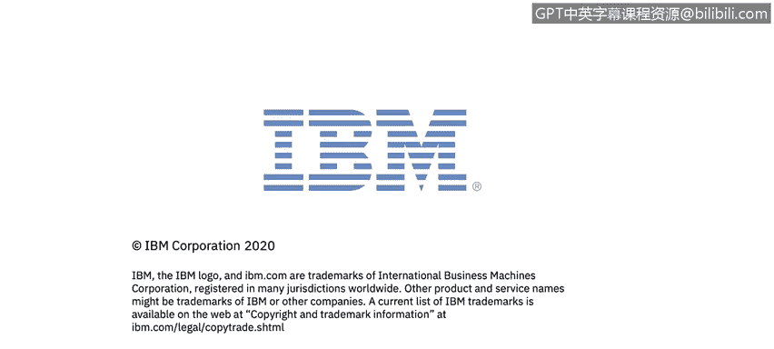

# 课程5：《渗透测试、事件响应与取证》：15：事件响应演示第1部分 🔍

在本节课中，我们将跟随IBM的演示，学习事件响应的基础知识。我们将回顾事件响应的定义、常见安全威胁，并介绍用于检测和响应的关键安全工具。课程分为三部分，这是第一部分，我们将重点关注事件响应流程的概述和准备工作。

---

欢迎观看由IBM为您带来的事件响应演示。

在这个由三部分组成的视频中，我们将跟随Tommy Patton，他将带我们简要回顾事件响应。

然后，他将通过他的QRadar事件响应演示，向我们展示事件响应的实例，以及他如何记录每个案例。

请您密切关注他提到的细节以及他沿途提出的问题。

接下来，交给Tommy。

我是Tommy Pennton。我从事网络安全领域大约五年。

我使用过许多不同的安全工具，并应对过无数的安全威胁，其中许多触发了事件响应。

在定义事件响应之前，我们必须首先了解我们日常面临的安全威胁。

一些最常见的安全威胁包括软件攻击、数据窃取、信息破坏，甚至设备盗窃。

既然我们已经识别了组织面临的常见安全威胁，接下来我们将识别黑客可能用来获取系统或网络控制权的不同攻击向量。

攻击向量的一个例子是托管恶意内容的网站，等待利用易受攻击的用户或浏览器。

幸运的是，我们可以使用许多现代安全工具，例如IBM QRadar、McAfee Policy Auditor、下一代防火墙等。

QRadar是一个安全信息与事件管理工具，简称SIEM。

简单来说，QRadar是一个日志收集工具，具有搜索、检测和告警的能力。

QRadar从我们网络上的设备或应用程序收集系统事件信息，包括来自操作系统、McAfee Policy Auditor、下一代防火墙以及默认约400种其他来源的日志信息。

QRadar收集信息后，会处理并存储收集到的数据。它会将收集到的信息规范化，并使用一组规则分析数据。我们稍后将看到QRadar的实际操作。

McAfee Policy Auditor是一个基于主机的安全系统，简称HBSS。McAfee HBSS用于许多不同的环境，以检测、预防和移除恶意文件。

McAfee HBSS包含多个子产品，包括McAfee Endpoint Security、McAfee Host Intrusion Prevention System、审计器等。

今天我们将看到一个McAfee ENS发现恶意软件、移除恶意软件以及如何响应此类事件的例子。

下一代防火墙是网络的第一道防线之一。下一代防火墙能够通过状态检测过滤网络数据包，进行特征匹配、数据包载荷检查等。

仅使用防火墙、EPO和QRadar，我们就可以对许多不同的安全威胁发出警报并做出响应。

我们的QRadar已部署。我们的Windows系统、DNS、防火墙和EPO正在向QRadar发送日志。

我们安装了带有ENS的McAfee代理，并已开始接收事件。

在开始调查事件之前，我们先回顾一下事件响应流程。

美国国家标准与技术研究院，简称NIST，将事件响应流程定义为四个步骤：准备、检测与分析、遏制与根除及恢复，最后一步是事后活动。

事件响应的第一步是准备。事件响应准备是收集响应事件所需的信息。因此，首先要收集的是资产清单，根据其对组织的重要性和受损风险进行排序。

同样重要的是收集一份利益相关者和在发生攻击时需要联系的人员名单。

这在事件期间将非常有益，因为在危机时刻，您不希望浪费时间寻找电话号码、电子邮件或联系人。

最后，您需要确定哪些类型的事件会触发调查。

例如，标准用户在早上8点多次登录失败，会触发事件吗？很可能不会，因为我们办公室的敏感开始时间是上午8点。

如果同样的事件发生在半夜呢？是的，半夜的多次失败登录可能需要调查，特别是因为我们办公室的人通常不在夜间工作。

了解监控哪些资产、哪些事件会触发调查以及联系谁，将使事件响应过程压力更小。

事件响应的第二步是检测与分析。当收到警报时，事件响应的检测与分析就开始了。

检测与分析过程始于研究触发警报的事件，并尽可能收集与警报相关的信息。

信息收集完毕后，我们将开始分析收集到的数据，以确定入口点、攻击范围和警报的有效性。

我们想知道，这是新管理员授权的操作，还是攻击者从远程设备使用了管理员账户？是一台设备受影响，还是多台设备？

一旦回答了这类问题，我们就可以开始记录和上报流程，通知所有相关方，并开始记录事件本身、时间线、为缓解、遏制、根除和恢复所采取的行动。

事件响应流程的第三步是遏制、根除与恢复。

在确定入口点后，我们希望遏制威胁，以防止对我们的系统造成进一步损害。

系统被遏制后，我们可以着手移除威胁，然后恢复任何受影响的系统，使业务恢复正常。

事件响应流程的最后一步是事后活动或事后报告。

在业务恢复正常后，应完成事件响应的最后一步。回顾在事件响应过程中采取的行动，将提供从不足中学习的机会。

可以保存事后报告，以记录用于提高事件响应效率的行动。根据我自己的经验，我们已经将事件响应从几天缩短到几分钟。记录错误并从中学习绝对有帮助。

现在我们已经识别了安全威胁、攻击向量和事件响应流程，并讨论了一些用于检测、监控和预防的安全工具，我们可以开始查看QRadar中的一些事件了。

---

在本节课中，我们一起学习了事件响应的基本概念，包括常见的安全威胁（如软件攻击、数据窃取）和攻击向量。我们介绍了关键的安全工具：**QRadar（SIEM工具）**、**McAfee Policy Auditor（HBSS）** 和下一代防火墙。最重要的是，我们详细探讨了NIST定义的事件响应四步流程：**准备**、**检测与分析**、**遏制/根除/恢复** 以及 **事后活动**。下一节，我们将深入QRadar工具，查看具体的安全事件并进行实际操作分析。