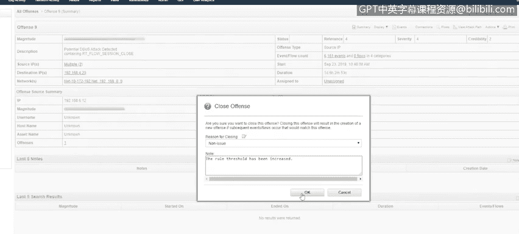
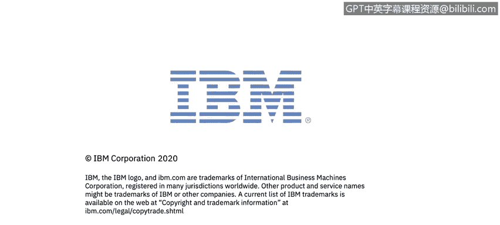

# 课程5：《渗透测试、事件响应与取证》：16：15_事件响应演示第2部分

## 概述
在本节课程中，我们将继续学习事件响应的实际操作流程。我们将基于上一节课程中触发的安全事件，在QRadar平台中分析事件详情，并按照标准的事件响应步骤进行处理，包括调查、记录、遏制和恢复。我们将重点关注如何区分真实威胁和误报，并完成整个事件响应闭环。

## 事件分析：恶意DNS查询

上一节我们介绍了QRadar中事件的触发机制，本节中我们来看看如何分析一个已生成的安全事件。

当规则被触发且动作设置为“创建事件”时，QRadar便会创建一个事件。在QRadar事件界面中，会列出所有被规则引擎告警的事件。目前我们有几个不同的事件，判断优先级最快的方法是查看事件的“严重性”等级。

将鼠标悬停在条形图上即可查看严重性等级。第一个事件的严重性为5，第二个为4，最后一个为3。让我们先查看严重性为5的事件。

点击进入事件后，会看到一个摘要页面。该页面提供了各种详细信息，包括：
*   **前5名源IP**
*   **目标IP**
*   事件涉及的**日志源**
*   用于创建此事件的**事件类别**

此页面一个主要查看点是“前5名注释”。第一条注释是“检测到恶意URL”。在这个QRadar实例中，我们配置了一条规则，用于将DNS查询与一个参考集进行比较，而该参考集包含多个恶意URL。

如果我们想进一步深入调查此事件，可以点击“事件”选项卡。我们可以看到被触发的不同事件。这是一个指向DNS服务器的“DNS查询进行中”事件。QRadar发现此查询后，将其与参考集进行比较，创建了此事件，并最终生成了安全事件。

既然我们已经看到了导致事件的事件详情，接下来让我们在X-Force Exchange上搜索这个DNS名称，以确认它是否被评级为恶意。它应该被评级为恶意，因为它存在于我们的参考集中。

在X-Force Exchange上，它立即被列为风险等级10。这个URL已被收录。根据信息，该URL被用作恶意软件的一部分，通过NTLM攻击窃取凭据，并且是其命令与控制服务之一。这证实了它是恶意的。

回到QRadar查看事件详情。我们确认这是一个恶意的DNS查询。接下来，我们再次查看那些事件以确认查询是否实际发生。

我立即注意到目标IP地址不属于我们的私有网络。DNS地址已被解析，并返回了结果`192.203.230.10`。至此，我将启动事件响应流程。由于我已经准备了资产清单、需要联系的利益相关者以及需要关注的事件，我将从第二步开始。

## 执行事件响应流程

现在，我将填写事件响应表单。需要说明的是，这只是一个模板，实际表单可能各不相同。

以下是填写表单的关键步骤：
*   **事件类型**：填写为“向已知僵尸网络的DNS查询”。
*   **检测来源**：填写为“QRadar”。
*   **环境**：填写为“局域网”。
*   **主机名**：填写为“live-PC2”。
*   **IP地址**：此处显示“多个”，原因是工作站查询了DNS服务器，然后DNS服务器又查询了外部世界来解析该DNS。我们应选择受影响的工作站IP地址。
*   **系统类型**：是“工作站”。
*   **公网IP**：我们的实验环境目前没有公网IP，因此可以虚构一个，例如使用谷歌的DNS服务器地址。

下一步是开始记录我们发现信息的时间以及完成事件响应流程各部分的时间。

因此，接下来我们要做的是开始记录我们发现信息的时间。

以下是事件响应步骤的记录：
1.  **确定恶意活动**：我们首先确定这是一次恶意的DNS查询。
2.  **识别受影响资产**：我们发现DNS查询来自我们的工作站，因此记录工作站及其IP地址和主机名。
3.  **确认威胁**：我们确认了该URL是恶意的，并且查询请求确实发出并成功解析。
4.  **遏制措施**：下一步是将其与网络断开连接。为此，我们需要提交工单，让网络团队禁用该工作站连接的交换机端口。如果是物理设备，也可以直接拔掉网线，然后通知网络团队禁用该端口。
5.  **启动杀毒扫描**：一旦端口被禁用，我们就可以开始进行杀毒扫描。
6.  **决定恢复方案**：如果扫描结果显示没有问题，理论上可以结束事件。但在此案例中，由于它确实联系了僵尸网络，即使杀毒扫描结果是干净的，我认为最好还是重新安装系统镜像。
7.  **扫描目的**：进行杀毒扫描的原因之一是确定是否存在其他未被检测到的恶意软件，可能需要进行全面扫描才能发现。
8.  **执行重镜像**：一旦交换机端口被禁用并启动了杀毒扫描，我们将返回并整理这份文档。假设扫描结果是干净的。之后，鉴于这是一个已知的命令与控制网络，我会决定重新安装该设备。我们不希望它感染其他主机或成为僵尸网络的一部分。由于它只是一台工作站，并非关键系统，可以快速重置和重装镜像，不会造成太大损失。
9.  **上报与归档**：之后，我会将这些信息上报，供上级处理并存档，以便我们了解此工作站上发生的情况。
10. **关闭事件**：完成调查后，我们需要去关闭事件。我们可以选择一个响应，将我们的事件响应表单粘贴进去，然后关闭该工单，关闭此安全事件。一旦关闭，它将不再显示在我们的活动事件列表中。

## 处理误报事件

关闭上一个事件后，我们可以处理下一个事件。由于剩下的三个事件严重性相同，我们应检查较早的事件，以防需要更快的响应。

点击进入该事件的摘要选项卡，我们可以看到事件源IP地址，这同样是一台工作站，并且与上一个事件是同一台工作站。我们还可以看到，参与此事件的日志源包括QRadar和防火墙。用于创建此事件的事件是“会话打开”和“会话关闭”事件。注释中说明这是一个“可能的DDoS攻击”。因此我们肯定要检查这个事件。

进入“事件”选项卡查看。由于这是一个本地到本地的攻击，通常相关性较低。当你看到本地到本地的DDoS攻击时，通常只是用户在进行日常工作。例如，该用户实际上正在与此服务器协作，使用API开发应用程序。因此，看到从该工作站到该系统有多个443端口的会话打开和关闭事件是正常的。所以，这个事件是一个误报。

误报被触发，尽管这些事件是典型的、正常的流量。这可能只是某种新开始的活动，或者是一台新搭建的服务器，而规则尚未进行相应调整。在这种情况下，我们需要去调整QRadar的规则。

我们将关闭此事件。我们将其作为“非问题”或“误报”关闭，因为我们希望该规则保留在QRadar中。在修改规则后，我们需要添加一条注释，说明我们提高了阈值（如果这是你为了减少误报而修改规则的方式）。

点击“确定”后，该事件将被关闭。

## 总结
本节课中，我们一起学习了事件响应流程的后半部分。我们深入分析了QRadar中生成的安全事件，通过外部威胁情报平台（X-Force Exchange）验证了威胁，并完整地演练了从记录、分析、遏制（断开网络）到恢复（杀毒扫描与系统重装）的标准响应步骤。同时，我们也学会了如何识别和处理误报事件，并通过调整检测规则来优化安全监控的准确性。整个过程强调了在事件响应中保持详细记录和遵循既定流程的重要性。