# 课程5：《渗透测试、事件响应与取证》：17：事件响应演示第3部分 🚨

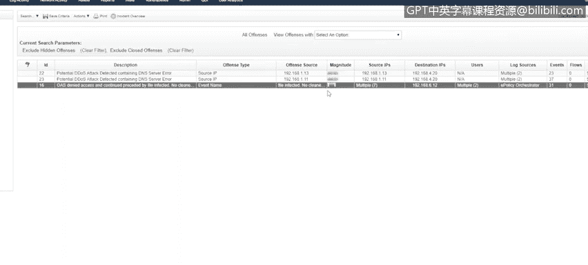

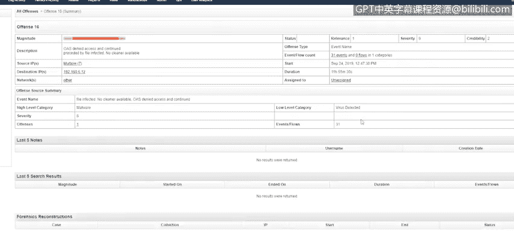

在本节课中，我们将继续学习事件响应的实际操作流程，重点分析一个具体的病毒检测警报，并回顾事件响应的完整步骤。我们将从警报调查开始，逐步完成遏制、根除、恢复以及事后总结。

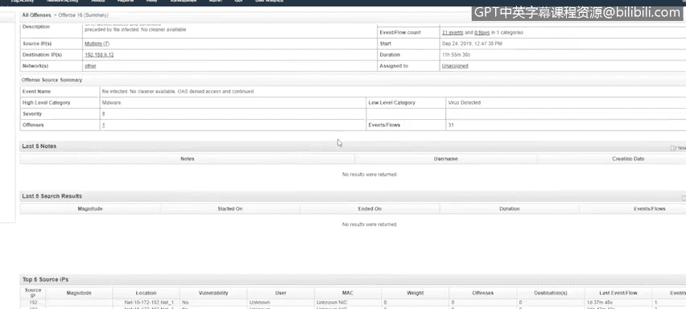

## 概述

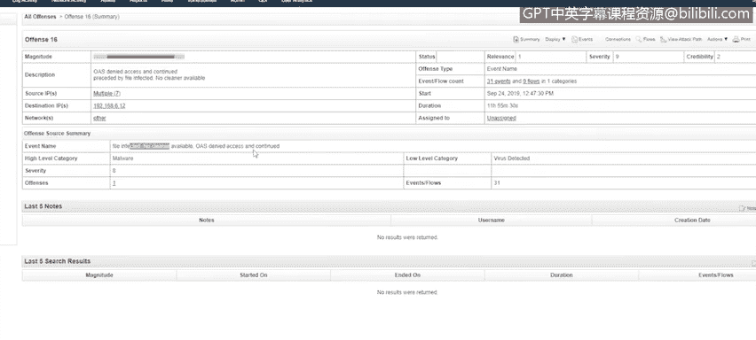

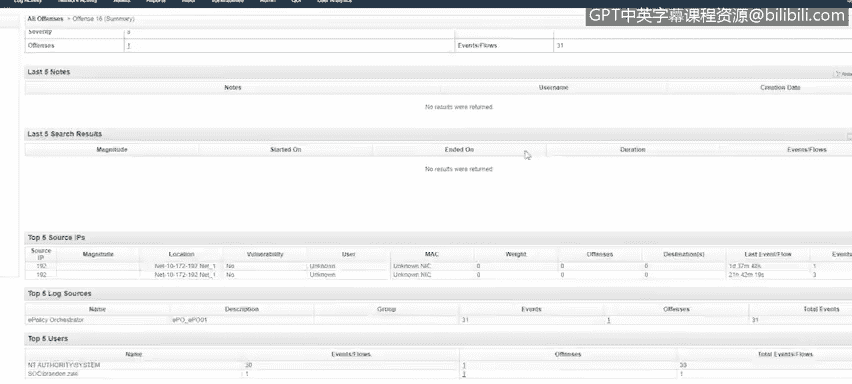

本节课程是事件响应演示的第三部分。我们将深入分析一个名为“文件被感染，无可用清除工具”的安全警报，并按照事件响应生命周期，完成从检测到事后回顾的全过程操作。

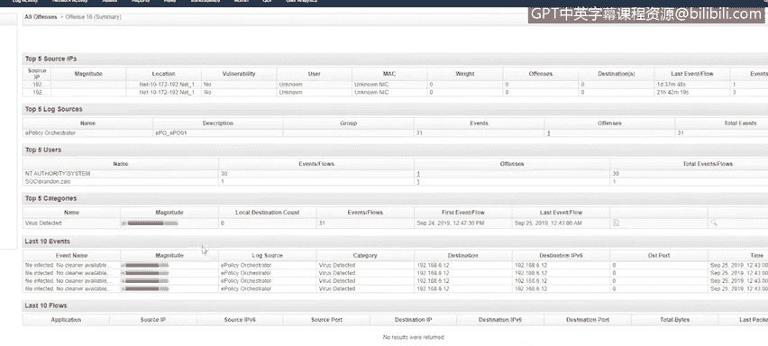

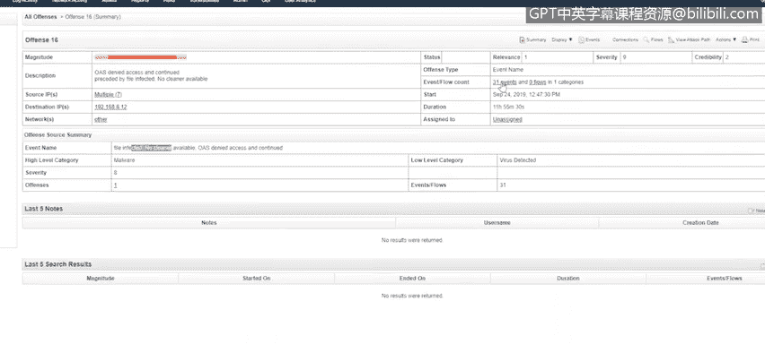

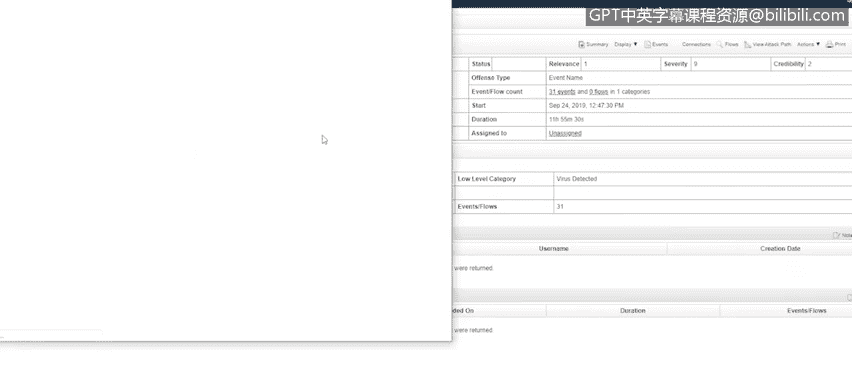

## 警报分析与调查 🔍

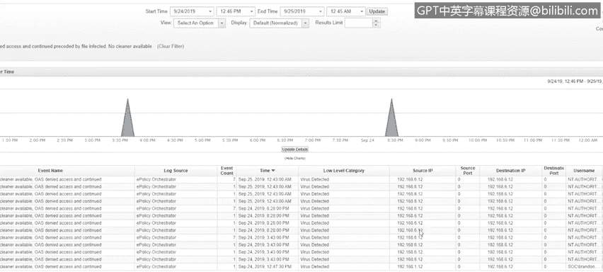

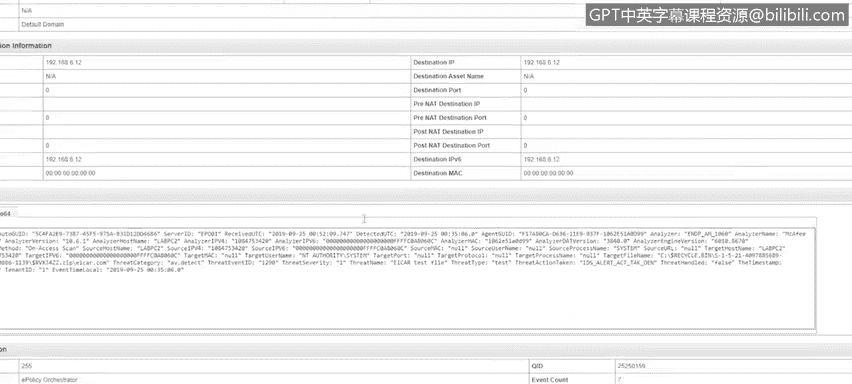

上一节我们介绍了如何初步筛选警报，本节中我们来看看如何对一个具体的病毒警报进行深入分析。

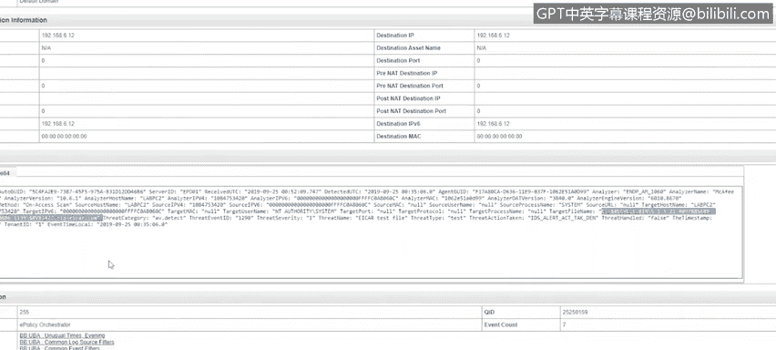

首先，我注意到一个严重性较高的警报。其事件名称为“文件被感染，无可用清除工具”。即使其可信度评级较低，也需要立即关注。

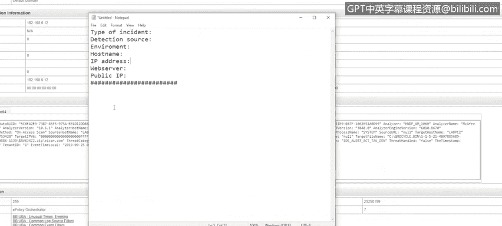

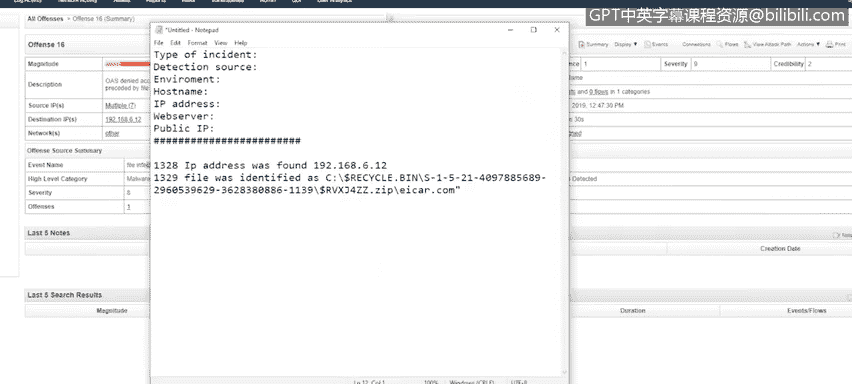

在警报摘要页面，可以清楚地看到有一份文件被感染，且当前没有可用的清除工具。

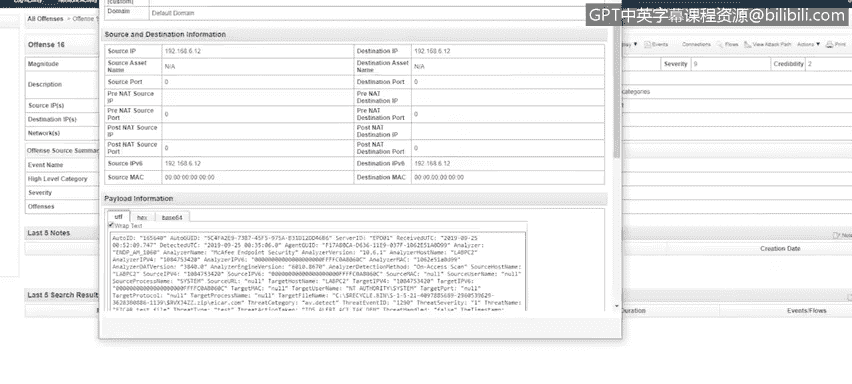

以下是调查此警报的关键步骤：

1.  **检查事件详情**：查看触发警报的原始事件日志，获取详细信息。
2.  **定位感染源**：从事件日志中，可以找到受感染主机的源IP地址。
3.  **识别恶意文件**：在日志中定位被检测到的具体文件名及其路径。

通过调查发现，病毒是在一台机器的回收站内被触发的。我记录了事件发生的时间、涉及的系统和文件等详细信息，为后续响应步骤做好准备。

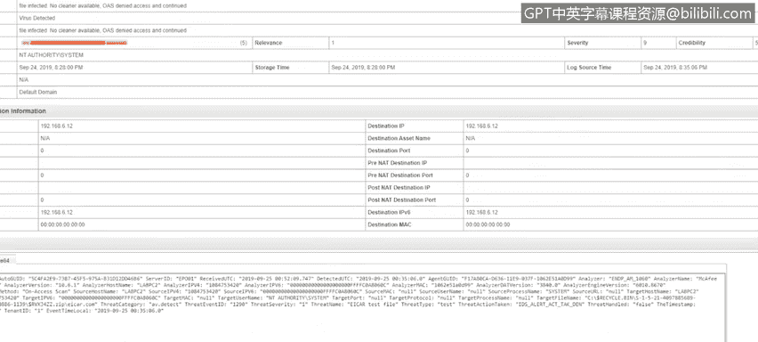

## 遏制与根除 🛑

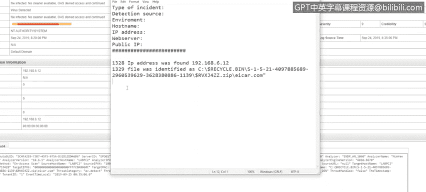

一旦识别出受感染系统和具体文件，下一步就是采取行动。

首先，我需要立即遏制威胁，防止其扩散。最有效的方式是隔离受感染主机。我再次联系网络团队，提交工单请求禁用该主机连接的交换机端口。

在提交网络隔离请求的同时，我根据在事件响应第一步（准备阶段）制定的利益相关者名单，联系相关人员进行通报。

完成初步通报和隔离后，我启动了对该系统的全面防病毒扫描，并等待扫描结果。

## 完成报告与系统恢复 📝

在等待防病毒扫描结果期间，我填写了事件响应表单的其余部分，补充了所有调查笔记。

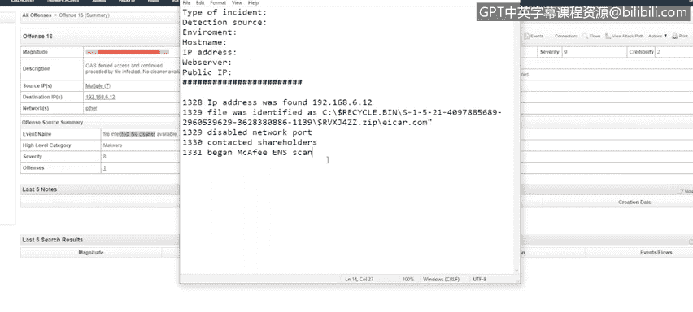

扫描完成后，我查看了结果。发现受感染文件并未被清除，仍然存在，并且扫描还检测到了其他可疑文件。基于此，我建议对该系统进行重新镜像以彻底清除威胁。

我将此建议发送给IT资产管理团队。在获得批准后，我们对该系统执行了重新镜像操作。

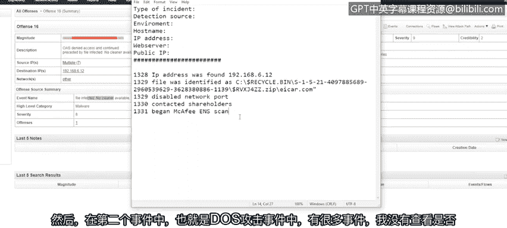

至此，本次事件的主要响应工作结束，我们进入事后报告阶段。

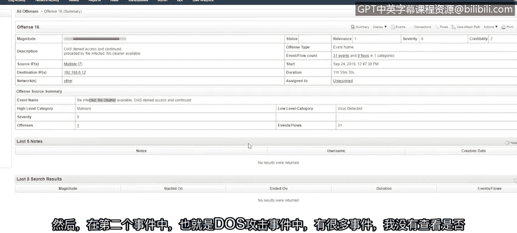

## 事后行动报告与经验总结 📊

事后行动报告是一份持续更新的文档，用于记录事件响应过程中出现的失误或可改进的环节，目的是为了学习和优化未来的响应流程。

回顾我们处理过的两个事件：

*   **第一个DNS查询事件**：我查看了事件日志，然后去查询了DNS记录，之后又返回事件日志确认攻击是否成功。一个提高效率的改进点是：在首次查看事件日志时，就应该先确认攻击是否已成功执行。如果DNS查询已被服务器拦截，那么我去查询IP地址就是浪费时间。此外，我最初没有及时通知任何利益相关者。
*   **第二个暴力破解攻击事件**：当时存在大量事件日志。我的调查不够充分，没有深入查看是否存在多个源IP地址，或者登录者是否真的是开发人员而非他人。这是一个需要更深入调查的方面。

进行事后审查至关重要，它能显著提升未来的事件响应效率。

## 事件响应流程回顾 🔄

让我们最后再快速回顾一遍事件响应的完整流程，确保涵盖了所有关键细节。

**第一步：准备**
你需要明确监控目标、了解关键资产、定义需要触发警报的事件类型，并制定在发生事件时需要联系的人员名单。

**第二步：检测与分析**
事件响应的检测与分析始于收到警报，然后开始收集信息、研究触发警报的事件，并判断这是真实事件还是误报，同时评估事件的影响范围。

**第三步：遏制、根除与恢复**
*   **遏制**：首要任务是隔离威胁。对于工作站，可以直接拔掉网线；对于服务器或虚拟机，则需要联系负责网络连接的团队。在我们演示的两个案例中，都是通过联系网络团队来禁用端口，这通常是最高效的方式。
*   **根除**：在遏制后，需要彻底清除威胁。确保查找其他潜在威胁，例如文件是否已被复制到共享目录。确认系统没有在与其它系统进行异常的通信。
*   **恢复**：最后一步是使系统恢复正常运行状态。通常需要管理层的批准，才能将系统重新接入网络，或按照指示（如重新镜像）进行操作。在我们的案例中，两个事件都要求对系统进行重新镜像。

**第四步：事后活动**
这是事件响应的最后一步。正如前面提到的，在事后行动报告中，记录任何可以改进的地方，任何能让事件响应更高效的措施。

## 总结

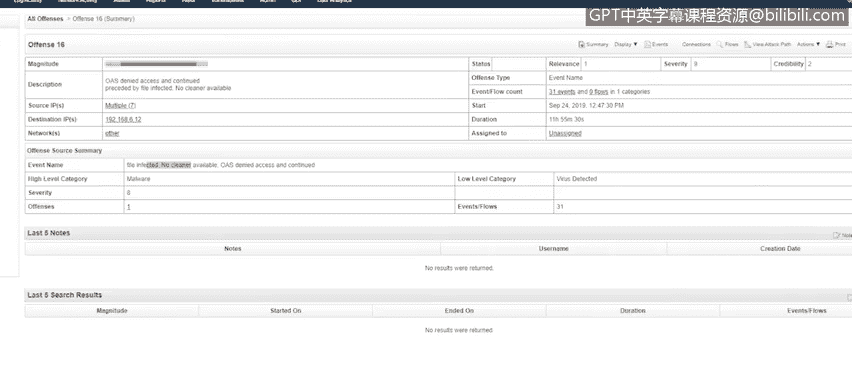

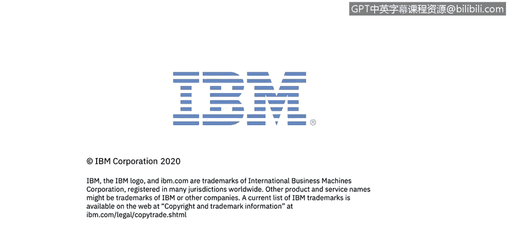

本节课中，我们一起学习了对一个病毒警报进行完整事件响应的过程。我们从分析警报详情开始，逐步执行了遏制、根除、恢复等操作，并最终通过事后行动报告总结了经验教训。我们还系统回顾了事件响应生命周期的四个核心步骤：准备、检测与分析、遏制/根除/恢复以及事后活动。掌握这个流程对于有效管理网络安全事件至关重要。