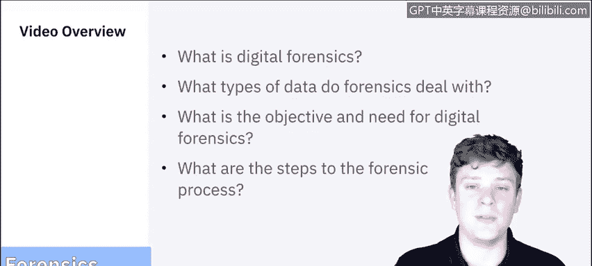
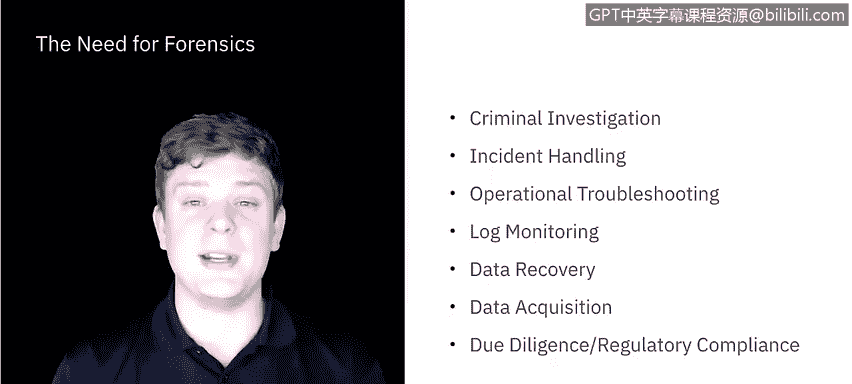
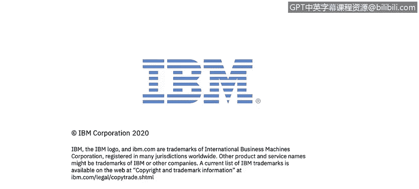

# 课程5：《渗透测试、事件响应与取证》：19：什么是取证 🔍

在本节课中，我们将学习数字取证的基本概念。我们将探讨取证处理的数据类型，聚焦于数字取证在网络安全行业中的目标和必要性，并回顾取证过程的基本步骤。

---

## 数字取证的定义

首先，我们来定义数字取证。数字取证，也称为计算机和网络取证，虽然定义众多，但通常被认为是**将科学应用于数据的识别、收集、检验和分析，同时保持信息的完整性，并为数据维护严格的监管链**。

在整个系列课程中，我们将频繁讨论“数据”。因此，明确数据的含义至关重要。

---

## 取证处理的数据类型

取证过程的第一步是识别潜在的数据源并从中获取数据。以下是常见的数据源：

*   **计算机与服务器**：包括台式机、服务器、网络存储设备和笔记本电脑。
*   **存储介质**：如CD/DVD光盘、内部和外部驱动器（固态硬盘、机械硬盘）、U盘、外置硬盘等。
*   **易失性数据**：指仅在特定时间点存在的数据。例如，断开网络连接、重启计算机、关闭应用程序或进程都会改变计算机的状态。这类数据具有很强的时间敏感性，必须立即捕获。
*   **网络活动数据**：可通过网络服务提供商（通常需要法庭命令）或系统日志获取。
*   **应用程序数据**：应用程序通常会存储会话记录、项目文件等，是丰富的数据来源。
*   **便携式数字设备**：包括手机、录音笔、安全摄像头、数码相机等。取证时需注意，数据可能不仅存在于计算机中，也存在于物理环境中的各种设备里。

综上所述，“数据”是一个广义的术语。在后续课程中，我们将详细讲解如何利用这些不同来源的数据。

---

## 数字取证的应用场景

根据美国国家标准与技术研究院的说明，取证最常见的应用场景是**刑事调查**和**事件响应**。然而，取证的技术和实践可应用于许多其他领域：

*   **操作故障排除**
*   **日志监控**
*   **数据恢复**：使用工具从数据丢失的系统中恢复数据，无论数据是意外还是故意丢失的。
*   **数据获取**：有时数据并未丢失，只是需要访问，例如从已退役或重新分配的工作站中，或从已离职员工擦除的电脑中获取数据。
*   **尽职调查**
*   **法规遵从**：现行及新兴法规要求许多组织保护敏感信息并保留特定记录以供审计。

由此可见，取证技术在不同情境下都有广泛的应用。

---

## 数字取证的目标与流程

接下来，我们深入探讨数字取证的目标，并分解其流程步骤。IBM常驻系统信息与事件管理器Raoul阐述了数字取证的主要目标：

1.  **记录过程与证据**：以文档形式记录获取证据的过程及证据本身，这对于法律程序至关重要。
2.  **推断动机与时间**：分析事件是犯罪还是事故，并推断其动机。
3.  **设计保护性流程**：设计取证程序以保护证据和流程本身。任何步骤的疏忽都可能导致调查人员被指控破坏证据。
4.  **确保安全获取与复制**：确保在复制数据时，程序完全安全，数据不会被更改，尤其是在涉及犯罪案件的受保护计算机上。
5.  **快速识别关键证据**：取证过程具有时间敏感性，需要快速确定证据的搜索方向。
6.  **撰写清晰易懂的报告**：及时撰写清晰、能让非技术人员理解的报告，而不仅仅是工程师能看懂。
7.  **保护证据与监管链**：保护证据并详细记录监管链。

NIST将取证过程分为四个步骤：**收集、检查、分析和报告**。我们将在后续视频中详细分解，此处先做概述：

*   **收集**：识别、标记、记录并从所有可能来源获取数据，同时保持数据的完整性。
*   **检查**：处理大量收集到的数据，评估并提取特别感兴趣的部分。
*   **分析**：使用法律上可证明的方法和技术，分析检查结果。
*   **报告**：汇报分析的结果。

---

## 总结

本节课中，我们一起学习了数字取证的基础知识。我们明确了取证的定义，了解了其处理的各种数据类型，探讨了在网络安全及其他领域的应用场景，并概述了取证的核心目标与标准流程（收集、检查、分析、报告）。

在下一节视频中，我们将具体深入**收集**和**检查**这两个步骤。