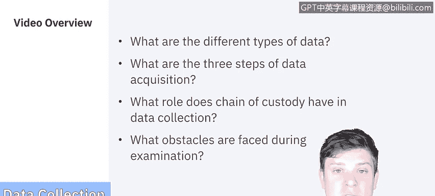
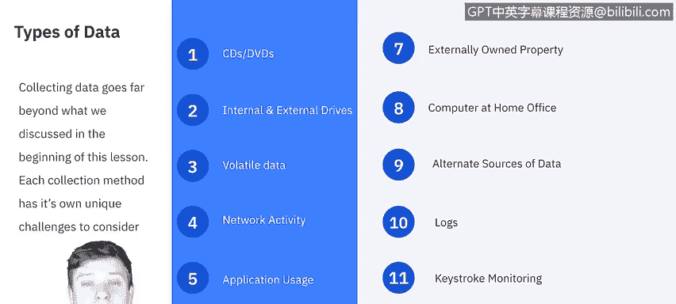
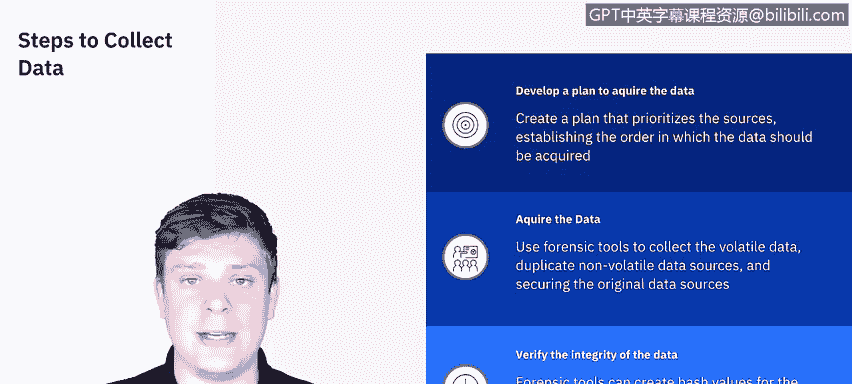

# 课程5：《渗透测试、事件响应与取证》：20：数据收集与检查

在本节课中，我们将学习数字取证过程中的数据收集与检查阶段。我们将探讨不同类型的数据、数据获取的三个步骤、保管链的重要性，以及在数据检查过程中可能遇到的常见障碍。

## 数据收集概述

上一节我们介绍了取证的基本概念，本节中我们来看看数据收集的具体范围。在取证入门中，我们提到了多种数据类型，例如CD/DVD、内外置驱动器、易失性数据、网络活动、应用程序使用记录以及物理空间中的便携式数字设备。

然而，数据收集的范围远不止于此。每种收集方法都有其独特的挑战需要考虑。例如，考虑外部拥有的财产，比如事件可能涉及员工个人拥有的电脑或手机。又或者，设备位于家庭办公室，我们可能无法直接接触。

如果无法直接访问设备，我们就需要考虑替代数据源。是否存在备份？设备是否连接到某个服务器？我们必须跳出常规思维，因为我们已经无法直接访问物理设备。此外，日志也非常重要。如果可能，建立一个集中的日志系统对于数据保存和审计至关重要。

如果您的组织和法律部门同意，甚至可以使用键盘记录器等工具来监控计算机上的击键，作为获取数据的另一种方式，尽管这在组织中并不常见。

## 数据获取的三个步骤

美国国家标准与技术研究院将数据收集过程分解为三个主要类别。以下是具体步骤：

**第一步：制定数据获取计划**
制定计划时，优先考虑收集哪些数据的关键因素是评估数据的价值，以及它是否是易失性数据。正如我们在之前的视频中讨论的，易失性数据是仅在当前时刻可用的数据。如果计算机状态发生变化（如关机、断网、需要身份验证等），这些数据就会改变。因此，易失性数据应优先获取。此外，我们还需要考虑实际获取这些数据需要付出多少努力。这些都是制定数据获取计划时必须考虑的因素。

**第二步：实际获取数据**
在这一步，我们将使用取证工具来收集易失性数据，并复制非易失性数据源，以确保不损害原始数据。同时，我们需要保护好原始数据源，确保在调查过程中不被篡改。

**第三步：验证数据完整性**
我们使用的取证工具可以为原始数据源创建哈希值。当我们制作镜像或备份时，工具会为其生成一个哈希值。然后，我们可以将这个哈希值与复制版本的哈希值进行比较。如果原始数据有任何改变，就会生成不同的哈希值，我们就能发现两者不再相同。使用这种方法可以验证数据的完整性。

## 保管链的重要性

进行数据收集时，最需要注意的事项之一是遵守保管链。遵循明确定义的保管链可以避免证据处理不当或被篡改的指控。

保管链涉及记录每一个实际保管过该证据的人员，记录他们对证据执行的操作，确保证据在不使用时存放在安全的位置，制作副本以避免在原始证据上操作，并验证原始证据与复制证据的完整性。本质上，保管链是一个概览，是一条审计轨迹，记录了证据接触者的**人物、事件、时间、地点和原因**。这样，在任何时候的法律程序中，你都可以证明证据的处理过程没有漏洞。

这一点非常重要，我们将在单独的课程视频中花更多时间讨论保管链。但现在，请记住，在进行数据收集时，必须时刻将其放在首位。

## 数据检查的障碍

取证过程的下一步是检查。检查，顾名思义，就是检查我们收集到的数据。然而，在这个过程中我们会面临许多障碍，并且每个场景的障碍可能不同。但大体上，以下是我们必须克服的常见障碍：

**需要绕过控制**
操作系统和应用程序可能采用数据压缩、加密或高级访问控制列表等技术，这使得检查我们收集到的数据变得非常困难。

**数据量庞大**
硬盘驱动器可能包含数十万个文件，并非所有文件都与当前案件相关。因此，筛选所有数据以找到与案件最相关的内容非常耗时。

幸运的是，我们可以使用各种工具和技术来帮助过滤和排除搜索中的数据，从而加快检查过程。

## 总结

本节课中，我们一起学习了数字取证中数据收集与检查的关键环节。我们了解了数据获取的三个步骤：**制定计划、实际获取、验证完整性**。我们强调了**保管链**在确保证据法律效力中的核心作用。最后，我们探讨了数据检查阶段可能遇到的障碍，如**系统控制**和**海量数据筛选**。掌握了这些基础后，下一节我们将进入取证过程的最后两个步骤：分析与报告。