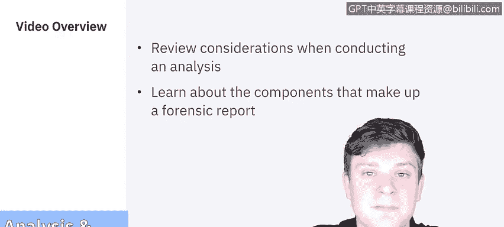
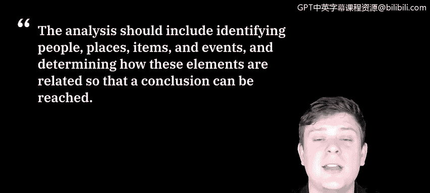
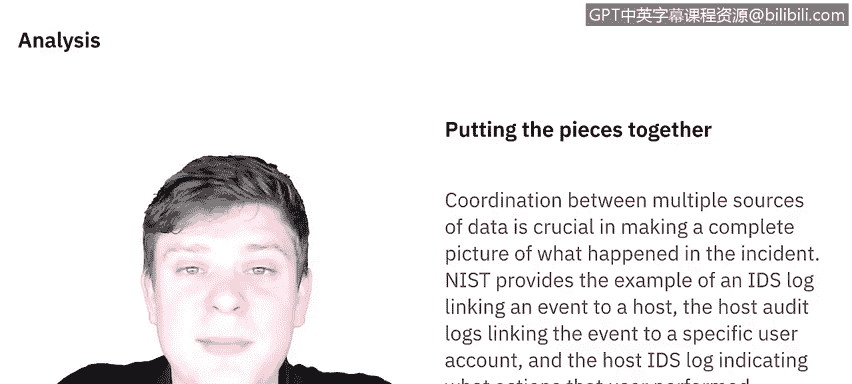
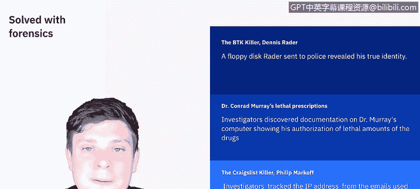

# 课程5：《渗透测试、事件响应与取证》：21：分析报告 📝

在本节课中，我们将学习数字取证过程中的分析与报告环节。我们将回顾进行分析时需要考虑的因素，并了解构成一份完整取证报告的各个组成部分。

---

## 分析过程

上一节我们讨论了证据收集，本节中我们来看看如何分析这些证据。分析过程应包括识别人员、地点、物品和事件，并确定这些元素之间的关联，从而得出结论。分析的本质是将所有线索拼凑在一起。

来自多个数据源的协调对于完整还原事件全貌至关重要。

以下是分析过程的核心思路：
*   **关联数据**：将不同来源的证据（如日志、文件、网络流量）联系起来。
*   **构建时间线**：确定事件发生的顺序。
*   **识别模式**：寻找异常行为或攻击者的操作模式。

美国国家标准与技术研究院提供了一个例子：入侵检测系统日志将事件关联到一台主机，主机审计日志将该事件关联到一个特定用户账户，而主机入侵检测系统日志则显示了该用户执行了哪些操作。这些数据源共同构成了分析的基础。

拥有尽可能完整的画面是解决这些安全事件的关键。在某些情况下，它甚至能帮助侦破重大犯罪案件。

以下是几个通过数字取证侦破的著名案例：
*   **BTK杀手**：丹尼斯·雷德通过寄给警方的软盘暴露了身份，最终被捕。
*   **康拉德·莫里医生案**：迈克尔·杰克逊的私人医生，其电脑中的记录显示他授权使用了致命剂量的药物，这成为定罪的关键证据。
*   **“克雷格列表杀手”**：警方通过追踪嫌疑人在克雷格列表上使用的电子邮件IP地址，锁定了23岁的医学生菲利普·马可夫。

这些只是众多通过数字取证解决的案例中的几个例子。

---

## 取证报告撰写

现在，让我们转向报告的撰写。你的取证报告或案件总结旨在为你得出的观点提供依据。虽然与专家报告相关的法律多种多样，但基本规则如下：
*   报告必须由你本人撰写，否则不能作为证词。
*   报告需要详细说明你所有结论的依据。
*   你需要详细记录进行的每一项测试、使用的方法和工具以及结果。

桑斯研究所提供了一些最佳实践。一份取证报告通常包含四个主要部分：
1.  **概述**
2.  **取证获取与检查准备**
3.  **发现与分析报告**
4.  **结论**

让我们进一步分解这些部分。

### 1. 概述

本节解释调查人员最初是如何介入案件的，以及最初的**事件、请求或证据**是如何提供给他们的。请记住，这份文件可能在法庭上使用，因此必须尽可能简洁和完整。

### 2. 取证获取与检查准备

这一部分非常重要，你必须详细说明你与数字证据的交互过程，以及为保存取证获取的证据所采取的步骤。你采取的任何额外步骤，例如**对存储介质进行取证擦除**，都应在报告的这部分注明。

报告的这部分通常记录了你作为检查员或分析师首次接触数字证据，并详细记录了你所做的操作，这对于维护数字证据的完整性和保管链至关重要。

一份专家报告必须首先详细说明：
*   使用了何种分析。
*   专家如何进行检查和分析。
*   使用了哪些工具。
*   测试的结果是什么。
*   被测试机器的详细信息。
*   用于进行测试的机器的详细信息。
*   进行测试的环境条件。

专家在报告中提出的任何主张都应得到内在、可靠来源的支持。例如，如果一份专家报告需要详细说明域名服务的工作原理以描述一次DNS投毒攻击，那么就应该引用关于域名服务细节的公认权威著作。

### 3. 发现与分析报告

对于发现和分析报告部分，桑斯研究所概述了一套最佳实践。

以下是撰写此部分时的一些实用建议：
*   **截取大量屏幕截图**。
*   通过你选择的取证应用程序**为证据添加书签**。
*   利用你的取证工具**内置的日志记录和报告功能**。
*   将数据项**高亮并导出为CSV或文本文件**，以便通用访问。
*   必要时，**使用数字音频记录器而非手写笔记**，以避免混淆。

### 4. 结论

报告的结论部分是对你所有发现和分析的总结。它应该简洁，同时在技术上准确反映你在整个报告中提出的所有要点。

虽然总结是好的，但结论不应过长，以至于掩盖了你实际进行的分析，因为分析部分才是你发现的核心所在。

---

## 总结

本节课中，我们一起学习了数字取证的分析与报告阶段。我们了解到，分析是将各种证据关联起来以还原事件全貌的过程，并通过真实案例看到了其重要性。我们还详细拆解了一份标准取证报告的四个核心组成部分：概述、取证获取与检查准备、发现与分析报告以及结论，并学习了撰写每一部分的最佳实践。记住，一份清晰、准确、完整的报告是调查成果的最终体现，也可能成为法律程序中的关键文件。

在下一视频中，我们将介绍如何利用从数据文件中获取的信息。我们下次见。