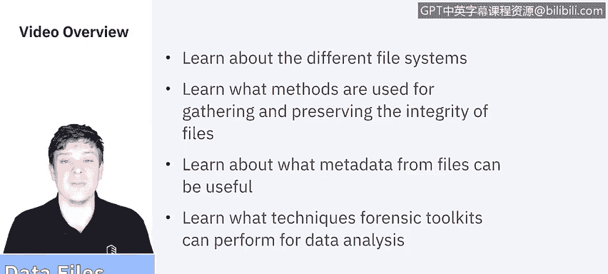
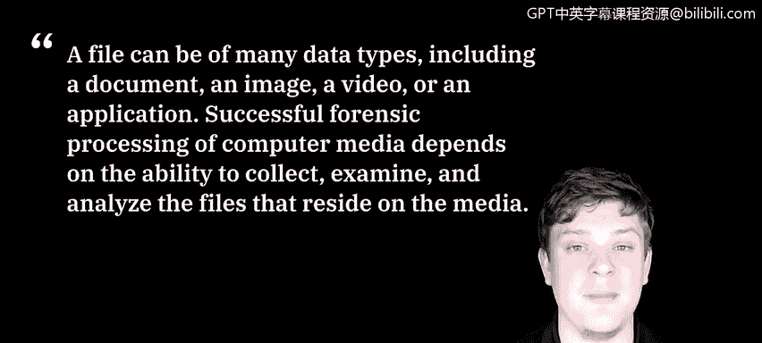
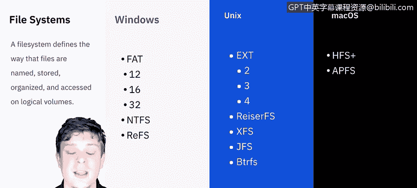
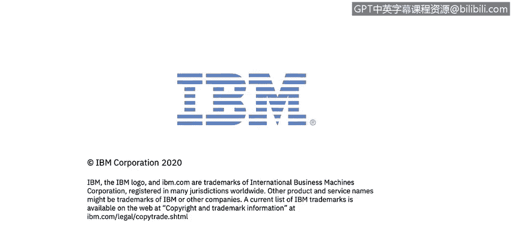

# 课程5：《渗透测试、事件响应与取证》：22：数据文件 📁

在本节课中，我们将要学习数据文件的相关知识。我们将了解不同的文件系统、用于收集和保持文件完整性的方法、文件元数据的用途，以及取证工具用于数据分析的各种技术。

---

## 文件系统概述

上一节我们介绍了课程目标，本节中我们来看看文件系统的基础知识。

根据美国国家标准与技术研究院的定义，文件可以是多种不同的数据类型，包括文档、图像、视频或应用程序。对计算机介质进行成功的取证处理，取决于收集、检查和分析存储在该介质上的文件的能力。在本视频中，我们不会深入探讨每一种文件系统，但视频结束后，强烈建议你寻找优质资源，了解不同文件系统的功能与局限。

对于桌面系统，Windows、Unix和Mac OS是存在的主要文件系统。实际上还有更多，尤其是在Linux/Unix领域。

---

## 文件数据的类型

除了文档、电子表格、音频和视频文件等显而易见的数据，还有一些更难以捉摸的数据类型，例如已删除的文件、松弛空间或空闲空间。

以下是几种特殊的数据存储区域：

*   **已删除的文件**：当文件被删除时，它通常并未从介质（例如硬盘）上被擦除。相反，目录数据结构中指向该文件位置的信息被标记为“已删除”，使其看起来不存在。然而，文件本身仍留在硬盘上。只有当保存新文件并占用驱动器空间时，才会覆盖那些标记为删除的目录项。因此，在硬盘完全写满之前，绝对有办法恢复已删除的文件。
*   **松弛空间**：这与最小文件分配大小有关。根据文件类型，操作系统会设定一个最小文件大小，表示至少为该类文件预留这么多空间。即使文件本身小于该分配空间，两者之间的差额就称为“松弛空间”，其中的数据确实可以被恢复。
*   **空闲空间**：这是介质上未分配给任何分区的区域。然而，该空闲空间可能仍包含已删除文件的残留数据片段。因此，虽然文件被删除后我们看到了空闲空间，但实际上，在该空间被新数据占用之前，旧数据仍然可以恢复。

---

## 文件元数据

另一种可以从文件中获取的信息是“MAC”数据。这里不是指苹果的Macintosh，而是指修改时间、访问时间和创建时间。这些都是文件被交互时捕获的元数据。

尽可能多地了解相关文件的信息非常重要。记录修改、访问和创建时间有助于分析人员建立事件时间线。

*   **修改时间**：指文件最后一次被更改的时间，不仅仅是打开，而是内容被修改并保存。
*   **访问时间**：指文件最后一次被打开的时间。
*   **创建时间**：指文件最初被建立或创建的时间。

通过修改、访问和创建时间，分析人员可以描绘出该文件历史中发生事件的清晰时间线。

---

## 数据收集方法

现在我们问自己，如何获取和收集这些数据？文件收集主要有两种方式：逻辑备份和逐位镜像。

以下是两种方法的对比：

*   **逻辑备份**：它复制逻辑卷的目录和文件，但**不捕获**介质上可能存在的其他数据，例如已删除的文件或存储在松弛空间中的残留数据。可以将其想象为插入外部硬盘并复制备份文件，或者使用定期（在发生更改时或按预定时间间隔）重新备份文件系统中所有文件的自动备份系统。逻辑备份的一个优点是，如果使用标准备份软件，可以在**活动系统**上执行。然而，它可能消耗大量计算机的时间和资源。
*   **逐位镜像**：这会生成原始介质的**逐位复制**，包括空闲空间和松弛空间。位流镜像需要更多的存储空间，执行时间可能比逻辑备份更长。如果需要用于法律或人力资源方面的证据，则应获取完整的位流镜像，并且所有分析都应在副本上进行。大多数情况下，我们会选择制作镜像，这意味着它只是计算机在**某个时间点**状态的精确快照。你可以进行磁盘到磁盘的克隆，也可以创建磁盘镜像文件以便传输。镜像**不应在活动系统**上执行，因为数据总是在变化，这样做将无法获得准确的时间戳。

---

## 取证分析技术

既然我们已经讨论了可以从文件中获取的数据类型以及收集方法，接下来我想花些时间谈谈取证工具辅助使用的分析技术。

许多取证产品允许分析人员执行广泛的过程来分析文件和应用程序，包括收集文件、读取磁盘镜像以及从文件本身提取数据。

以下是取证工具辅助的关键技术：

*   **使用文件查看器**：无需使用原始的应用程序源，可以使用单一工具查看每种类型的文件，从而加快搜索速度，并无需为每种文件类型都安装可用的原生应用程序。
*   **解压缩文件**：ZIP或压缩文件很常见。在取证过程的早期，分析人员应解压缩文件，以便将其包含在搜索中。唯一需要注意的是所谓的“压缩炸弹”，这是黑客或恶意人员设置的陷阱，有时是数十、数百甚至数千个文件相互嵌套压缩。保持防病毒或事件检测软件更新有助于缓解此风险。
*   **使用图形用户界面显示目录结构**：这种做法使分析人员能够更轻松、更快速地收集有关介质内容的一般信息，例如安装的软件类型以及数据创建者可能具备的技术能力。大多数产品可以显示Windows、Linux和Unix目录，有些则专门针对Mac OS。
*   **识别已知文件**：这看似显而易见，但对于从考虑范围内排除不重要的文件（例如已知良好的操作系统和应用程序文件）非常有益。分析人员应验证哈希值，例如由NIST软件参考库项目创建的哈希值或个人创建的哈希值。这有助于简化流程，并让你专注于需要的文件。
*   **执行字符串和模式搜索**：字符串搜索有助于处理大量数据以查找关键词或字符串。各种搜索工具可以使用布尔逻辑、模糊逻辑、同义词和概念、词干提取等搜索方法。
*   **访问文件元数据**：这可以为我们提供大量关于文件的上下文信息，甚至可能包括作者信息。

本视频不会深入介绍所有具体的工具，但视频结束后，会有一些课外活动，鼓励你去查阅和了解现有的许多取证分析工具。

---

本节课中我们一起学习了数据文件的基础知识。我们探讨了不同的文件系统，了解了已删除文件、松弛空间和空闲空间等概念，认识了文件元数据（MAC时间）的重要性。我们还比较了逻辑备份和逐位镜像两种数据收集方法，并概述了取证工具在文件分析中使用的关键技术，如文件查看、解压缩、目录浏览、已知文件过滤以及字符串搜索等。掌握这些知识是进行有效数字取证分析的基础。