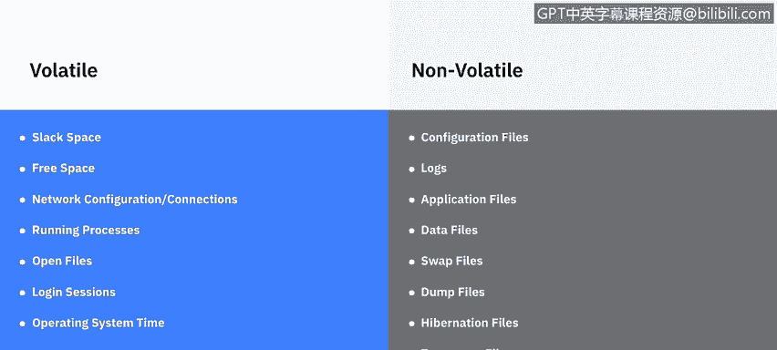
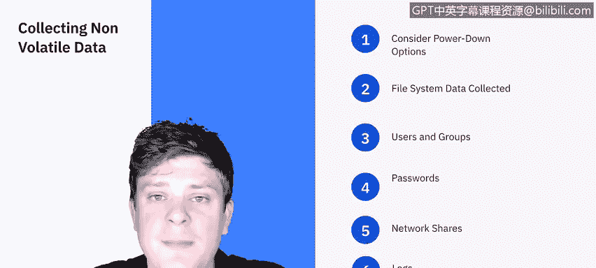
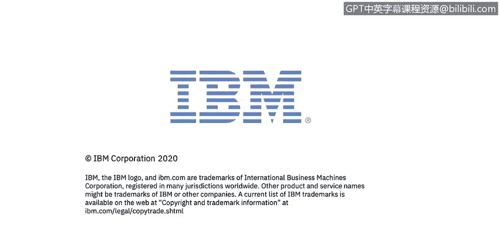

# 课程5：《渗透测试、事件响应与取证》：23：操作系统数据 🔍

在本节课中，我们将学习操作系统中的不同数据，包括易失性数据和非易失性数据。我们将了解当今存在的不同操作系统，并探讨哪些日志信息可能对取证分析有用。

---

## 数据状态：易失性与非易失性

根据美国国家标准与技术研究院的解释，操作系统数据同时存在于非易失性和易失性两种状态。

*   **非易失性数据** 指的是计算机关机后仍然持续存在的数据，例如存储在硬盘上的文件系统。
*   **易失性数据** 指的是活动系统上的数据，计算机关机后这些数据会丢失，例如系统当前进出的网络连接。

以下是易失性数据的一些例子：
*   **Slack空间**：文件系统中未使用的空间。
*   **空闲空间**：磁盘上可用的存储空间。
*   **网络配置与连接**：当前的网络设置和活动连接。
*   **运行中的进程**：系统当前正在执行的程序。
*   **已打开的文件**：当前会话中正在访问的文件。
*   **登录会话**：当前活动的用户登录信息。
*   **操作系统时间**：系统的当前时间。

所有这些数据都依赖于当前活动系统的会话状态。

非易失性数据的例子包括：
*   **配置文件**：系统和应用程序的设置文件。
*   **日志文件**：记录系统活动的文件。
*   **应用程序文件**：已安装的程序文件。
*   **数据文件**：用户创建和存储的文档等。
*   **交换文件和转储文件**：用于内存管理的文件。
*   **休眠文件或临时文件**：系统休眠或应用程序运行时产生的文件。

无论系统是否重启，这些数据都会保留在系统中。

---

## 数据收集的优先级 🎯

上一节我们介绍了两种数据状态，本节中我们来看看收集它们的顺序和优先级。我们总是希望从收集易失性数据开始，因为我们不知道还能访问它多久。

以下是我们应该获取的数据的优先级列表，从最重要到“有时间再获取”：

1.  **所有网络连接**：这是首要任务，因为如果计算机改变电源状态，这些信息可能会改变且无法恢复。大多数操作系统（Windows、Linux、Mac OS及其所有变体）都有列出其网络连接的方法。
2.  **登录会话**：当前活动的用户会话信息。
3.  **内存内容**：系统随机存取存储器中的数据。
4.  **任何打开且正在运行的进程以及打开的文件**：这些信息通常比较容易获取，不过一些第三方取证工具可以更便捷地捕获整个进程。
5.  **网络配置本身**：系统的IP地址、子网掩码、网关等设置。
6.  **操作系统时间**：系统的当前时间。

在本视频中，我们不会详细介绍所有工具，但在最终测验前我们会进行复习。

---

## 收集非易失性数据 💾

现在，让我们转向非易失性数据的收集。对于收集非易失性数据，我们有一个选择是在需要时关闭计算机。你需要考虑的是有哪些选项。

通常，这主要归结为两种不同的方法：
*   一种是**正常关机**，通常使用电源按钮或操作系统内的命令。
*   另一种是针对便携式设备（如笔记本电脑、手机等）的情况，即**移除电池**。

这种强制关机会带来问题，对于台式机来说，如果你直接拔掉墙上的电源插头，如果它们使用的是旋转硬盘，或者正处于读写数据的过程中，如果关机不当，这些数据可能会损坏。这一点需要牢记，因为数据的完整性始终是每位取证专家首要考虑的问题。

接下来，我们将收集实际的**文件系统数据**，这相当直接，可以使用U盘、外置硬盘来完成，如果需要也可以制作镜像。我们在关于从文件收集数据的视频中讨论过，是使用标准备份还是制作镜像。对于文件系统数据，两种方式都可以。

列出的**用户和组**信息是操作系统的一部分，你可以获取这些数据，以及**密码哈希值**，或者如果他们恰好有一个列出密码的文档，也可以获取。

**共享网络**：每个系统都有权限访问其他系统的能力，因此你可以查看哪些设备曾与此系统联网，这应该能让你收集到一些信息。

然后是**日志**：每个操作系统都有原生的日志功能，也有很多取证分析师使用的应用程序可以帮助收集这些日志。

---

## 日志收集场景 📝

在日志这个话题上，让我们花点时间看看在不同场景下你可能需要收集哪些不同的日志文件。

你应该收集的日志类型在很大程度上取决于正在分析的事件。这里我们有几个例子：网络攻击事件、未经授权的访问事件，或特洛伊木马、病毒或蠕虫攻击事件。

*   **在网络攻击的情况下**，你需要收集位于攻击路径上的所有网络设备的日志，包括边界路由器（互联网服务提供商提供的那个）。在这种情况下，防火墙规则库的日志可能也需要。
*   **对于未经授权的访问**，你需要保存Web服务器日志、应用服务器日志、应用程序本身的日志、路由器或交换机日志、防火墙日志、数据库日志以及入侵检测系统日志等，具体取决于你正在使用的取证工具或检测系统。
*   **最后，在特洛伊木马、病毒或蠕虫攻击的情况下**，除了与杀毒软件相关的实际事件日志外，你还需要保存杀毒软件的日志。

---

## 不同操作系统的取证要点 💻

当我询问IBM的系统信息和事件经理Raoul对不同操作系统的看法时，他是这样说的：

*   **Windows**：这是微软设计的、广泛使用的操作系统。Windows使用的文件系统包括FAT、exFAT、NTFS和ReFS。调查人员可以通过分析Windows的以下重要位置来寻找证据：**回收站、注册表、Thumbs.db文件、浏览器历史记录和打印池**。

*   **macOS**：macOS是一个基于UNIX的操作系统，包含Mach 3微内核和FreeBSD子系统。其用户界面是苹果风格的，而底层架构非常像UNIX。他还提到一个最佳实践：macOS提供了一种新颖的创建取证副本的技术。要做到这一点，你可以将嫌疑人的电脑置于**目标磁盘模式**。使用此模式，取证检查员借助两台PC之间的火线电缆连接创建硬盘的取证副本。本质上，如果你在重启Mac时按住字母T键，它会启动进入一种类似于外置硬盘的模式，当连接到另一个系统时，可以直接被复制。

*   **Linux**：这是一个开源的、类UNIX的、设计优雅的操作系统，兼容个人电脑、超级计算机、服务器、移动设备、网络设备和笔记本电脑。与其他操作系统不同，Linux拥有EXT家族的多种文件系统，包括EXT2、EXT3和EXT4。如果从犯罪现场恢复的是嵌入式Linux机器，它可以提供经验证据。在这种情况下，取证调查人员应分析以下文件夹和目录：
    *   `/etc`：系统配置目录，包含每个应用程序的单独配置文件。
    *   `/var/log`：包含应用程序和安全日志的目录，这些日志通常保留四到五周。
    *   `/home/[user]`：用户文件夹。此目录保存所有用户数据和配置信息。
    *   `/etc/passwd`：密码目录，其中包含用户账户信息。

---

## 总结

本节课中，我们一起学习了可以从操作系统中收集的数据类型。我们区分了**易失性数据**（关机后丢失）和**非易失性数据**（持久存储），并明确了取证时应优先收集易失性数据。我们还探讨了针对不同安全事件（如网络攻击、未授权访问、恶意软件攻击）需要收集的特定日志类型。最后，我们了解了Windows、macOS和Linux这三大主流操作系统在取证调查中的关键位置和特点。掌握这些知识是进行有效数字取证的基础。接下来，我们将学习应用程序数据。