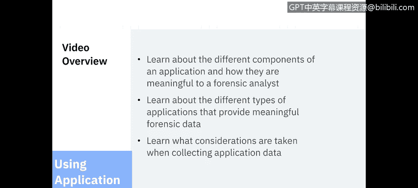
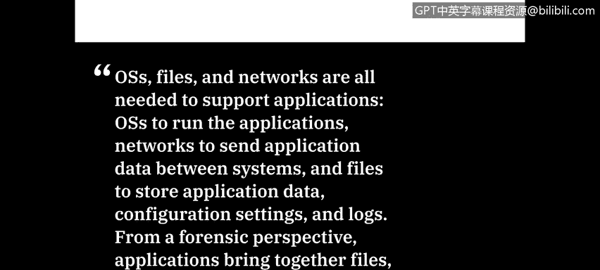
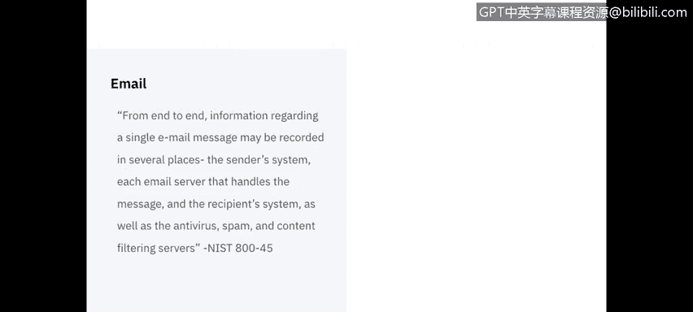
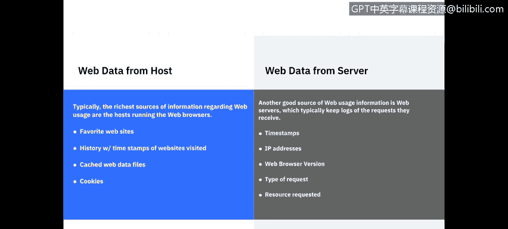
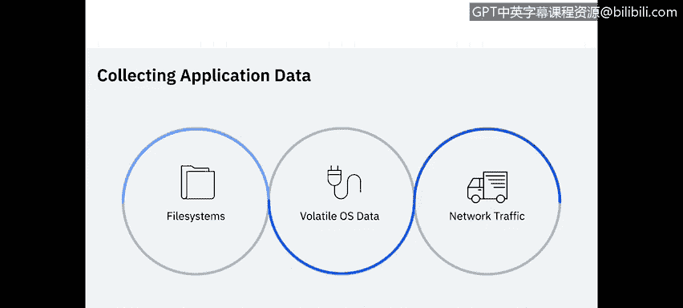

# 课程5：《渗透测试、事件响应与取证》：24：应用程序数据 📊

在本节课中，我们将学习应用程序的不同组成部分，以及它们对取证分析师的意义。我们还将了解能提供有价值取证数据的应用程序类型，以及在收集应用程序数据时需要考虑的因素。

---

## 应用程序的取证组件 🔍

上一节我们概述了课程内容，本节中我们来详细看看对取证分析师最重要的应用程序组件。

第一个组件是**配置设置**。配置设置可能是临时的，在特定应用程序会话期间动态设置，也可能是永久的。许多应用程序都有适用于所有用户的设置，同时也支持一些用户特定的设置。

以下是配置设置通常的存储方式：
*   **配置文件**：通常是文本文件或具有专有二进制格式的文件。它可能与应用程序存储在同一主机上，也可能不是。
*   **运行时选项**：应用程序允许通过命令行在运行时指定某些配置设置。
*   **源代码**：对于提供源代码的应用程序（如开源应用程序或脚本），用户或管理员指定的配置设置可以直接写入源代码中。

接下来，我们看看应用程序的**身份验证**机制。

以下是常见的应用程序身份验证类型：
*   **外部身份验证**：身份验证在目录服务器等外部系统上进行。这种情况下，外部系统可能比主机拥有更多信息。
*   **专有身份验证**：最常见的是应用程序特定的用户名和密码，而非操作系统（OS）级别的。
*   **传递身份验证**：应用程序直接使用操作系统的身份验证信息。
*   **主机用户环境**：主要在企业环境中看到，应用程序根据已批准用户的域来检查身份验证。

大多数应用程序会生成某种类型的**日志**，并将其记录到操作系统特定的日志或专有日志中。

以下是常见的日志类型：
*   **事件日志**：记录执行的操作、每个操作发生的日期和时间以及每个操作的结果。
*   **审计/安全日志**：专门跟踪被审计的活动，例如身份验证尝试。
*   **错误日志**：记录应用程序发生的错误及其时间戳。
*   **安装日志**：记录应用程序安装或更新的时间。
*   **调试日志**：通常只对软件开发人员有意义。

**数据**是一个非常广泛的术语，但几乎每个应用程序都专门设计用于以一种或多种方式处理数据，例如创建、显示、传输、接收或修改数据，以及保护和存储数据。

以下是应用程序数据文件的存储方式：
*   **文件格式**：可以是通用格式或专有格式。
*   **存储位置**：可能存储在多个不同的地方，例如数据库、临时文件（在内存或应用程序中）或永久文件中。
*   **临时文件**：需要注意的是，临时文件可能由于应用程序的不当关闭而产生，这些文件可能位于应用程序内部，或操作系统特定的位置。

**支持文件**在所有组件中可能提供的关键信息最少，但当其他方法都失败时，它可以提供一些信息碎片，有助于更好地理解数据。

以下是支持文件的类型：
*   **文档/手册**：许多应用程序附带安装的支持文档或用户手册，可以帮助分析师确定任何给定应用程序的用途以及应用程序可能存储支持文件的位置。
*   **链接/快捷方式**：在Windows中常被称为快捷方式，是指向其他内容的指针。分析师可以确定链接运行的程序及其位置。
*   **图形/图标**：通常关注度较低，但如果恢复了图标图像，分析师有时可以确定正在运行哪些可执行文件。

---

## 应用程序架构与取证意义 🏗️

了解了应用程序的各个组件后，本节我们来看看应用程序架构。应用程序架构告诉我们应用程序如何在逻辑上分离组件，这反过来让分析师能更好地了解应用程序数据将存储在哪里。

应用程序通常构建为以下几种架构模式：
*   **本地应用程序**：旨在将所有内容保留在主机本地。例如文本或图形编辑器以及办公生产力套件。
*   **客户端-服务器架构**：这是最复杂的结构，因为数据可能分布在本地主机、应用程序服务器和数据库服务器之间的2到4个位置。基于Web的应用程序用Web浏览器替代本地主机，并增加一个Web服务器。
*   **点对点应用程序**：设置为直接在主机之间共享信息，例如文件共享、即时消息或聊天应用程序。

某些类型的应用程序更可能成为取证分析的重点，包括电子邮件、网络使用、即时消息、文件共享、文档使用、安全应用程序和数据隐藏工具。让我们深入探讨其中几个以提供示例。

首先是**电子邮件**。电子邮件已成为人们进行电子通信最主要的方式之一。单封电子邮件包含大量可见和不可见的数据。在电子邮件表面，我们有**邮件头**（通常详细说明收件人）和包含内容的**邮件正文**。隐藏在邮件头中的信息包括发件人使用的电子邮件客户端类型、发送邮件的邮件服务器、邮件的重要性，以及是否存在特定内容类型（如附件或嵌入式图形）。端到端来看，关于单封电子邮件的**信息可能记录在多个地方**：发件人系统、处理邮件的每个电子邮件服务器、收件人系统，以及防病毒、垃圾邮件和内容过滤服务。

接下来是**网络使用**，它可以分为从主机收集的数据和从Web服务器收集的数据。我们可以从主机获取的Web数据通常位于Web浏览器应用程序中。分析师可以获取收藏的网站、带有时间戳的访问历史、缓存的Web数据文件以及任何保存的Cookie。另一方面，我们有**Web服务器**，它们通常会记录收到的请求。这些日志将为我们提供每个请求的时间戳、IP地址、发出请求的Web浏览器、请求类型以及请求的资源。即使无法从主机访问数据，Web数据也能提供大量有意义的信息。

最后要介绍的应用程序类型是**交互式通信**。这包括群聊、即时消息和音视频应用程序。群聊通常使用客户端-服务器架构。基于文本通信最流行的标准群聊协议是**互联网中继聊天（IRC）**。即时消息应用程序的配置设置可能包含用户信息、用户与之通信的用户列表、文件传输信息以及存档的消息或聊天会话。最后，随着音频和视频技术（如IP语音）的日益融合，人们被允许通过互联网等网络进行电话通话，从而提供了更多基于媒体的数据。

---

## 应用程序数据的收集 📥

在概述了应用程序数据之后，本视频的最后一部分将讨论这些数据的收集。这应该是对我们之前课程内容的复习，因此将是一个高层次的概述。

应用程序相关数据可能位于文件系统、易失性操作系统数据和网络流量中。

以下是不同类型数据中的应用程序信息：
*   **易失性操作系统数据**：可能包含应用程序使用的网络连接信息、系统上运行的应用程序进程、每个进程使用的命令行参数、应用程序持有的打开文件以及其他类型的支持信息。鉴于易失性数据的性质，应首先考虑收集这些数据。
*   **网络流量数据**：最相关的是用户到远程应用程序的连接，以及不同系统上应用程序组件之间的通信。其他网络流量记录也可能提供支持信息，例如应用程序进行远程打印的网络连接，以及应用程序客户端或其他组件为将应用程序组件的域名解析为IP地址而进行的DNS查询。

---

## 总结 📝

本节课中，我们一起学习了应用程序对取证分析至关重要的各个组件，包括配置设置、身份验证、日志、数据和支持文件。我们探讨了不同的应用程序架构（本地、客户端-服务器、点对点）及其对数据存储位置的影响。我们还深入了解了能提供丰富取证数据的特定应用程序类型，如电子邮件、网络使用和交互式通信工具。最后，我们回顾了从易失性内存、文件系统和网络流量中收集应用程序相关数据的关键考虑因素。理解这些概念对于有效进行数字取证调查至关重要。