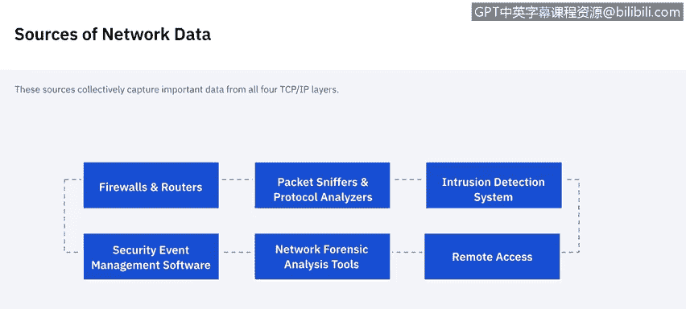
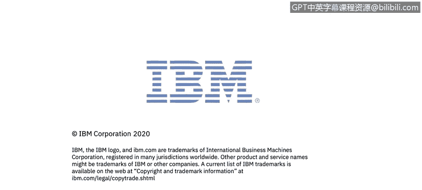

# 课程5：《渗透测试、事件响应与取证》：25：24_网络数据 🌐

在本节课中，我们将学习网络数据的基础知识，包括TCP/IP协议栈的基本原理及其在取证中的应用。我们还将探讨网络流量的不同来源，以及如何检查和分析这些数据。

## TCP/IP基础与取证意义

上一节我们介绍了课程概述，本节中我们来看看TCP/IP协议栈的基础知识及其在取证中的重要性。美国国家标准与技术研究院指出，分析师可以利用网络流量数据来重建和分析基于网络的攻击、不当的网络使用行为，并解决各种类型的操作问题。

术语“网络流量”指的是在有线或无线网络上主机之间进行的计算机网络通信。在我们开始深入探讨收集网络数据之前，理解TCP/IP及其在取证中的含义至关重要。

TCP/IP协议栈通常分为四层，每一层都包含对取证分析师有价值的信息。

以下是各层的简要说明：

*   **应用层**：该层使应用程序能够在应用服务器和客户端之间传输数据。最常见的例子包括**HTTP**、**DNS**、**FTP**、**SMTP**。这些协议是应用服务进行通信的方式。
*   **传输层**：该层负责封装数据以便在主机之间传输。传输层最常用的两种协议是**TCP**（传输控制协议）和**UDP**（用户数据报协议）。在这两种情况下，数据包都包含源端口号和目的端口号，这对取证分析师非常有用。
*   **网络层（IP层）**：该层负责跨网络路由数据包。**IP**（互联网协议）是TCP/IP的基础网络层协议。网络层其他常用的协议包括**ICMP**（互联网控制消息协议）和**IGMP**（互联网组管理协议）。ICMP是一种无连接协议，不保证其错误或状态消息的传递。由于它不用于传输应用数据，因此没有端口，而是使用消息类型来指示每条ICMP消息的用途。例如，ICMP消息类型“目的地不可达”有多个可能的代码，用于指示具体是什么不可达（网络、主机、协议等）。IP地址也经常通过一层间接寻址来使用，最常见的是通过**DNS**（域名服务）。当人们需要访问网络上的资源（如网站）时，他们输入的是域名（如 `www.nist.gov`），而不是服务的IP地址。这既便于记忆，也解决了IP地址可能变更而服务器名称不变的问题。
*   **数据链路层（硬件层）**：该层处理物理网络组件上的通信。最著名的数据链路层协议是以太网。

综上所述，正如美国国家标准与技术研究院的文章所引述：TCP/IP协议栈的四层都包含重要信息。硬件层提供有关物理组件的信息，而其他层则描述逻辑方面。例如，分析师可以将网络层中的IP地址映射到数据链路层中特定网卡（NIC）的**MAC地址**（物理标识符），从而识别出感兴趣的主机。结合IP协议号（网络层字段）和端口号（传输层字段），可以告诉分析师最可能正在使用或成为目标的是哪个应用程序。

当分析师开始检查数据时，他们通常依赖所有层的信息。他们最初可能只有有限的信息，很可能只是一个感兴趣的IP地址，或许还有协议和端口信息。

## 网络数据的主要来源

现在我们已经了解了网络数据的各层结构，接下来让我们深入探讨网络数据的主要来源。

以下是网络数据的主要来源：

*   **防火墙和路由器**：基于网络的设备（如防火墙和路由器）以及基于主机的设备（如个人防火墙）会根据一组规则检查网络流量并允许或拒绝其通过。防火墙和路由器通常配置为记录大多数或所有被拒绝的连接尝试和无连接数据包的基本信息，有些甚至会记录每一个数据包。执行网络地址转换（**NAT**）的基于网络的防火墙和路由器可能包含有关网络流量的额外有价值信息。一些防火墙还充当代理服务器。除了提供NAT和代理服务外，防火墙和路由器还可能执行其他功能，如入侵检测和**VPN**（虚拟专用网络）。
*   **数据包嗅探器**：数据包嗅探器旨在监视有线或无线网络上的网络流量并捕获数据包。通常，网络接口控制器（**NIC**）只接受专门发送给它的传入数据包。但是，当NIC被置于**混杂模式**时，它会接受它看到的所有传入数据包，而不管其预期的目标地址。大多数数据包嗅探器也是协议分析器，这意味着它们可以从单个数据包重组数据流，并解码使用数百或数千种不同协议中任何一种的通信。
*   **入侵检测系统（IDS）**：网络入侵检测系统（**NIDS**）执行数据包嗅探并分析网络流量，以识别可疑活动并记录相关信息。
*   **远程访问服务器**：远程访问服务器是诸如VPN网关和调制解调器服务器之类的设备，它们促进网络之间的连接。这通常涉及外部系统通过远程访问服务器连接到内部系统，但也可能包括内部系统连接到外部或其他内部系统。除了远程访问服务器，组织通常还使用多个专门设计用于提供对特定主机操作系统远程访问的应用程序。虽然大多数与远程访问相关的日志记录发生在远程访问服务器或应用程序服务器上，但在某些情况下，客户端也会记录这些信息，因此我们也应该寻找这些日志。
*   **安全事件管理软件（SEM）**：安全事件管理软件能够从各种与网络流量相关的安全事件数据源（如IDS日志、防火墙日志）导入安全事件信息，并在所有不同来源之间进行关联分析。它通常通过安全通道接收来自所有不同数据源的日志副本，将其转换为标准格式，然后通过匹配IP地址、时间戳和其他特征来识别相关事件。
*   **网络取证分析工具（NFAT）**：网络取证分析工具通常将数据包嗅探器、协议分析器和SEM软件的功能集成到单一产品中。因此，虽然SEM软件专注于所有现有数据源，但NFAT软件主要侧重于收集、检查和分析所有网络流量。它还提供了许多其他附加功能。

## 不同数据源的价值

既然我们知道了要寻找哪些不同的数据来源，但并非所有数据都具有同等价值。因此，我想谈谈我们数据源的价值，从IDS软件开始。

以下是不同数据源的价值分析：

*   **入侵检测系统（IDS）数据**：IDS数据很重要，因为它通常是检查可疑活动的起点。IDS不仅尝试在所有TCP/IP层识别恶意网络流量，而且还记录许多数据字段，有时还会捕获数据包，这些对于验证事件并将其与其他数据源关联起来非常有用。
*   **安全事件管理（SEM）软件**：理想情况下，SEM软件对取证极其有用，因为它能自动关联多个不同数据源的事件，然后提取相关信息并呈现给用户。
*   **网络取证分析工具（NFAT）软件**：NFAT软件专门设计用于辅助网络流量分析。因此，如果它监控了感兴趣的事件，它将始终具有价值。
*   **防火墙、路由器、代理服务器、远程访问服务器**：这些数据源本身通常只记录少量数据。分析长时间段内的数据可以指示总体趋势，例如被阻止连接尝试的增加等。然而，由于这些来源通常只记录每个事件的少量信息，因此数据本身对事件性质的洞察力有限。
*   **DHCP服务器**：DHCP服务器通常可以配置为记录每个IP地址分配对应的MAC地址以及时间戳。这对于分析师识别哪个主机使用特定IP地址执行了活动非常有帮助。
*   **数据包嗅探器**：在所有网络数据流量来源中，数据包嗅探器收集的网络活动信息最多。然而，缺点是它也包含了大量无关的数据（数百万或数十亿个数据包），并且通常不指示哪些数据包可能真正包含恶意活动。
*   **网络监控软件**：网络监控软件有助于识别与正常流量流的显著偏差，例如由分布式拒绝服务（**DDoS**）攻击引起的偏差，在此类攻击中，成百上千的系统同时对特定主机或网络发起攻击。
*   **互联网服务提供商（ISP）记录**：这些信息的主要价值在于将攻击追溯回其源头，特别是在攻击使用**欺骗性IP地址**时。

## 识别攻击者

关于从网络获取数据，我想讨论的最后一点是可能识别攻击者是谁。

在分析大多数攻击时，识别攻击者通常不是立即的主要关注点。确保攻击已停止并恢复系统数据始终是主要利益所在。

但可以采取以下措施：

*   **联系IP地址所有者**：有时可以帮助确定谁对某个IP地址负责，但这通常需要某种升级流程。
*   **寻求互联网服务提供商（ISP）的帮助**：这需要法院命令，并且通常只在最严重的攻击事件中才会进行。
*   **避免直接探测**：当您有一个IP地址时，本能可能是尝试ping它或发送数据。对于组织来说，通常不推荐这样做。
*   **查看IP地址历史**：可以查看IP地址的历史记录，寻找可疑活动的趋势。
*   **检查数据包内容**：数据包可能包含有关攻击者身份的信息。

重申一遍，我们的主要目标始终是确保黑客攻击被阻止并恢复系统数据。

本节课中我们一起学习了TCP/IP协议栈的基础知识、网络流量的多种来源及其在取证分析中的不同价值。理解这些概念是有效进行网络取证和事件响应的关键第一步。