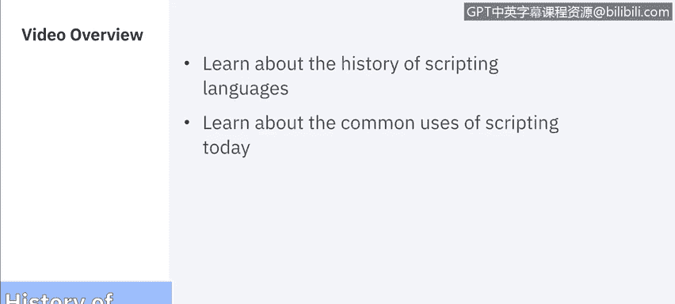
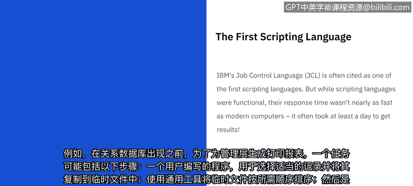
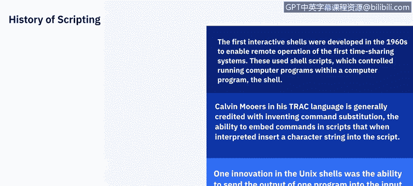
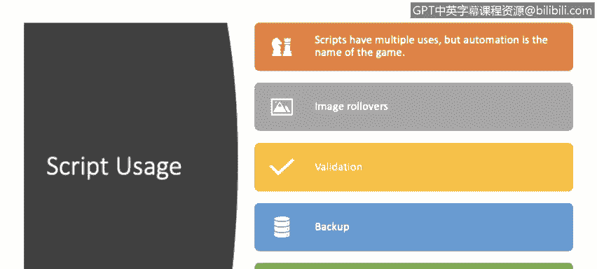
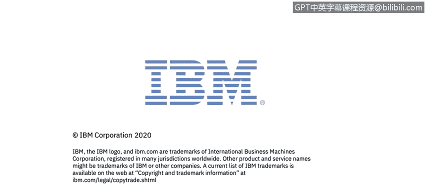

# 课程5：《渗透测试、事件响应与取证》：27：脚本编程历史 📜

在本节课中，我们将要学习脚本语言的发展历史及其在现代计算中的常见用途。我们将从早期的大型机时代开始，一直探讨到当今自动化任务中脚本的核心作用。

## 早期计算与批处理脚本

脚本自计算机诞生之初便已存在。事实上，在早期，脚本是使用计算机的唯一方式。在20世纪50年代和60年代，程序员将穿孔卡片提交给大型机操作员，机器以批处理模式运行。

IBM的作业控制语言（JCL）常被认为是首批脚本语言之一。虽然这些脚本语言功能完备，但其响应速度远不及现代计算机，通常至少需要一天才能获得结果。

在DOS和OS系统中，工作的基本单位是作业本身。一个作业包含一个或多个步骤，每个步骤都是运行一个特定程序的请求。

例如，在关系数据库出现之前，为管理层生成打印报告的作业可能包含以下步骤：
*   一个用户编写的程序，用于选择适当的记录并将其复制到临时文件。
*   使用通用实用程序对临时文件进行排序，使其符合要求的顺序。
*   一个用户编写的程序，以易于最终用户阅读的方式呈现信息，并包含小计等其他有用信息。
*   一个用户编写的程序，用于格式化最终用户信息的部分页面，以便在监视器或终端上显示。

最初，大型机系统主要面向批处理。许多批处理作业需要根据特定要求进行设置，例如主存储器、专用设备（如磁带、私有磁盘卷）以及使用特殊表格的打印机设置。

JCL的开发旨在确保在作业计划运行之前，所有必需的资源都可用。例如，许多系统（如Linux）允许在命令行上指定所需的数据集，因此可以由Shell进行替换或在程序运行时生成。在这些系统中，操作系统的作业调度程序对作业的需求知之甚少。相比之下，JCL明确指定了所有必需的数据集和设备。调度程序可以在释放作业运行之前预先分配/定位资源，这有助于避免某种形式的死锁。

## 交互式Shell的兴起

第一个交互式Shell是在20世纪60年代开发的，用于实现对首批分时系统的远程操作。这些系统使用Shell脚本，即在称为Shell的计算机程序内部控制运行计算机程序的脚本。

Calvin Mooers在其TRAC语言中，通常被认为是发明了命令替换功能的人，即能够在脚本中嵌入命令，然后由脚本解释并将生成的字符串插入到脚本中。

当这些交互式分时系统在20世纪60年代开始发展时，可编写脚本的Shell理念开始付诸实践。最早的例子之一是MULTICS项目。当几位贝尔实验室的程序员退出该项目后，他们决定实现自己的系统，并将其命名为Unix。Unix Shell的一项创新是能够将一个程序的输出发送到另一个程序的输入，这使得用一行Shell代码完成复杂任务成为可能。随后，Unix世界中出现了其他脚本语言，如用于文本处理的AWK和Sed。

上一节我们回顾了脚本语言的起源和发展，本节中我们来看看脚本在当今计算环境中的具体应用。

## 现代脚本的常见用途

为了讨论脚本在当今的用途，我们将请IBM Security的Raoul来分享他的见解。

我们使用脚本的目的是什么？脚本就是自动化工具。我们有一个任务，但不想每次都为每个任务编写命令。特别是因为编写一个程序可能需要10分钟到两周不等，具体取决于任务的复杂程度。因此，我们需要编写一个程序，允许我们在每次需要执行某个任务时调用它，例如针对特定数据库或特定文件集进行操作。是的，核心就是自动化。

以下是脚本在现代计算中的几个主要应用场景：
*   **商业应用**：例如，当我们看到那些图片轮播效果，你想查看某个商品的大图时，这背后就是脚本在起作用。
*   **表单验证**：当我们被要求填写信用卡信息等表单时，如果尝试在卡号字段输入姓名，字段会提示“需要卡号”，这种验证就是由脚本完成的。
*   **数据库备份**：我们不希望在需要执行备份时手动守在电脑旁。我们使用脚本在特定时间将备份执行到特定的硬件上。
*   **测试**：我们可能让人一遍又一遍地执行测试，但更高效的方式是使用脚本来自动执行测试。

## 总结

本节课中我们一起学习了脚本编程的历史。我们从早期大型机的批处理作业控制语言JCL开始，了解了脚本如何成为与计算机交互的基础。随后，我们探讨了交互式Shell和分时系统的出现如何催生了更强大的脚本功能，如命令替换和管道操作。最后，我们通过实际案例看到了脚本在现代计算中的核心价值——自动化，它被广泛应用于商业交互、数据验证、系统维护和软件测试等众多领域，极大地提升了效率和可靠性。