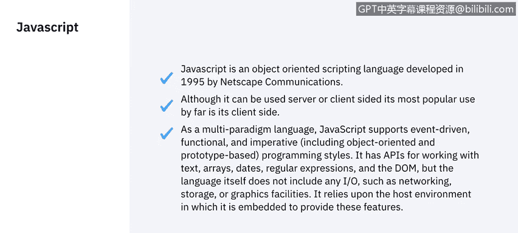
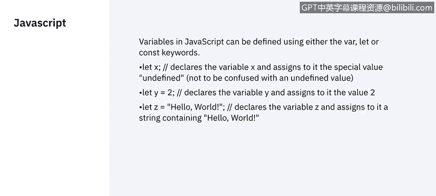
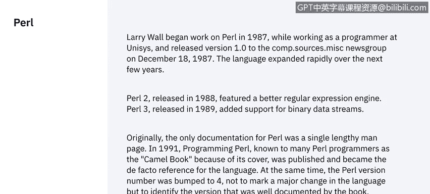
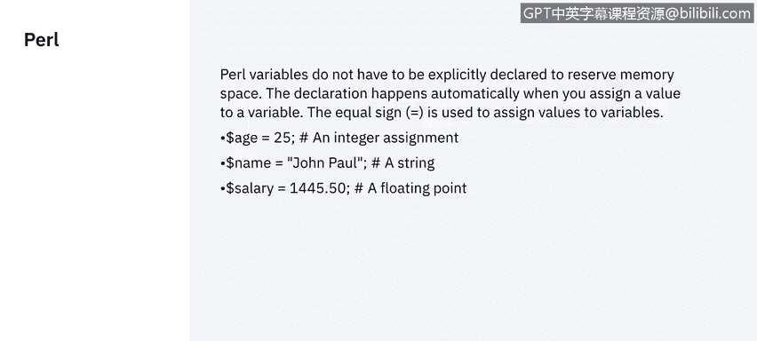
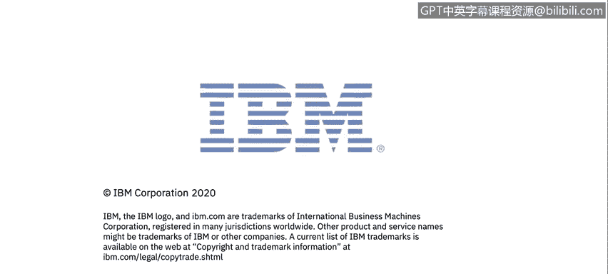

# 课程5：《渗透测试、事件响应与取证》：29：脚本语言 📜


在本节课中，我们将学习几种关键的脚本语言，了解它们的基本概念、用途以及如何在网络安全领域应用。脚本语言是自动化任务、分析数据和执行渗透测试的重要工具。

---

## JavaScript

上一节我们介绍了课程概述，本节中我们来看看第一种脚本语言：JavaScript。JavaScript 是一种面向对象的脚本语言，由 Netscape 通信公司于 1995 年开发。当时，网页内容非常单调，甚至动画 GIF 图也处于发展阶段。为了执行一系列行为使网页更具交互性，必须开发一种脚本语言。因此，Netscape 公司主导并率先创建了这种脚本语言。

JavaScript 被设计为能在几乎所有环境中运行。它轻量、安全，不允许人们像某些编程语言那样使用或共享资源。该语言不允许任何输入/输出操作，例如网络或存储操作。本质上，它运行在客户端机器上，可以将其视为一种受限制的环境。

在 JavaScript 中，变量可以使用 `var`、`const` 或 `let` 关键字来定义。我们也可以直接声明变量名来定义变量，并为其分配数字或任何类型的值。

以下是 JavaScript 中定义变量的示例：



```javascript
let y = "IBM";
// 或者声明一个完整的字符串
let y = "Hello";
// 请注意，任何文本，任何在引号之间的内容都是字符串。定义必须以分号结束。
```

---

## Bash 脚本

上一节我们探讨了 JavaScript，本节中我们来看看 Bash 脚本。Bash 是为 Unix 系统创建的 Shell。Shell 本质上是一个允许我们与操作系统通信的程序。Bash 包含一个脚本解释器，使我们能够创建小型、单一的程序来执行各种功能。

例如，如果我们想在 Unix 中创建用户列表，可以编写一个 Bash 脚本来完成。



Bash 中的变量定义非常简单。我们只需写出变量名、等号，然后赋值。

以下是 Bash 中定义和引用变量的示例：

```bash
variable_name=value
# 之后，要引用一个变量，我们使用美元符号（$）来调用它。
echo $variable_name
# 在脚本中，我们可以创建任意多的变量，然后在脚本内部调用它们。
```

---


## Perl 脚本

上一节我们介绍了 Bash，本节中我们来看看 Perl。Perl 是一种脚本语言，创建于 1987 年。它用于客户端与服务器之间的脚本编写，至今在网络页面中仍有大量应用。Perl 能创建非常有趣的功能，并且在某些方面遵循 JavaScript 的模式，但稍微复杂一些。

Perl 拥有非常忠实的支持者，并且互联网上有大量学习资源。

与 Bash 类似，Perl 中的变量无需预先声明。不同之处在于，在 Perl 中声明变量时，我们必须使用美元符号（`$`）来告诉解释器我们将要使用一个变量。



以下是 Perl 中变量的示例：

```perl
$variable_name = value;
```



---

## PowerShell

上一节我们讨论了 Perl，本节中我们来看看 PowerShell。Windows 直到 2016 年才广泛使用脚本语言，这比其他操作系统晚了近 20 到 30 年。因此，PowerShell 基本上是一个运行在 .NET 框架上的解释器，它允许我们在 Windows 环境中执行基本脚本。

我们可以使用 PowerShell 执行文件操作、事件网络操作等。机器代码，即我们所说的机器语言，是编译器对任何编程语言进行处理后的结果。实际上，用二进制编写脚本并不容易，通常是为特定任务而设计的。

---

## 二进制脚本

上一节我们介绍了 PowerShell，本节中我们来看看底层脚本。二进制脚本主要用于电信和二进制编码领域，例如当我们刻录 CD、DVD 或克隆存储系统时。二进制的核心思想是只有两种状态：0 和 1。存储这些状态的内存空间是计算中最小的单位，称为比特（bit）。在数据传输中，比特是计算传输速率的基本单位。

你可能已经看出，这不是一种你会经常使用的语言。在 Shell 脚本中嵌入二进制负载的想法，通常是为了使用较小的数据包来覆盖程序中的库或文件，无论这个程序是你编写的还是正在更新的。不过，这通常也通过使用十六进制脚本来完成，因为它更易于读写。

---


## 十六进制脚本

上一节我们探讨了二进制，本节中我们来看看十六进制脚本。十六进制脚本主要基于数学，它是一种更易于阅读机器语言的方式。它主要用于更新软件时，覆盖十六进制数值比逐个覆盖比特更快，然后对已编译的机器代码进行加密、更改并重新编译。

大多数公司通过覆盖文件中的十六进制数值来更新软件。它也可以用于监视某些值，了解程序在内存中进行了哪些更改，用于故障排除和调试。

对于普通计算机工程师来说，除非你是非常专业的调试人员，或者正在调试应用程序执行程序等，否则不太可能经常使用十六进制代码。

---

## 总结




本节课中，我们一起学习了多种脚本语言：从用于网页交互的 **JavaScript**，到 Unix 系统自动化的 **Bash**，再到功能强大的 **Perl** 和 Windows 环境的 **PowerShell**。我们还探讨了底层的 **二进制脚本** 和更易读写的 **十六进制脚本** 及其在软件更新和调试中的特殊用途。理解这些脚本语言的基本概念和用途，是成为一名网络安全分析师的重要基础。