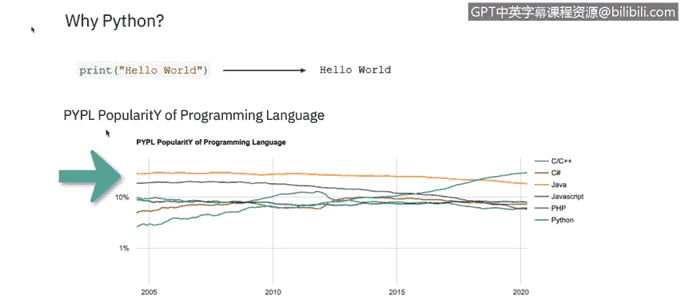
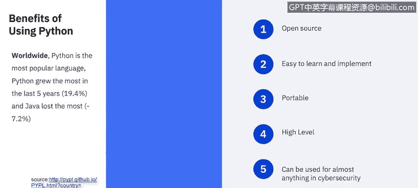
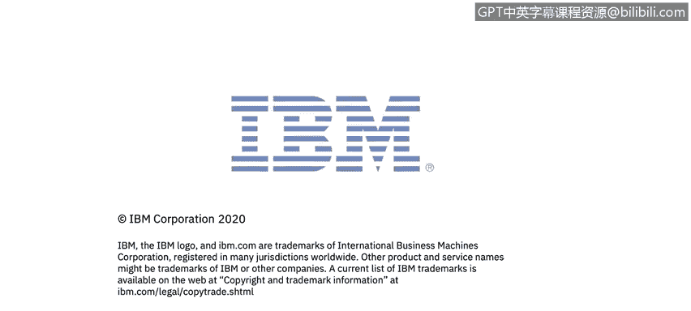

# 课程5：《渗透测试、事件响应与取证》：5：ython基础 🐍

在本节课中，我们将要学习Python脚本语言的基础知识，了解它在网络安全领域中的应用与优势。

## 概述

Python是一种脚本语言，诞生于1991年，它使用解释器逐行翻译代码。Python被广泛用于开发基于Web和软件的应用程序。虽然它在访问底层计算机功能方面不如C等语言强大，但在Web应用、图形用户界面、网络编程以及其他重要的网络安全应用中需求日益增长。Python是一门优秀的入门语言，能帮助你后续学习其他面向对象语言，甚至有助于理解那些技术上并非面向对象的语言。在深入学习Java、C、PHP等课程中提到的其他常用语言之前，学习Python是开启网络安全职业生涯的重要第一步。

## Python的优势与应用



上一节我们介绍了Python的基本概念，本节中我们来看看Python的具体优势及其在网络安全领域的应用。

美国国家网络安全职业与学习研究所认为Python在多个信息安全领域都很有用。Python为用户提供了包含大量现成函数的库，这使得创建应用程序比从零开始容易得多。作为一名网络安全专业人员，你可以利用Python开发自己的分析工具、黑客脚本并设计安全程序。

Python不要求用户学习计算机最底层的运作原理，但功能非常全面。以下是一个简单的“Hello world”示例：

```python
print("Hello world")
```

从下图可以看出，根据PYPL编程语言流行度指数（该指数通过分析Google上语言教程的搜索频率得出），Python被公认为最流行的脚本语言。


现在，让我们深入探讨使用Python的好处。Python的设计和功能为初学者作为第一门脚本语言提供了诸多益处。

### Python的优势列表

以下是Python作为首选脚本语言的主要优势：

1.  **开源免费**：ython是作为开源编程语言开发的，类似于Linux是开源操作系统。其开源特性形成了一个强大的开发者社区，共同支持并推动语言发展。由于开源，有大量可用信息，且使用Python是免费的。
2.  **易于学习与实现**：ython被有意设计得简单、直接、轻量，与其他语言相比，完成任务所需的代码量更少。事实上，Python通常比C或Java等其他编程语言所需的代码量少得多。其直接的结构意味着学习曲线更短，尤其适合脚本编程新手。互联网上有大量免费的Python学习资源，包括视频和示例项目。鉴于网上有海量的免费材料，几乎任何人都可以在不上正式课程的情况下掌握Python的实用知识。
3.  **可移植性**：ython可以在Windows、Linux和Unix系统上使用。
4.  **高级语言特性**：ython像C++一样是通用语言，但它还具有高级语言的额外优势。高级意味着更用户友好，用对人类思维更直观的关键词取代了晦涩的术语。Python的结构使其更易于学习和实现。
5.  **可读性与易调试**：ython直接的设计和易用性也提高了其代码的可读性。更高的可读性使得调试代码更加直接，这意味着即使是初级或初学者程序员也能相当容易地排查和调试自己的代码，并且整体调试时间可以大大缩短。
6.  **在网络安全中用途广泛**：由于Python的学习曲线通常较短，它已成为网络安全领域的首选编程语言，该领域的许多人编程背景有限。Python的易用性意味着任何积累了相对较强技术背景的网络安全专业人员都可以快速学习Python语言的基础知识并开始编程和实现代码。凭借对Python和编程概念的深入理解，网络安全专业人员几乎可以使用Python代码完成他们需要的任何任务。例如，Python被大量用于恶意软件分析、主机发现、数据包解码、服务器访问、端口扫描和网络扫描等。考虑到Python在脚本编写、任务自动化和数据分析方面如此高效，随着网络安全变得越来越重要，Python的流行度上升是可以理解的。
7.  **拥有丰富的库**：如上所述，Python的易用性无疑是使其成为网络安全专业人员首选语言的最重要因素之一，但Python庞大的模块库也是一个主导因素。Python因其广泛的库而闻名并被广泛使用，这意味着网络安全专业人员无需为常见任务重复造轮子，在大多数情况下，可以快速找到现成的网络安全分析或渗透测试工具。




## 总结


本节课中我们一起学习了Python的基础知识。我们了解到Python是一种强大、易学且用途广泛的脚本语言，特别适合网络安全领域的初学者和专业人士。它的开源特性、丰富的库、出色的可读性以及广泛的应用场景（从恶意软件分析到网络扫描），使其成为构建安全工具和自动化任务的理想选择。掌握Python是迈向成功网络安全职业生涯的关键一步。