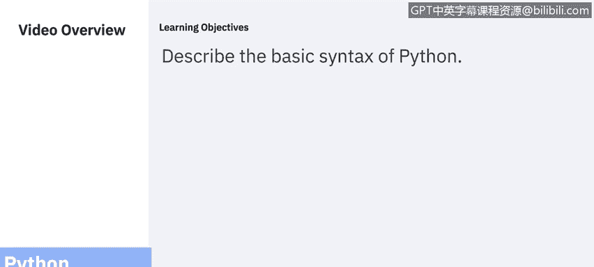
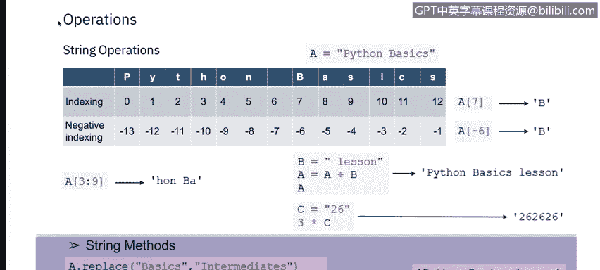

# 课程5：《渗透测试、事件响应与取证》：31：ython入门 🐍



在本节课中，我们将要学习Python编程语言的基础语法。我们将从如何执行Python代码开始，逐步了解变量、数据类型、字符串以及各种运算符。这些基础知识是后续进行网络安全脚本编写和自动化任务的重要前提。

## 代码执行与缩进

Python语法可以通过在命令行中直接编写代码来执行，也可以通过创建扩展名为 `.py` 的文件，并在命令行中运行该文件来执行。

缩进指的是代码行开头的空格。在其他编程语言中，代码缩进仅用于提高可读性。但在Python中，缩进至关重要。**Python使用缩进来表示代码块**。

空格的数量由程序员决定，但必须至少有一个。需要注意的是，在同一个代码块中，必须使用相同数量的空格，否则Python会报错。

## 变量

上一节我们介绍了代码结构，本节中我们来看看如何存储数据。在Python中，当你为某个名称赋值时，就创建了一个变量。变量是用于存储数据值的容器。与其他脚本语言不同，Python没有声明变量的命令。当你首次为其赋值时，变量就被创建了。

此外，变量不需要声明为任何特定类型，甚至在设置之后还可以更改类型。字符串变量可以使用单引号或双引号来声明。

以下是关于变量命名的一些规则：
*   变量名必须以字母或下划线字符开头。
*   变量名不能以数字开头。
*   变量名只能包含字母数字字符和下划线。
*   变量名区分大小写。例如，小写的 `age` 和大写的 `Age` 是两个不同的变量。

Python允许在一行中为多个变量赋值，也可以在一行中将同一个值赋给多个变量。

Python的 `print` 语句通常用于输出变量。要组合文本和变量，Python使用加号 `+` 字符。

## 数据类型

变量可以存储不同类型的数据，不同类型的数据可以执行不同的操作。在编程中，数据类型是一个重要的概念。

Python默认内置了以下类别的数据类型：
*   **int**：整数
*   **float**：浮点数（实数）
*   **complex**：复数
*   **bool**：布尔值
*   **str**：字符串

让我们更深入地了解其中几种数据类型。在Python中，当你为变量赋值时，就设定了其数据类型。

Python中有三种数值类型：
1.  **int（整数）**：是正或负的整数，没有小数，长度不限。
2.  **float（浮点数）**：是正或负的数，包含一个或多个小数。浮点数也可以是带有 `e` 表示10的幂的科学计数法数字。
3.  **complex（复数）**：写法是 `a + bj`，其中 `j` 是虚部。


你可以使用 `int()`、`float()` 和 `complex()` 方法进行类型转换。有时你可能希望为变量指定一个类型，这可以通过**类型转换**来完成。Python是一门面向对象的语言，因此它使用类来定义数据类型，包括其原始类型。

## 字符串

现在，让我们来谈谈Python字符串。Python中的字符串字面量由单引号或双引号包围。`‘Hello’` 和 `“Hello”` 是相同的。你可以使用 `print()` 函数显示字符串字面量。

通过变量名后跟等号和字符串，可以将字符串赋值给变量。例如：
```python
a = “Python basics”
```

列表允许你将一组枚举项存储在一个位置，并通过其位置或索引来访问项。使用索引时，在本例中，第7个位置的值是 `‘B’`。

我们还可以使用负索引。不使用从0开始的索引，而使用从-1向下的索引。在本例中，索引-7的值是 `‘B’`。

你也可以使用索引切片，如本例所示：`a[3:9]`。从上表可以看出，这相当于 `‘HON BA’`。


以下是算术运算符的一些例子：
*   如果 `b = “ lesson”`，那么 `a + b` 的结果是 `“Python basics lesson”`。
*   如果 `c = 26`，那么 `c * 3` 的结果是 `262626`。

我们还应该回顾一些字符串方法：
*   `a.replace(“basics”, “intermediates”)` 的结果是 `“Python intermediates lesson”`。
*   而执行 `a = a.replace(“basics”, “intermediates”)` 后，`a` 的结果将是 `“Python intermediates lesson”`。

## 运算符

在接下来的幻灯片中，你可以看到Python中可用的不同运算符。

主要有两种操作：
1.  **算术运算符**：用于对数值执行常见的数学运算。
2.  **比较运算符**：用于比较两个值。

Python中还有其他可用的运算符：
*   **赋值运算符**：用于为变量赋值。
*   **逻辑运算符**：用于组合条件语句。
*   **身份运算符**：用于比较对象，不是看它们是否相等，而是看它们是否是内存中同一个对象。
*   **成员运算符**：用于测试序列是否存在于对象中。
*   **位运算符**：用于比较二进制数。

## 其他重要概念


屏幕上显示的三个大于号 `>>>` 表示示例代码。



关于额外的语法规范，你可以查阅 **PEP 8 Python 风格指南**。这是一套关于如何格式化Python代码以最大化其可读性的规则。按照规范编写代码有助于使由许多作者编写的大型代码库更加统一和可预测。PEP 是 “Python Enhancement Proposal”（Python 增强提案）的缩写。

现在让我们谈谈 `.py` 文件。它是一个用Python编写的程序文件或脚本。可以用文本编辑器创建和编辑，但需要Python解释器来运行。`.py` 文件通常用于编程、Web服务器和其他计算机系统管理。

最后，**注释**可用于解释Python代码。注释可以使代码更具可读性，或在测试代码时防止执行。注释以井号 `#` 开头，Python会忽略它们。

---


本节课中我们一起学习了Python的基础语法，包括代码执行方式、缩进规则、变量的创建与命名、主要数据类型（特别是数值和字符串）、以及各种运算符的用途。我们还了解了代码规范（PEP 8）、`.py` 文件的作用以及注释的写法。这些是编写任何Python程序，包括网络安全相关脚本的基石。