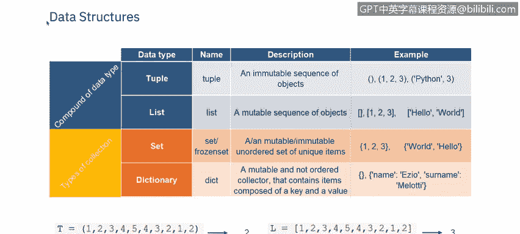
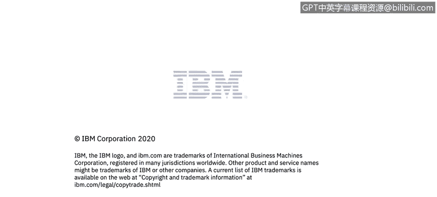

# 课程5：《渗透测试、事件响应与取证》：32：31_数据结构

## 概述
在本节课中，我们将要学习Python中的数据结构，以及条件和分支的基本语法。理解这些概念是编写有效程序的基础。


---

## Python数据结构 🧱
数据结构是一种组织和存储数据的方式，以便我们能高效地访问和修改它。

### 元组
Python中的元组是一个异构的容器，用于存放多个项目。这可能会让你联想到数组。但由于Python不支持数组，我们使用元组和列表。

要声明一个Python元组，你需要在圆括号内键入一个由逗号分隔的项目列表，然后将其赋值给一个变量。

```python
my_tuple = (1, "hello", 3.14)
```

当你希望其中的项目在未来不被改变时，应该使用元组，因为元组是不可变的。其内部元素无法更改。

### 列表
列表是可变的，它们可以改变，并且项目在方括号内由逗号分隔。

```python
my_list = [1, 2, 3]
```

### 集合
集合可以是可变的或不可变的，具体取决于它是常规集合还是冻结集合。集合不保存重复值，并且是无序的。

```python
my_set = {1, 2, 3}
```



要对集合执行操作，Python为我们提供了一系列函数和方法。

### 字典
字典使用花括号，就像集合一样，但它以键值对的形式存储数据，而不是像集合那样存储单个值。所有键必须是唯一的，并通过冒号与值配对。键值对之间用逗号分隔。

```python
my_dict = {"name": "Alice", "age": 30}
```

---

## 条件与分支 🔀
上一节我们介绍了如何存储数据，本节中我们来看看如何根据条件控制程序的流程。

当你创建程序时，几乎总是需要检查条件，并根据条件是真是假来改变程序的行为。最简单的条件语句是 `if`。

### `if` 语句
让我们建立第一个条件。如果条件为真，它将执行任务一。如果返回假，它将切换到另一个条件（如果存在的话）。


### `elif` 语句
如果我们在主条件中使用 `elif` 语句，它代表“否则如果”，用于检查多个条件。如果条件二存在且为真，它将执行任务二；如果为假，则执行下一个条件以进行任务三。

### `else` 语句
当所有先前的条件都不满足时，使用 `else`。

以下是条件语句的基本结构：
```python
if condition1:
    # 执行任务1
elif condition2:
    # 执行任务2
else:
    # 执行任务3
```

---

## 条件语句示例 📝
让我们通过一些例子来更好地理解条件语句。

在第一个例子中，我们总是会打印“你好”和“你好吗”。然后我们有两个不同的 `if` 语句。如果变量名是“Antonio”，它会打印“你好，Antonio”。如果变量名是“Martina”，它会跳过那一行。

第二个例子展示了一个 `if-elif-else` 的场景。如果 `a` 大于0，它会打印“a是正数”。如果检查 `a` 发现它小于0，它会执行其 `elif` 条件并打印“a是负数”。如果 `a` 正好是0，既不满足 `if` 也不满足 `elif` 条件，它将输出 `else` 部分的“a是0”。

---

## 循环 🔄
现在，我们可以讨论如何重复执行任务。如果你想打印一个列表的元素，如果只有三个项目，很容易做到 `print(0)`，`print(1)`，`print(2)`。但如果超过1000个项目，你该怎么办？循环就是为了帮助处理重复性任务而存在的。

为了实现这一点，循环使用 `range` 函数。这是一个Python内置函数，它返回一个遵循特定模式的序列，最常见的是连续的整数，从而满足为 `for` 语句提供迭代序列的要求。

### `for` 循环
我们首先要看的是 `for` 循环。传统上，当你有一段代码想要重复固定次数时，使用 `for` 循环。Python的 `for` 语句按顺序遍历序列的成员，每次执行代码块。

```python
for i in range(5):
    print(i)
```


### `while` 循环
`while` 循环与 `for` 循环的不同之处在于，它们只在满足某个条件时才运行。在这个例子中，我们想要打印列表 `L` 中的元素，直到出现第一个负数。只要条件为真，循环就会继续运行。一旦条件为假，循环就结束。

```python
while condition:
    # 执行代码
```

---




## 总结
本节课中，我们一起学习了Python的核心数据结构，包括元组、列表、集合和字典，以及它们各自的特性和用途。我们还探讨了如何使用 `if`、`elif` 和 `else` 语句来控制程序的条件分支。最后，我们介绍了 `for` 循环和 `while` 循环，它们是自动化重复任务、提高代码效率的强大工具。掌握这些基础知识是迈向更复杂编程和网络安全分析任务的重要一步。