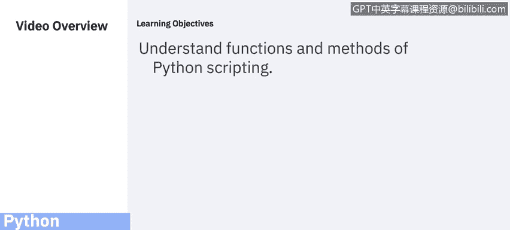

# 课程5：《渗透测试、事件响应与取证》：33：函数和方法 🐍

在本节课中，我们将要学习Python编程中的核心概念：函数和方法。理解它们如何工作，对于编写高效、可重用的脚本至关重要。

---

## 概述



函数和方法是组织代码、实现特定功能的基本单元。本节将介绍函数的定义、调用、参数传递，并解释方法与函数的区别。

---

## 什么是函数？

函数是一段仅在调用时才会运行的代码块。你可以向函数传递数据（称为参数），函数也可以返回数据作为结果。

Python内置了许多有用的函数，例如：
*   `type()`: 检查变量类型。
*   `len()`: 获取序列长度。
*   `sum()`: 计算序列总和。
*   `float()`: 将数据转换为浮点数。
*   `print()`: 输出信息。

我们在之前的课程中已经接触过其中一部分。

---

## 如何定义和调用函数？

在Python中，使用 `def` 关键字来定义函数。调用函数时，使用函数名后跟括号 `()`。

以下是定义和调用函数的语法示例：

```python
def my_function():
    print("Hello from a function")

# 调用函数
my_function()
```

上一节我们介绍了函数的基本概念，本节中我们来看看如何向函数传递信息。

---

## 参数与实参

信息可以通过参数传递给函数。参数在函数名后的括号内指定。你可以添加任意数量的参数，只需用逗号分隔。

术语“参数”和“实参”通常可以互换使用，都指传递给函数的信息。严格来说：
*   **参数** 是函数定义时，括号内列出的变量。
*   **实参** 是函数调用时，传递给函数的具体值。

以下是一个带参数的函数示例：

```python
def greet(name):
    print("Hello, " + name)

greet("Alice")
greet("Bob")
```


默认情况下，必须使用正确数量的实参来调用函数。这意味着如果你的函数期望两个参数，你就必须传递两个实参，不能多也不能少。

---

## 为什么使用函数？

使用函数主要有以下好处：
*   **组织代码**：将一系列命令封装成独立的单元。
*   **提高可读性**：使代码结构更清晰，易于理解。
*   **代码复用**：定义的函数可以在程序中多次调用，避免重复编写相同代码。

了解了函数的基本用法后，我们来看看与之相关的另一个概念：方法。

---

## 方法与函数的区别

Python中的方法与函数非常相似，但有两个主要区别：
1.  方法是与**对象**和**类**相关联的。
2.  方法可以访问其所属**类**内部包含的数据。

简单来说，方法是作用于特定对象上的函数。我们将在后续关于类和对象的课程中深入探讨。

---

## 总结


本节课中我们一起学习了：
1.  **函数**是可调用的代码块，用于执行特定任务，并能接收参数和返回值。
2.  使用 `def` 关键字定义函数，通过函数名加括号 `()` 调用函数。
3.  **参数**用于向函数传递信息，调用时需提供正确数量的**实参**。
4.  使用函数可以提高代码的组织性、可读性和复用性。
5.  **方法**是隶属于类或对象的函数，可以操作对象内部的数据。


在接下来的视频中，我们将学习更多关于Python库的知识。