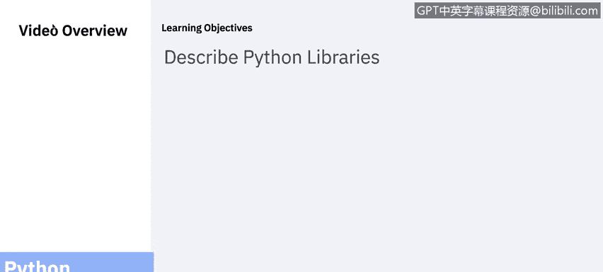
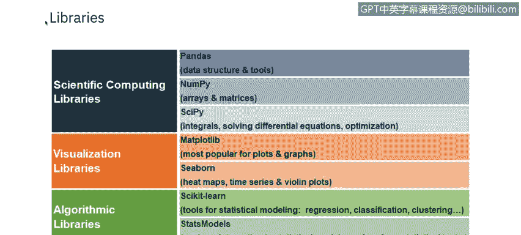
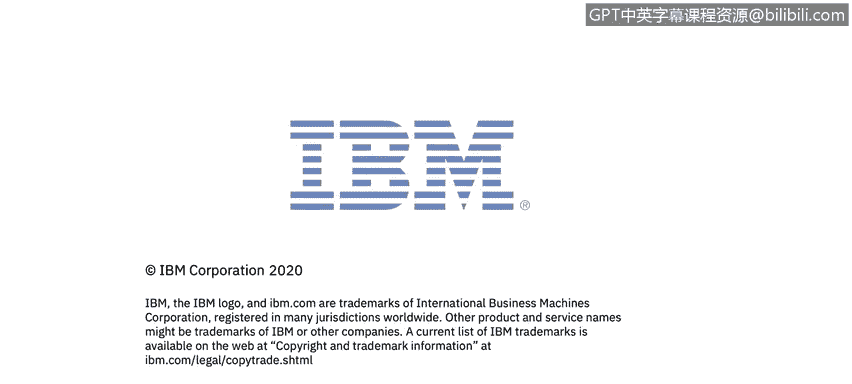

# 课程5：《渗透测试、事件响应与取证》：5：ython库 🐍

在本节课中，我们将要学习Python库的基本概念，了解一些常用的库及其功能，并探讨一个具体的应用目标。

## 概述

Python库是一个包含函数和方法的集合，它允许你无需编写自己的代码即可执行许多操作。这极大地提高了开发效率，并使得复杂任务变得简单。

## 常用Python库简介

以下是Python中可用的一些库的简要介绍。它们被分成了不同的功能类别。

*   **Pandas**：提供易于使用的数据结构。
*   **NumPy**：是数值计算的基础包，它定义了数值数组和矩阵类型以及它们的基本操作。
*   **SciPy**：是SciPy栈的一个组成部分，提供了许多数值计算例程。
*   **Matplotlib**：是一个成熟且流行的绘图包，提供出版质量的2D绘图以及基础的3D绘图功能。
*   **Seaborn**：用于开发热图、时间序列图和小提琴图。
*   **Scikit-learn**：是一个机器学习算法和工具的集合。
*   **Statsmodels**：用于探索数据、估计统计模型和执行统计检验。

正如你所见，许多库根据其功能被归入非常不同的类别。

## 应用目标与练习

上一节我们介绍了Python库的基本概念，本节中我们来看看一个具体的应用目标。

我们想要构建一个能够执行以下操作的应用程序。

以下是该应用程序需要实现的功能列表：
*   请求用户输入一个数字。
*   计算该数字的质因数分解。
*   打印一个字典，其中键是质因数，值是相应的幂指数。
*   迭代此操作。
*   如果用户要求退出，则结束应用程序。

你可以根据课程提供的实验步骤，在自己的计算机上完成这个练习。

## 总结

本节课中我们一起学习了Python库的定义，认识了几种在数据分析、科学计算和机器学习等领域常用的库，并了解了一个关于质因数分解的应用程序目标。通过利用这些库，你可以更高效地完成复杂的编程任务。