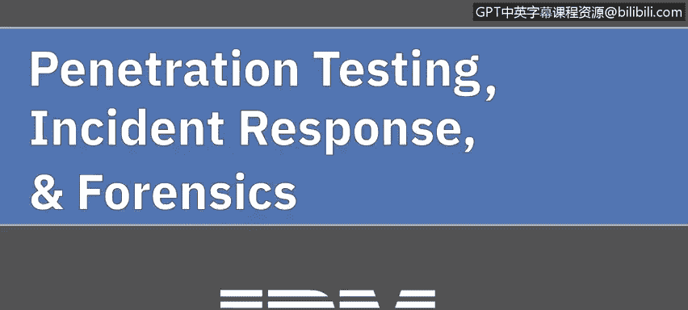
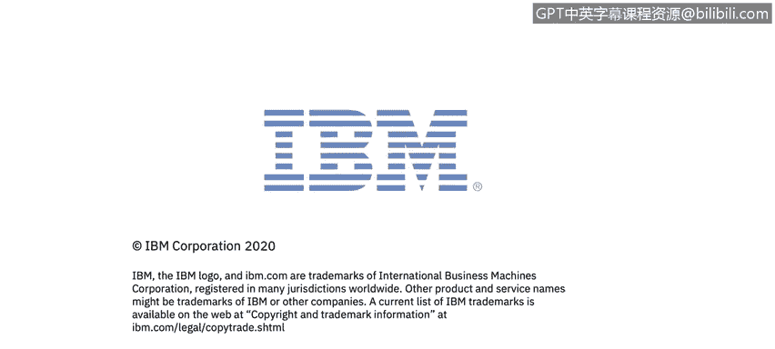

# 课程5：《渗透测试、事件响应与取证》：35：0_01_渗透测试简介

在本节课中，我们将学习渗透测试的基础知识。我们将探讨渗透测试的定义，分解其攻击阶段，并了解相关的工具与伦理法律考量。

欢迎学习由IBM带来的《渗透测试、事件响应与取证》。

我们将从探讨渗透测试开始本课程。在本课程中，我们将讨论什么是渗透测试。我们会分解渗透攻击的不同阶段，例如规划、侦察、攻击本身以及报告阶段。

上一节我们介绍了课程的整体目标，本节中我们来看看渗透测试的具体阶段。以下是渗透测试通常包含的几个关键阶段：

*   **规划阶段**：在此阶段，测试团队定义测试的范围、目标、规则和授权。
*   **侦察/发现阶段**：此阶段涉及信息收集，目标是了解目标系统的结构、漏洞和潜在入口点。
*   **攻击阶段**：这是执行模拟攻击的阶段，旨在利用已发现的漏洞获取访问权限或达成特定目标。
*   **报告阶段**：测试完成后，团队需整理发现的问题、利用过程、风险等级以及修复建议，形成详细报告。

接下来，我们将继续探讨执行渗透测试时使用的工具。我们将讨论进行渗透测试时使用的不同工具，并以讨论进行渗透测试所涉及的伦理和法律后果作为结束。

本节课中，我们一起学习了渗透测试的基本概念，包括其定义、核心阶段（规划、侦察、攻击、报告）以及相关的工具与伦理法律框架。理解这些基础知识是成为一名合格网络安全分析师的重要一步。