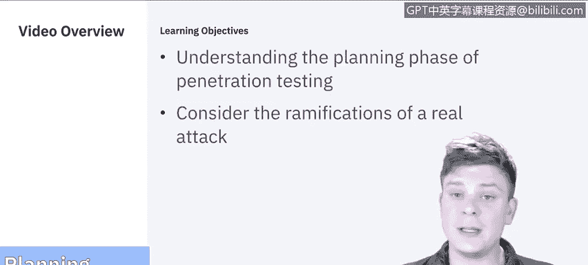
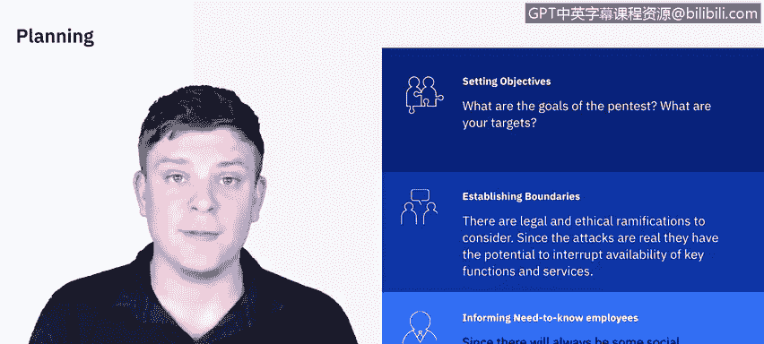

# 课程5：《渗透测试、事件响应与取证》：37：2_01_渗透测试规划

在本节课中，我们将要学习渗透测试的第一个阶段：规划。我们将详细分解规划阶段的各个组成部分，并探讨对真实系统进行真实攻击可能带来的后果。

上一节我们介绍了课程概述，本节中我们来看看渗透测试的规划阶段。

规划是渗透测试的第一步。在此阶段，你需要设定明确的目标。这意味着你需要与客户会面，详细讨论渗透测试的具体目标是什么。

以下是规划阶段需要考虑的关键要素：

*   **设定目标**：明确测试的焦点。目标是针对特定数据、特定个人或群体，还是像之前模块讨论的那样，专注于网络、应用程序或某个系统？这需要全面考虑。
*   **签订合同**：将所有约定写入合同至关重要。合同将界定你被允许和禁止的操作范围。
*   **确立边界**：在设定边界时，必须考虑对真实系统、产品或服务进行真实攻击所涉及的法律和道德后果。你的行为很可能会影响这些产品和服务的可用性。
*   **权衡细节**：需要考虑诸多细节，例如：我们是否在工作日进行测试？在周末进行？测试的深度如何？是进行到底，还是仅仅获取访问权限即止？
*   **书面确认**：所有这些边界都需要以书面形式确定。因为如果超出了设定的边界，很可能需要承担相应的法律后果。
*   **通知相关人员**：最后需要考虑的是，是否需要通知必要的知情人员。渗透测试的整个目的是模拟真实世界的攻击，但你肯定也不希望因为在测试过程中进行社会工程学攻击，或试图进入无权进入的物理空间而被逮捕。所有这些因素都需要仔细权衡，并在规划阶段明确列出。

以上主要是我们在规划阶段需要考虑的内容。下一阶段，我们将学习如何收集信息，即发现阶段。

本节课中我们一起学习了渗透测试规划阶段的核心任务。我们了解到，规划阶段的核心在于通过与客户沟通明确测试目标，并将所有行动范围、法律边界和道德考量以合同形式书面确定，这是确保测试合法、合规、有效进行的基础。