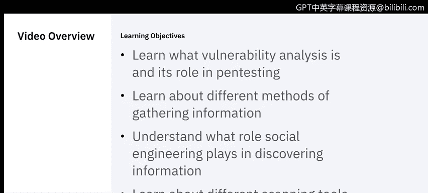
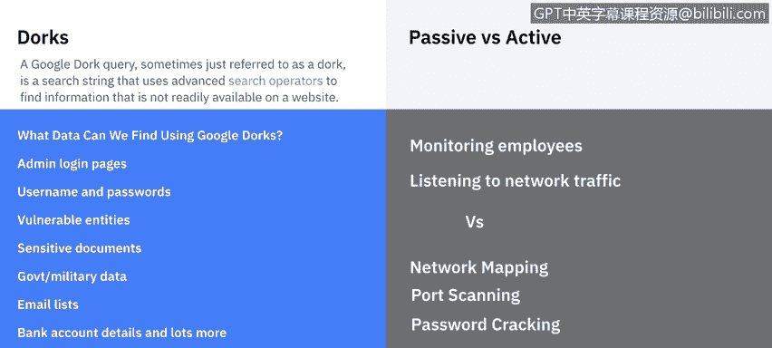
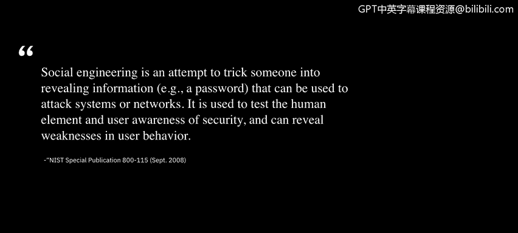

# 课程5：《渗透测试、事件响应与取证》：38：3_03_渗透测试-发现阶段

在本节课中，我们将要学习渗透测试的“发现”阶段。我们将了解漏洞分析的作用，并介绍用于信息收集的各种方法和工具。课程分为两部分：首先讲解漏洞分析的基础知识，然后由IBM的系统信息与事件经理Raoul深入探讨具体的发现技术。

## 漏洞分析的作用

上一节我们介绍了渗透测试的整体流程，本节中我们来看看“发现”阶段的第一步——漏洞分析。

在运行渗透测试之前，进行漏洞扫描有助于识别过时的软件版本、缺失的补丁以及错误的配置。这可以验证系统是否符合安全策略，或发现其中的偏差。

这一点至关重要，因为我们需要一个明确的目标。我们不希望盲目地进入发现阶段。因此，我们会使用特定的工具（市面上有很多此类工具）来进行漏洞扫描。

其工作原理是：扫描工具识别主机上使用的操作系统和主要应用程序，然后将其与工具漏洞数据库中的已知漏洞进行匹配。扫描完成后，它会报告系统上存在的所有组件以及所有已知的漏洞。这为我们开始发现阶段提供了一个起点。

## 信息收集方法与工具

现在，我们开始进入发现阶段。接下来，我们将请Raoul介绍用于收集信息的不同工具和方法。

当我们谈论侦察时，我们指的是可以从目标、特定服务器或公司本身获取信息的不同方法。

以下是几种主要的信息收集方法：

*   **谷歌黑客技术**：谷歌黑客技术是指我们可以使用特殊的谷歌搜索命令来获取关于目标的更多信息。我们可以搜索公司网站内部，尝试进入其内网（如果他们使用了谷歌作为内部搜索引擎），并通过使用一些谷歌命令来进行数据分析。
*   **被动侦察**：被动侦察基本上是观察公司的人员。如果我们想检查建筑物或物理设施的漏洞，或者我们可以在网络外部使用监听器，检查玩家如何向其他人发送数据。
*   **主动侦察**：主动侦察将涉及进入网络，检查开放的端口。我们会开始使用一系列工具，尝试对网页进行暴力攻击，或者主动寻找漏洞。主动侦察是一种非常“高调”的方式，等于在宣告“我们正在监视你”。除非以非常隐蔽的方式进行，否则不建议使用。
*   **社会工程学**：最后一部分是针对员工。有时，通过使用社会工程学，你可以从员工那里获得最多的信息。你可以假装是重要人物，假装是客户，以获取信息。在非常激进的方式下，有些人甚至会跟踪员工以获取信息。

## 常用工具介绍

那么，我们会使用哪些工具呢？

以下是渗透测试发现阶段常用的一些工具：

*   **Nmap**：Nmap是一个免费的网络映射器。但如果你有更好的工具，也可以使用它。
*   **网络分析器**：如果我们在网络内部捕获了一些数据包，可以使用Wireshark或任何其他你掌握的分析工具来分析它们。
*   **密码破解器**：如果你足够幸运，能够获取密码文件的副本，可以使用密码破解器来破解它。这里的一个例子是John the Ripper，它是最古老的工具之一。现在，你可以访问OWASP网站获取最新的工具。我个人使用Metasploit作为一个黑客数据库工具库。

本节课中我们一起学习了渗透测试“发现”阶段的核心内容。我们首先了解了漏洞扫描如何为测试提供目标和起点，然后探讨了包括谷歌黑客、被动/主动侦察和社会工程学在内的多种信息收集方法，最后介绍了几款在发现阶段常用的工具，如Nmap、Wireshark和John the Ripper。掌握这些基础知识是进行有效渗透测试的关键第一步。