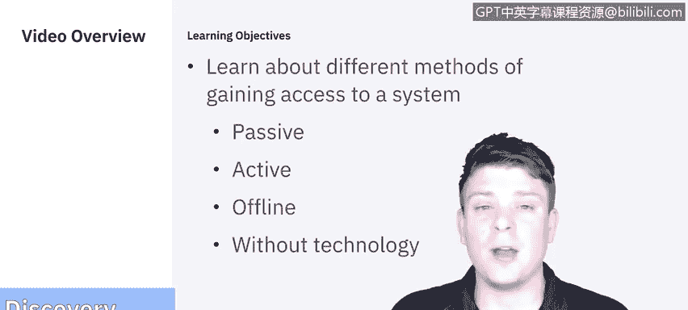
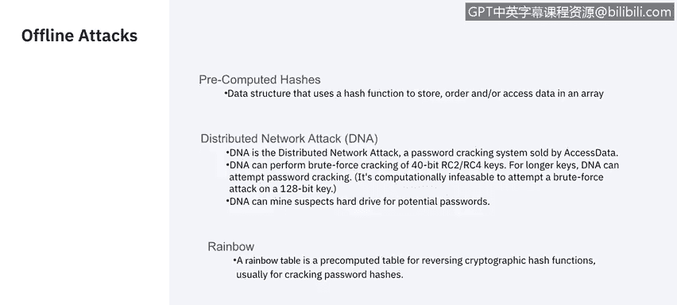
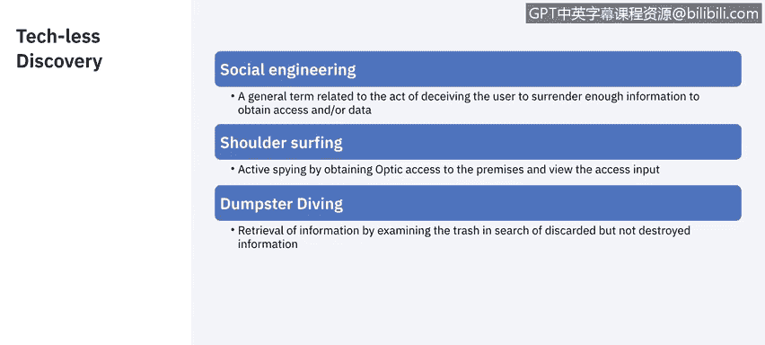

# 课程5：《渗透测试、事件响应与取证》：39：4_05_渗透测试-额外发现细节

在本节课程中，我们将学习渗透测试中获取系统访问权限的不同方法。IBM的系统信息与事件经理Raoul将为我们讲解被动、主动、离线以及非技术性的攻击途径。

## 概述

上一节我们介绍了渗透测试的基本阶段。本节中，我们将深入探讨如何实际获取对目标系统的访问权限。我们将了解攻击者可能使用的多种技术，从网络监听、密码破解到社会工程学攻击。

## 在线攻击方法

在线攻击是指攻击者与目标系统存在直接或间接网络交互的攻击方式。以下是几种主要的在线攻击类型。

### 被动在线攻击

被动在线攻击旨在秘密收集信息，而不直接干扰目标系统。

*   **网络嗅探**：攻击者捕获流经公司网络的所有数据包，以供后续分析。这种攻击通常不留痕迹。
    *   `tcpdump -i eth0` （示例：使用tcpdump工具捕获网络接口eth0上的流量）
*   **中间人攻击**：如果攻击者能够劫持一个用户会话，他们就能获取该用户的尽可能多的信息，甚至访问其权限级别的资源。
*   **重放攻击**：当攻击者识别出用户用于身份验证的会话和信息时，他们可能会复制这些信息，尝试自行建立认证会话。这是一种非常有效的获取访问权限的方式。

### 主动在线攻击

主动在线攻击涉及与目标系统的直接交互，试图破解或绕过安全措施。

*   **密码猜测**：通常借助字典辅助，尝试各种密码直到找到正确的那个。这也被称为**暴力破解攻击**。
    *   `hydra -l username -P wordlist.txt ssh://target_ip` （示例：使用Hydra工具对SSH服务进行密码爆破）
*   **木马与间谍软件**：通过使用木马、间谍软件或键盘记录器，攻击者试图感染受害者，从而获取他们键入的任何内容，甚至获得对其计算机的远程访问权限。
*   **哈希注入**：本质上是从目标服务器获取密码文件（哈希值），并尝试对其进行解码。
*   **钓鱼攻击**：这是当前非常流行的一种攻击方式。攻击者复制或仿造一个受害者信任的页面（如银行登录页），并利用它来获取受害者真实页面的密码。这类攻击通常在需要访问银行或特殊数据库时发生。

## 离线攻击方法

离线攻击发生在攻击者已经获取了某些关键数据（如密码哈希文件）之后，可以在不与目标系统持续交互的情况下进行分析和破解。

*   **预计算哈希攻击**：这与哈希注入基本相同，但侧重于对已获取的哈希值进行离线破解。
*   **彩虹表攻击**：这是一种使用预先计算好的哈希链来快速破解密码哈希的**查表攻击**。
    *   `rcrack . -h 5d41402abc4b2a76b9719d911017c592` （示例：使用彩虹表工具破解给定的MD5哈希）

## 非电子技术攻击

非技术性攻击不依赖于复杂的软件或漏洞，而是利用人的心理和行为弱点。

上一节我们讨论了技术性手段，但人为因素往往是安全链中最薄弱的一环。以下是几种常见的非电子攻击方法。

*   **社会工程学**：攻击者诱使某人（如通过电话）向员工灌输某些想法，或让他们相信你是上司并需要他们的帮助，从而获取信息或访问权限。
*   **肩窥**：攻击者派人近距离观察员工输入密码的过程，从而看到他们按下了哪些键。
*   **垃圾搜寻**：在某些地方，检查公司的垃圾并不违法。你可能会以文件形式获得未被妥善处理的信息。谁知道呢？也许你能找到一些密码、账号或其他可用于调查的信息。

## 总结

本节课中，我们一起学习了渗透测试中用于获取系统访问权限的多种方法。我们涵盖了**被动在线攻击**（如网络嗅探）、**主动在线攻击**（如密码破解和钓鱼）、**离线攻击**（如破解哈希值）以及**非技术性攻击**（如社会工程学和肩窥）。理解这些攻击途径对于有效防御和进行全面的安全评估至关重要。