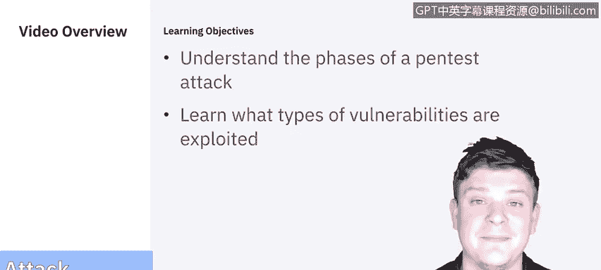
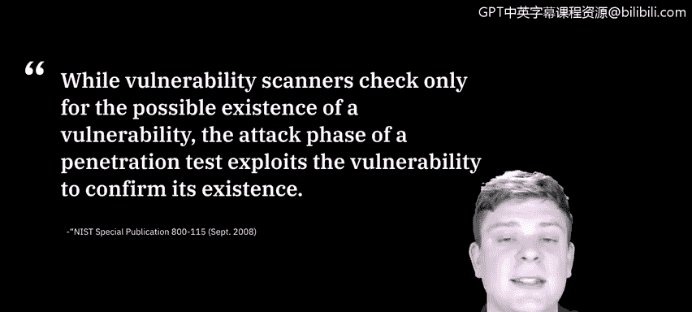
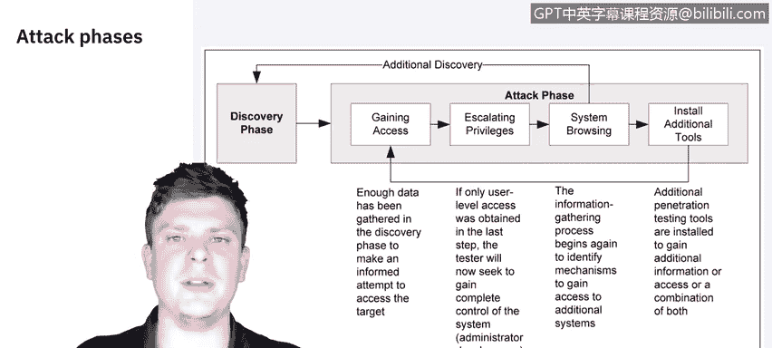
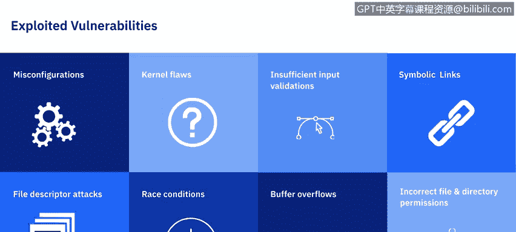
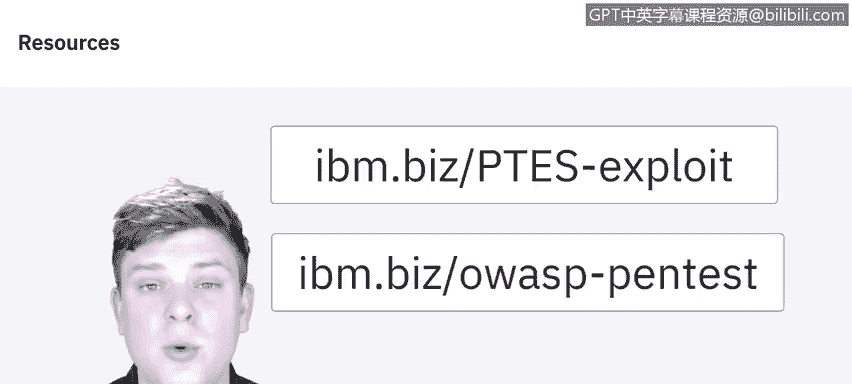

# 课程5：《渗透测试、事件响应与取证》：5.08：渗透测试攻击阶段详解 🔍

在本节课中，我们将学习渗透测试的攻击阶段。我们将讨论攻击阶段的不同组成部分，并了解通常被利用的漏洞类型。攻击阶段是确认漏洞真实存在的关键步骤。

## 攻击阶段概述

上一节我们介绍了信息收集与发现阶段。本节中我们来看看攻击阶段的核心作用。漏洞扫描器仅检查漏洞存在的可能性，而渗透测试的攻击阶段则通过实际利用漏洞来确认其存在。

## 攻击阶段的组成部分

接下来，让我们分解攻击阶段，看看它的不同组成部分。

攻击阶段的第一步是确保能够获得对系统的访问权限。在之前的视频中，Raoul带领我们通过发现阶段收集信息，并介绍了用于获取访问权限的工具和方法。

根据美国国家标准与技术研究院提供的图表，您会发现发现阶段、获取访问权限和攻击阶段并非完全独立。所有这些步骤相互关联，我们将在整个过程中反复审视它们。

一旦进入系统或获得访问权限，我们就需要确定所获得的权限级别。如果我们只是一个标准用户，那么就需要进行**权限提升**，直到获得完全控制权或至少是能够进行更改的管理员访问权限。

获得所需权限后，便可以开始浏览和收集信息，以识别可以控制的机制以及其他系统。您会注意到图表中系统浏览实际上会循环回到发现阶段。这意味着每次发现新系统或可以进入的新工具时，都可以进行另一个发现阶段，以探索如何获取访问权限、它连接到什么、它访问什么以及可能需要什么工具。然后，您将再次开始这个过程，直到根据目标确定“这就是我们需要的位置”。接着，我们可以安装监控或利用工具，以收集更多信息或获取访问权限。

这是一个我们经历的生命周期：发现 -> 获取访问权限 -> 提升权限，直到有能力浏览系统或工具。当我们对此满意后，可以继续尽可能多地发现，或者直接安装所需的工具。

## 常见漏洞类型

虽然理论看起来很好，但它并未详细说明我们正在利用什么或实际寻找哪些漏洞。因此，让我们来分解这些漏洞类型。

根据美国国家标准与技术研究院的分类，大多数漏洞可以归结为以下几类。您的屏幕上将看到我们将要介绍的八种不同类型。

以下是主要的漏洞类别：

1.  **配置错误**
    配置错误是指通过安全设置引入的漏洞，特别是不安全的默认设置，这些设置通常很容易被利用。

2.  **内核缺陷**
    内核代码是操作系统的核心，它强制执行系统的整体安全模型。因此，内核中的任何安全缺陷都会危及整个系统。

3.  **输入验证不足**
    许多应用程序未能充分验证从用户那里接收的输入。例如，一个将用户输入的值嵌入数据库查询的Web应用程序。如果用户输入了SQL命令（而不是或附加在请求值中），并且Web应用程序不过滤这些SQL命令，则查询可能会按照用户请求的恶意更改运行，从而导致所谓的**SQL注入攻击**。
    *代码示例：`SELECT * FROM users WHERE username = ‘“ + userInput + “’;` （如果`userInput`是 `admin’ OR ‘1’=’1`，则可能绕过认证）*

4.  **符号链接**
    符号链接是指向另一个文件的文件。操作系统包含可以更改授予文件权限的程序。如果这些程序以特权权限运行，用户可能会策略性地创建符号链接，诱骗这些程序修改或列出关键的系统文件。

5.  **文件描述符攻击**
    文件描述符是系统用来跟踪文件的数字，代替文件名使用。特定类型的文件描述符具有隐含的用途。因此，当特权程序分配了不适当的文件描述符时，就会暴露该文件使其面临被破坏的风险。

6.  **竞争条件**
    竞争条件可能发生在程序或进程进入特权模式期间。用户可以对攻击进行计时，以利用程序或进程仍处于该特权模式时的提升权限。

7.  **缓冲区溢出**
    当程序没有充分检查输入的长度是否适当时，就可能发生缓冲区溢出。发生这种情况时，可以将任意代码引入系统并以运行程序（通常是管理员级别）的权限执行。

8.  **不正确的文件和目录权限**
    文件和目录权限控制分配给用户和进程的访问权限。不良的权限可能允许许多类型的攻击，包括读取或写入密码文件，或添加到受信任的远程主机列表中。

## 深入学习资源

深入学习渗透测试攻击阶段的资源包括：
*   OWASP的Web应用程序渗透测试检查清单。
*   渗透测试执行标准。该组织提供了一份出色的文档，概述了整个渗透测试过程。如果您特别关注利用部分，会发现一些很好的信息。

## 总结与预告

本节课中我们一起学习了渗透测试攻击阶段的流程、生命周期以及常见的八大类漏洞。虽然我们讨论了很多关于渗透测试应该是什么样子或它可以包含哪些不同过程的理论。

现在是时候开始加入一些具体示例了。因此，在下一个视频中，我们将再次交给Raoul，他将讨论我们用于执行这些测试的工具。

