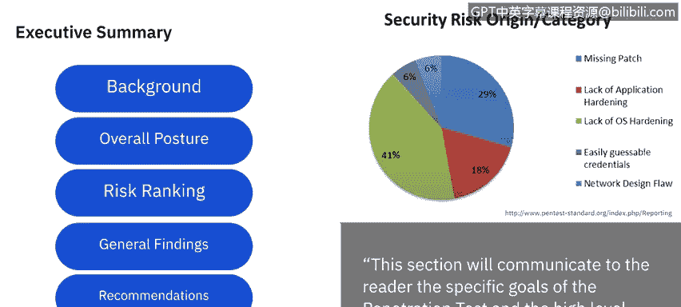

# 课程5：《渗透测试、事件响应与取证》：41：渗透测试报告编写 📋

在本节课中，我们将学习如何编写一份专业的渗透测试报告。报告是渗透测试流程的最终成果，它向客户清晰地展示测试发现、风险以及改进建议。一份结构清晰的报告对于客户理解其安全状况并采取行动至关重要。

我们将把渗透测试报告分解为两个主要部分：**执行摘要**和**技术报告**。在整个讲解中，我们将参考**渗透测试执行标准**。课程结束后，您将有充足的时间深入研究相关标准文档。现在，让我们开始吧。

---

### **执行摘要** 📊

执行摘要旨在向报告阅读者传达渗透测试的具体目标和高层次的测试发现。您可以将其理解为测试的“**谁、什么、何时、何地**”，而技术报告则涵盖“**为何**”和“**如何**”。

根据PTES标准，执行摘要可分为六个主要类别。

以下是这六个类别的详细说明：

*   **背景**：本节提供测试的概述，包括所有参与人员、测试时间框架、测试目标以及其他任何能为测试提供背景信息的细节。
*   **整体态势**：本节以叙述形式描述测试的整体有效性，以及渗透测试人员实现规划阶段所设定目标的能力。您可以简要描述遇到的问题，以及是否成功克服并达成了目标。
*   **风险评级**：在规划阶段，您可以选择并使用多种评分或评级方法。一般而言，风险等级从低到极高。根据您的发现，告知客户其当前在风险等级中所处的位置。
*   **总体发现**：本节以基本的统计或图形格式，总结在渗透测试中发现的问题。此外，应以易于阅读的格式（例如右侧的示例图表）呈现问题的根本原因。
*   **建议**：顾名思义，本节是您向公司提出的建议，告知他们需要采取哪些措施来解决您所利用的漏洞。
*   **修复路线图**：本节将您的建议分解为一个**30/60/90天行动计划**，最关键或高风险的行动项应优先处理。

正如前面提到的，执行摘要主要涵盖了渗透测试的“谁、什么、何时、何地”。接下来，我们将进入**技术报告**部分，它将详细解释我们“为何”以及“如何”执行这些测试步骤。

---

### **技术报告** 🔧

技术报告可以分解为六到七个不同的类别。

以下是技术报告各部分的详细介绍：

*   **引言**：本节将详细列出执行摘要“背景”部分提到的许多相同信息，但会更加详尽。例如，列出所有参与人员的姓名、联系方式、确切目标、测试范围（内/外）、采用的方法等。与技术摘要不同，技术报告会详细阐明一切。
*   **信息收集范围**：本节将审查您如何收集所有信息（无论是被动还是主动方式），以及您从公司或人员那里获得了哪些信息。
*   **漏洞评估与确认**：对于评估部分，详细说明您用于评估的工具以及您的发现。确认部分则是测试或利用这些发现，以确认它们是否对公司构成实际风险。
*   **时间线与目标选择**：您可以回顾测试时间线、选择的目标以及为实现目标所采取的步骤。
*   **攻击后分析（最重要部分）**：本节说明我们发现了什么。具体包括：这些是发现的漏洞，这是我们利用它们的方式，这是与这些漏洞相关的实际风险。我们将讨论采取的不同权限提升路径、获取的关键信息、这些信息的价值等。您可以详细列出所有发现。
*   **风险与影响关联**：将风险或暴露情况与公司的实际业务关联起来，使其具有现实世界的应用意义。

---

### **总结** ✅

本节课中，我们一起学习了渗透测试报告的两个核心组成部分：**执行摘要**和**技术报告**。执行摘要提供了高层概述和关键发现，而技术报告则提供了详细的技术细节、利用过程和风险分析。

如果您想回顾任何要点，本视频和**渗透测试执行标准**文档是极佳的复习资料。该文档按时间顺序概述了整个渗透测试过程的所有主要组成部分，而不会过于深入细节。在此基础上，您可以判断自己对哪些部分有信心，或需要重温我们为您提供的任何课程和额外材料。

我们下节课再见。