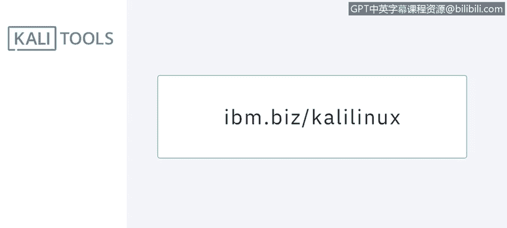
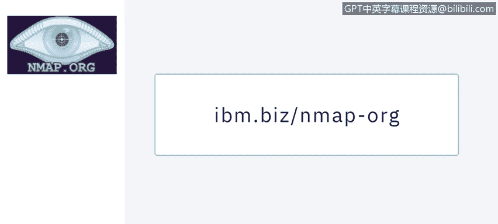
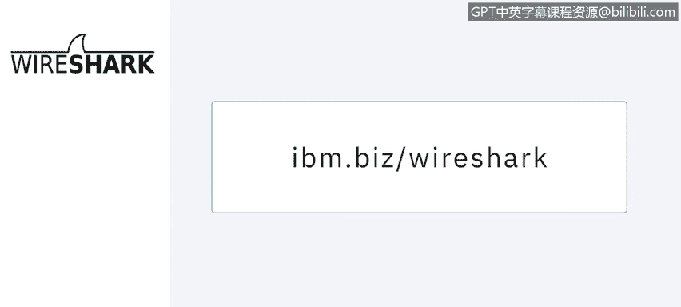
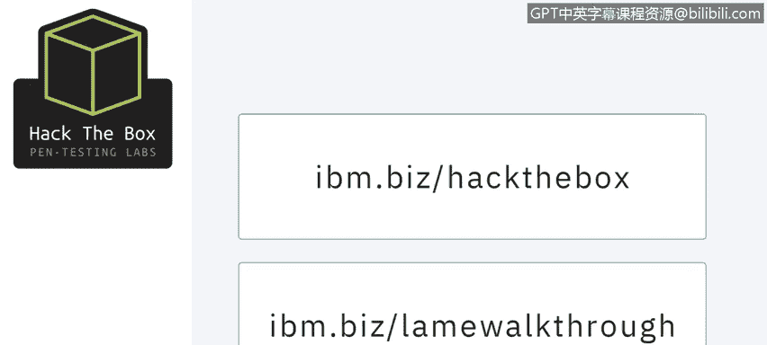

# 课程5：《渗透测试、事件响应与取证》：42：渗透测试工具 🛠️

在本节课中，我们将学习渗透测试中常用的一些行业领先工具。课程将逐一介绍这些工具的核心功能与用途，并鼓励你访问其官方网站进行深入了解。课程结束时，你将选择三个最感兴趣的工具进行深入研究。

---

## Kali Linux：你的工具箱 🧰

上一节我们介绍了课程概述，本节中我们来看看第一个核心工具：Kali Linux。

Kali Linux 是一个集成了数百种信息安全测试工具的一体化 Debian 发行版。它就像一个工具箱，包含了面向安全研究、渗透测试、取证分析和逆向工程的各种工具。

它是我在准备认证考试时的可靠伙伴。Kali Linux 也是一个执行沙箱测试的绝佳工具，可以在安全环境中进行病毒研究。它拥有一个可自定义的内核，你可以将其修补到任何级别，以便尝试代码注入、进行 Rootkit 分析、发起攻击或进行练习。

建议至少在你的最新发行版上安装几个 Kali Linux 虚拟机，以便进行实践。

---

## Nmap：网络探索器 🔍

了解了综合性的 Kali Linux 后，我们来看看一个专注于网络发现的具体工具：Nmap。

Nmap 是一个开源的网络扫描器，用于发现计算机网络上的主机和服务。如果你想通过认证道德黑客考试，掌握 Nmap 是必须的。

以下是 Nmap 的主要功能：
*   **被动扫描**：通过发送 Nmap 监听路由器分发的数据包，来探测网络中有哪些服务器。
*   **主动扫描**：主动探测目标主机，告诉你哪些端口是开放的，以及正在运行哪些服务。

---

## John the Ripper：密码破解者 🔑

上一节我们介绍了网络扫描工具，本节中我们来看看用于密码安全测试的工具：John the Ripper。

John the Ripper 是一个密码破解工具，它要求你拥有一个密码文件或加密文件的转储，并试图将其破解为文本格式。历史上，它被用来破解和检测 Unix 系统的密码。

以下是 John the Ripper 的主要用途：
*   尝试**字典攻击**。
*   尝试破解影子文件中的密码。
*   这个工具功能非常强大，能完成许多任务。

---

## Metasploit：攻击框架 ⚔️

在了解了密码破解工具后，我们转向一个更全面的攻击框架：Metasploit。

Metasploit 项目是一个攻击代码库。使用 Metasploit 应用程序，你可以根据目标的系统架构尝试大量不同的攻击。

如果你已经掌握了目标操作系统或应用程序的版本信息，例如发现一个旧的 FTP 服务，那么有 90% 的把握可以在 Metasploit 中找到对应的攻击模块，并将其应用到目标服务器上。顺便一提，它也已经集成在 Kali Linux 的软件库中。

---

## Wireshark：网络分析仪 📡

接下来，我们来看一个用于网络流量分析的关键工具：Wireshark。

Wireshark 是一个数据包分析器，它会告诉你网络中正在发生什么。它的前身是 Ethereal。如果你很久以前用过 Ethereal，那么 Wireshark 与之差别不大，但现在更加优雅。

Wireshark 是跨平台的，这意味着你可以在 Linux、Windows 和 Mac 上使用它。安装它是一个好主意，因为有时客户会发送数据包转储文件供我们分析，而 Wireshark 是完成这项任务的最佳工具。

---

## Hack The Box：实战平台 🎯

最后，我们介绍一个用于合法练习的实战平台：Hack The Box。

Hack The Box 不是一个工具，而是一个非营利组织。它创建了大量供你进行合法黑客攻击练习的 Linux 和 Windows 虚拟机环境。

尝试攻击这些“盒子”是完全合法的，并且免费。不过，他们也出售一些课程和指导服务。如果你购买了订阅，他们甚至会提供部分“盒子”的解决方案。

---

## 总结

本节课中，我们一起学习了渗透测试领域的几个核心工具：综合性的 Kali Linux 发行版、用于网络发现的 Nmap、用于密码破解的 John the Ripper、强大的攻击框架 Metasploit、网络流量分析器 Wireshark 以及实战练习平台 Hack The Box。

市场上还有很多其他工具，这里展示的只是其中一部分。请积极研究其他工具，并选择你最喜欢的使用。请务必访问视频中出现的每个工具的官方网站以深入了解。课程结束时，请选择三个你最感兴趣的工具，花时间深入研究它们的网站以了解更多信息。

保重，下节课再见。