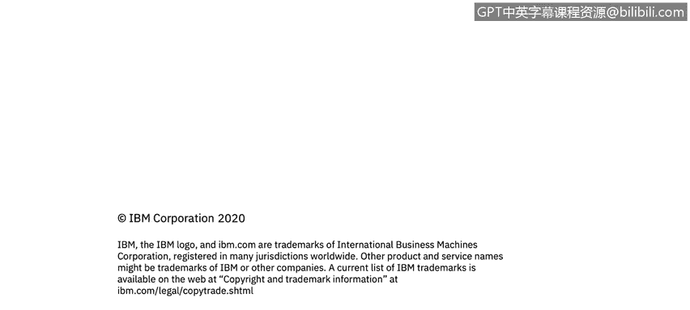

# 课程5：《渗透测试、事件响应与取证》：43：8_01_事件响应概述

## 概述

在本节课中，我们将学习网络安全中的核心环节——事件响应。我们将了解事件响应的定义，并详细解析构成事件响应流程的各个阶段。

## 什么是事件响应？🛡️

事件响应是针对已发生或正在发生的网络安全事件，所采取的一系列有组织、有计划的行动。其核心目标是控制事件影响、减少损失、恢复运营并防止未来再次发生。

## 事件响应阶段 📋

一个完整的事件响应流程通常包含六个关键阶段。以下是这些阶段的简要介绍：

1.  **准备**：建立事件响应策略、组建团队并准备必要的工具和资源。
2.  **检测**：通过监控和分析，识别潜在的安全事件。
3.  **分析**：对检测到的事件进行深入调查，评估其性质、范围和影响。
4.  **遏制**：采取紧急措施，防止事件影响进一步扩大。
5.  **根除与恢复**：彻底清除威胁根源，并将受影响的系统和服务恢复到安全、正常的运行状态。
6.  **事后活动**：总结事件经验教训，完善安全策略和响应计划。

上一节我们介绍了事件响应的整体阶段划分，接下来我们将逐一深入探讨每个阶段的具体内容。

## 各阶段详解

### 1. 准备阶段

准备是事件响应成功的基础。此阶段的核心工作是建立预案和储备能力。主要活动包括：
*   制定事件响应策略和计划。
*   组建并培训专门的事件响应团队。
*   部署必要的安全监控和取证工具。
*   建立内部及外部的沟通联络机制。

### 2. 检测阶段

检测阶段的目标是尽早发现安全异常。这依赖于有效的监控体系。常见检测手段包括：
*   安全信息和事件管理（SIEM）系统告警。
*   入侵检测系统（IDS）/入侵防御系统（IPS）的警报。
*   终端检测与响应（EDR）工具的报告。
*   用户或系统管理员提交的可疑活动报告。

### 3. 分析阶段

在分析阶段，团队需要确认事件真伪并评估其严重性。关键任务有：
*   收集与事件相关的日志、文件样本和内存转储。
*   进行根本原因分析，确定攻击入口和手法。
*   评估事件对业务运营、数据和资产造成的实际影响。

### 4. 遏制阶段

一旦确认事件，必须立即采取遏制措施以限制损害。遏制策略需根据情况灵活选择，例如：
*   隔离受感染的网络段或主机。
*   禁用受影响的用户账户。
*   应用临时防火墙规则阻断恶意流量。

### 5. 根除与恢复阶段

在威胁被遏制后，需彻底清除并恢复系统。此阶段工作包括：
*   从系统中移除恶意软件、后门等所有攻击组件。
*   修补被利用的漏洞。
*   从干净的备份中恢复数据和系统。
*   验证恢复后的系统安全性，并监控其运行状态。

### 6. 事后活动阶段

事件处理完毕后，进行回顾总结至关重要。本阶段主要产出有：
*   撰写详细的事件响应报告，记录时间线、行动和发现。
*   召开复盘会议，分析响应过程中的优缺点。
*   根据经验教训更新安全策略、响应计划和员工培训内容。

在了解了标准的事件响应流程后，我们还需要掌握一种重要的分析方法。

## 根本原因分析 🔍

根本原因分析是一种用于追溯问题根源的方法论。在事件响应中，其目标是找出导致安全事件发生的根本性缺陷，而不仅仅是处理表面症状。常用技术包括“**5个为什么**”分析法，即通过连续追问“为什么”来层层深入，直至找到根本原因。

最后，为了将理论知识应用于实践，本系列课程将以一个演示环节收尾。

## 总结

本节课中，我们一起学习了网络安全事件响应的基础知识。我们明确了事件响应的定义，并系统性地探讨了其六个核心阶段：准备、检测、分析、遏制、根除与恢复以及事后活动。此外，我们还介绍了用于深入探究事件起源的根本原因分析法。掌握这些结构化流程和方法，是有效管理安全事件、提升组织韧性的关键。