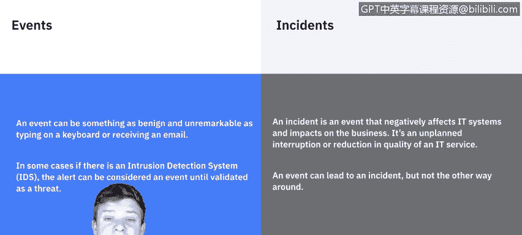
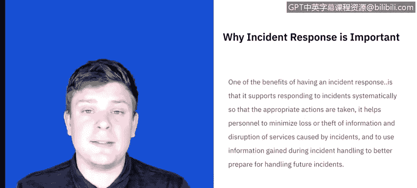
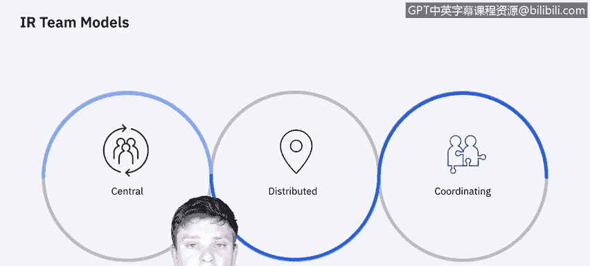
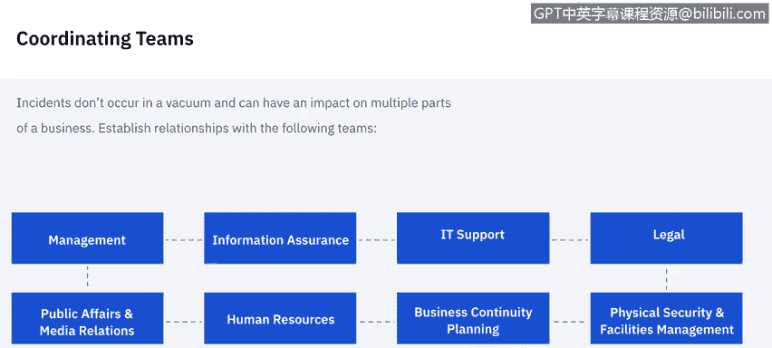
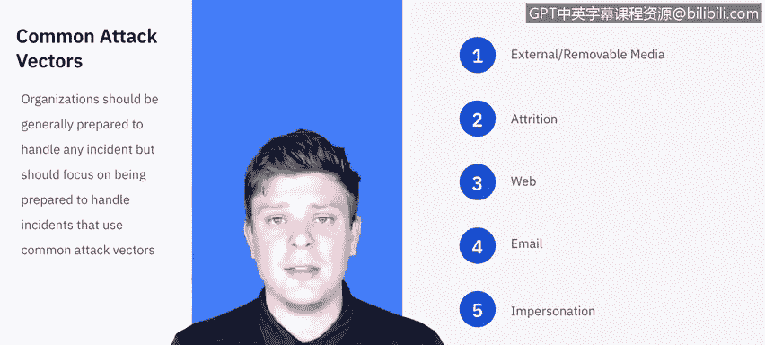
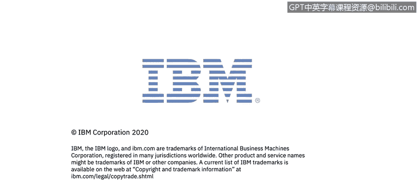

# 课程5：《渗透测试、事件响应与取证》：44：事件响应基础 🛡️

在本节课中，我们将学习事件响应的核心概念、重要性以及其基本框架。我们将明确区分“事件”与“事故”，了解事件响应的不同阶段，并认识事件响应团队的类型及其需要协调的部门。

## 事件与事故的区别

在定义事件响应之前，我们需要先区分“事件”和“事故”。

一个“事件”可以是像敲击键盘或接收电子邮件这样普通且不起眼的行为。很多时候，这些看似平常的事件，在特定背景下，可能演变为“事故”。例如，一次按键、登录或接收邮件本身并不严重。但如果在一个很短的时间段内，发生了数十次、数百次此类事件，就会引发警报。这些警报通常由入侵检测系统或安全软件捕捉。它们捕捉到的警报在未被事件响应团队验证前，仍被视为“事件”；一旦被验证，就升级为“事故”。

因此，我们知道“事故”是已构成威胁的事件。它会对信息系统产生负面影响，并冲击业务运营，是IT服务计划外的中断或质量下降。一个事件可以演变为事故，但反之则不成立。

## 什么是事件响应？🤔

既然我们知道了事件与事故的区别，现在让我们来定义事件响应。

基于风险评估结果采取的预防性活动可以降低事故数量，但并非所有事故都能被预防。因此，事件响应对于快速检测事故、最小化损失和破坏、修复被利用的漏洞以及恢复IT服务是必要的。

我们知道了什么是事故，也知道需要响应这些事故。但为什么需要呢？

事件响应的好处在于，它支持系统性地响应事故，以便采取适当行动；它帮助人员最小化信息丢失或被盗以及服务中断造成的损失；最终，可以利用事件处理中获得的信息，为未来可能发生的事故做更好的准备。

## 事件响应团队的类型

接下来，我们简要讨论一下现有的事件响应团队类型。事件响应团队内包含许多角色，但这里我们只做概览。

团队的组织方式主要有三种：

*   **集中式事件响应团队**：可以想象成一个小公司，所有资源都集中在一个区域。整个组织只有一个事件响应团队。
*   **分布式事件响应团队**：想象一个非常大的公司，其技术资源和计算能力可能分布在全球。因此，你可能在每个地理位置、每个国家或每个站点都有一个事件响应团队，具体取决于计算能力集中的位置。尽管他们分布在不同地点，但保持协调努力非常重要，因为一个团队的发现将有益于另一个团队。这仍然是同一个团队，只是分布在许多不同区域。
*   **协调团队**：我们不会深入探讨这种类型，但你可以将其视为一个向其他团队提供建议的事件响应团队，他们对这些团队没有直接管理权。例如，一个部门级别的团队可能会协助其下属各机构的团队。

我们可以这样理解事件响应团队：它们是集中在一起支持整个组织，还是分布在多个地点，或者是在协助其他团队的工作。

## 需要协调的团队 🤝

事件响应并非在真空中运作。每个独立的事故或威胁都可能、并且很可能会影响组织的其他领域。因此，你需要与那些可能参与事件处理的个人建立工作关系，以便在需要时能提前获得他们的合作，而不是事后才去寻求。

以下是应寻求建立关系的一些主要领域：

*   **管理层**：管理层负责制定事件响应政策，并负责协调事件响应及向各利益相关方报告。这应该是你首先要接触的领域之一。
*   **信息安全保障部门**：在事件处理的某些阶段，可能需要信息安全人员参与，例如需要更改任何网络安全控制措施或防火墙规则集时。
*   **IT支持部门**：他们很可能参与其中。他们不仅拥有协助所需的技能，通常还对他们日常管理的技术有更深入的了解。这在需要针对受影响系统采取适当行动时（例如决定是否断开连接、重启或制作镜像）会很有帮助。
*   **法律部门**：法律专家应审查事件响应计划、政策和程序，以确保其符合法律和联邦指导方针，包括隐私权。如果威胁或事故涉及敏感个人信息，法律部门很可能需要参与。
*   **公共关系与媒体部门**：考虑到事故影响的性质，你可能需要与媒体接触，或者如果信息泄露给媒体，你需要有人来协调应对。
*   **人力资源部门**：如果涉及员工，无论是员工的信息还是员工直接导致了事故，都需要人力资源部门参与以协助处理。
*   **业务连续性规划部门**：可以这样理解，每个业务都有许多环节在运行，一个事故可能影响所有这些不同的业务领域。因此，你需要联系业务连续性规划经理或负责日常运营的人员，让他们了解他们的服务可能受到的影响。
*   **物理安全与设施管理部门**：有些事故可能源于物理安全漏洞或涉及物理攻击。事件响应团队可能需要进入相关设施，因此与这些团队建立关系很重要。

## 常见攻击向量

虽然组织可能无法为网络安全事故的每一种情况都做好准备，但他们应该能够处理攻击可能来自的常见途径。

例如：

*   **外部可移动媒体**：如果网络或系统中出现了未经授权或不熟悉的闪存盘、外置硬盘或光盘，我们应该能够发现。
*   **入侵攻击**：像暴力破解密码这样的攻击，我们应该能够发现。
*   **来自网络或电子邮件的威胁**：我们应该能够检测到来自网络或电子邮件的任何威胁。
*   **冒充攻击**：如果有人冒充他人进行活动，并篡改信息传递（类似于中间人攻击），这是严重问题。
*   **物理设备的丢失和盗窃**：我们需要对物理设备进行清点并定期审计。

这些是常见的攻击途径。这不是一个详尽的列表，但这些都是我们需要准备好去处理的事情。

## 事件响应的关键问题

我们将深入探讨事件响应最终需要记录的所有事项。从高层次概述，我们需要能够回答以下问题。这些问题更像是如果现在必须面对媒体，我们知道些什么。这就是我们的筛选标准。

我们需要知道：

*   谁攻击了我们？
*   为什么攻击？
*   何时发生？
*   如何发生？
*   是否因为我们的安全流程薄弱而导致？
*   影响范围有多广？
*   我们采取了哪些步骤来确定发生了什么，并防止未来再次发生？
*   事故的影响是什么？是否有任何个人身份信息（公司、员工或客户的）被泄露？
*   这次事故的预估成本是多少？

这些只是一般性指导原则，用于检查自己是否在继续之前掌握了基本信息。

## 事件响应的阶段 📊

本视频最后要讨论的内容，实际上将引导我们进入本系列视频的其余部分：事件响应的阶段有哪些？

我们将带你了解以下阶段：

1.  **准备**
2.  **检测与分析**
3.  **遏制**
4.  **根除与恢复**
5.  **事后活动**

我们将在下一个视频中从“准备”阶段开始。

---

**本节课总结**：在本节课中，我们一起学习了事件响应的基础知识。我们明确了“事件”与“事故”的关键区别，理解了事件响应的定义、重要性及其带来的益处。我们还探讨了三种主要的事件响应团队组织类型（集中式、分布式、协调式），并认识了在事件响应过程中需要协调的各个关键部门（如管理层、IT、法务等）。最后，我们概述了事件响应的核心阶段，为后续深入学习奠定了基础。掌握这些概念是构建有效网络安全防御和响应能力的第一步。