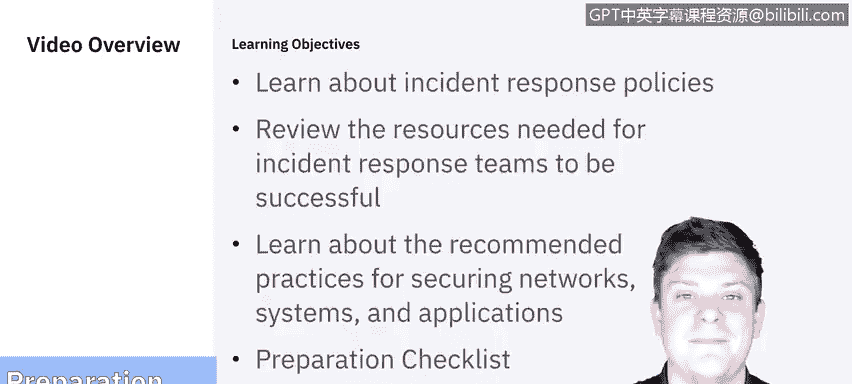
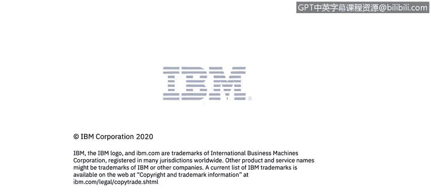

**课程5：《渗透测试、事件响应与取证》：45：10_01_事件响应准备**

在本节课程中，我们将学习事件响应准备工作的核心内容。我们将首先了解事件响应策略，然后审视事件响应团队成功所需的资源，接着学习保护网络、系统和应用的推荐实践，最后以一个准备清单作为总结。

每个成功的事件响应团队都需要一个成文的策略。该策略帮助决定由谁、在何时、何地、为何以及如何响应一个事件。

以下是策略需要涵盖的一些关键内容：
*   **团队与角色**：明确组织内的事件响应团队构成，以及团队内各成员的不同职责。这有助于确定每个人的支持范围。
*   **工具与资源**：规定用于识别和恢复受损数据的方法、工具和资源。
*   **策略测试**：鉴于网络安全威胁环境的不断演变，定期测试策略至关重要。
*   **行动计划**：提供一个从开始到结束如何执行该计划的详细大纲。

上一节我们介绍了事件响应策略的框架，本节中我们来看看策略中提到的具体资源。这些资源可以大致分为三类。

以下是资源分类的详细列表：
*   **事件处理、通信与设施**
    *   **联系人信息**：掌握团队所有成员的联系方式，以及非工作时间的值班信息。明确指挥链（例如，经理、上级经理的联系方式），因为时间是事件响应中最重要的因素之一。
    *   **事件报告机制**：确定并部署好使用的软件、数据库、工单系统等报告工具。
    *   **公司配发的智能手机**：确保团队成员拥有公司配发的手机，以便随时应对事件。
    *   **加密软件**：准备好用于加密恢复或克隆数据的加密工具。
    *   **集中指挥室**：拥有一个可供所有相关方聚集并现场沟通的“作战室”。
    *   **安全存储设施**：为任何恢复的资产提供安全的存储场所。
*   **硬件与软件**
    *   **数字取证工作站**：准备好数字取证工作站和备份设备。
    *   **计算设备**：确保团队成员拥有笔记本电脑、备用笔记本电脑、备用工作站/服务器、网络设备或其虚拟机等效物。
    *   **空白可移动介质**：备有空白的外部硬盘、光盘、U盘等。
    *   **便携式打印机**：用于打印所需的日志或证据。
    *   **网络分析工具**：配备数据包嗅探器、协议分析器，以便在网络攻击发生时监控网络，查找来源或获取相关信息。
*   **事件分析材料**
    *   **报告清单**：拥有所有报告的清单。
    *   **文档**：准备好进行事件分析所需的适当文档。
    *   **网络拓扑图**：拥有列出所有关键资产的网络拓扑图。
    *   **当前基线**：了解网络和组织的当前基线（例如，服务、软件状态）。这有助于与事件发生后的状态进行对比分析。
    *   **加密哈希值**：准备好用于验证数据完整性的加密哈希值。

以上并非详尽无遗的列表，但它很好地说明了事件响应准备工作可能涉及的方方面面。

事件响应团队任务繁重。他们管理工作量的最佳方式之一，就是尽可能地帮助预防事件发生。虽然创建预防措施通常超出了事件响应团队的职责范围，但他们可以提供建议，这一点值得在此提及。保持事件数量处于合理低位，对于保护组织的整体业务流程至关重要。如果安全控制不足，高发的事件量会压垮事件响应团队。因此，最好的进攻就是良好的防守。

以下是事件响应团队可以提供建议或传达给组织内其他成员的一些关键领域：
*   **风险评估**：定期对系统和应用进行风险评估，以确定威胁和脆弱性组合所带来的风险。
*   **主机与网络安全**：
    *   **主机**：所有主机都应使用标准配置进行适当加固，遵循严格的访问控制列表，并进行持续监控。
    *   **网络**：网络边界应配置为**拒绝所有未明确允许的活动**，这是零信任网络安全的基本原则。
*   **恶意软件防护**：需要部署优秀的软件来检测和阻止恶意软件，并应在整个组织范围内部署端点安全解决方案。
*   **用户意识与培训**：应让用户了解不同的策略和程序，特别是涉及网络、系统和应用使用的变更。

重申一下，这并非事件响应团队的严格职责，但加强这些方面并确保所有相关人员得到培训，能有效减少事件数量，从而提高事件响应团队的响应效率。

最后，关于准备工作，我们提供一个由SANS研究所制定的实用检查清单：
*   所有成员是否都了解组织的安全策略？
*   计算机事件响应团队的所有成员是否都知道需要联系谁？
*   所有事件响应人员是否都能访问日志和事件响应工具包以执行实际的事件响应流程？
*   所有成员是否都参与了事件响应演练，以实践事件响应流程并定期提高整体熟练度？

本节课中我们一起学习了事件响应准备的核心要素。我们探讨了制定事件响应策略的重要性，详细列出了团队成功所需的人员、工具和文档资源，并了解了通过加强风险评估、主机与网络安全、恶意软件防护以及用户培训来主动减少事件的最佳实践。最后，我们使用一个实用的检查清单来确保准备工作没有遗漏。扎实的准备工作是有效事件响应的基石。接下来，我们将进入事件响应的下一个阶段：检测与分析。