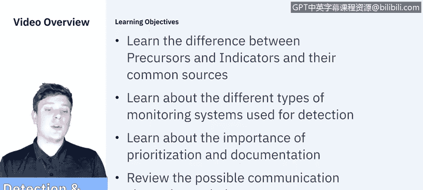

# 课程5：《渗透测试、事件响应与取证》：46：事件响应-检测与分析 🕵️

在本节课中，我们将学习事件检测与分析阶段的核心概念。我们将了解前兆与指标的区别及其常见来源，讨论用于检测的不同监控系统类型，并探讨事件优先级划分、文档记录的重要性。最后，我们将回顾检测后可能需要的沟通渠道。

## 前兆与指标 🔍

上一节我们介绍了课程概述，本节中我们来看看事件检测中的两个基本概念：前兆与指标。

*   **前兆** 是指示未来可能发生安全事件的迹象。它为你提供了即将发生某事的预警。
*   **指标** 是指示安全事件可能已经发生或正在发生的迹象。它是你在当下注意到并判断“某事正在发生或已经发生”的信号。

以下是前兆与指标的具体示例：

*   **前兆示例**：显示有人使用漏洞扫描器的Web服务器日志条目。这表明“有人正在对我们进行漏洞扫描，可能会发生某些事情”。
*   **前兆示例**：针对组织邮件服务器漏洞的新漏洞利用程序的公告。

## 监控系统类型 📊

理解了如何识别事件信号后，我们需要知道通过哪些系统来捕获这些信号。以下是组织用于检测安全事件的主要监控系统类型：

*   **基于网络的监控系统**：这类系统监控网络流量，以识别恶意活动或策略违规。例如，入侵检测系统（IDS）或网络流量分析工具。
*   **基于主机的监控系统**：这类系统安装在单个设备（如服务器、工作站）上，监控该设备上的活动。例如，主机入侵检测系统（HIDS）或防病毒软件。
*   **基于应用的监控系统**：这类系统专注于监控特定应用程序的行为和日志，以检测针对该应用的攻击或异常。

## 优先级划分与文档记录 📝

在检测到潜在事件后，并非所有事件都需要立即投入同等资源进行处理。因此，优先级划分和文档记录至关重要。

*   **优先级划分的重要性**：安全团队需要根据事件的潜在影响、紧急程度和涉及资产的重要性，来决定响应顺序。这确保了资源被有效分配到最关键的威胁上。
*   **文档记录的重要性**：从检测开始，详细记录所有观察到的现象、采取的行动和决策依据至关重要。这不仅有助于当前的调查和响应，也为事后分析和流程改进提供了依据。文档应清晰、准确、及时。

## 检测后的沟通渠道 📢

最后，在确认检测到安全事件后，及时有效的沟通是协调响应、控制影响的关键。以下是检测后可能需要使用的沟通渠道：

*   **内部沟通**：向组织内部的管理层、IT团队、法律部门、公关部门等相关方通报情况。
*   **外部沟通**：根据事件性质和法规要求，可能需要向执法机构、监管单位、受影响的客户或合作伙伴以及公众进行通报。
*   **沟通原则**：沟通应遵循既定的应急响应计划，确保信息准确、一致，并避免造成不必要的恐慌或信息泄露。

## 总结 🎯

本节课中我们一起学习了事件响应中检测与分析阶段的核心内容。我们区分了预警未来的**前兆**与指示已发生事件的**指标**，了解了**基于网络、主机和应用的监控系统**如何帮助我们进行检测。随后，我们探讨了根据事件影响进行**优先级划分**以及全程保持详尽**文档记录**的重要性。最后，我们回顾了检测后协调内外部响应的关键**沟通渠道**。掌握这些知识，是有效启动和进行安全事件响应的基础。