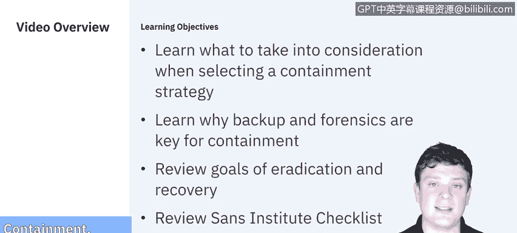
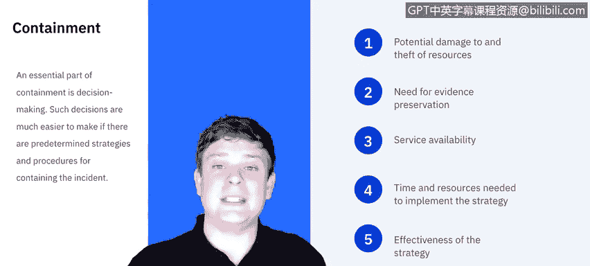
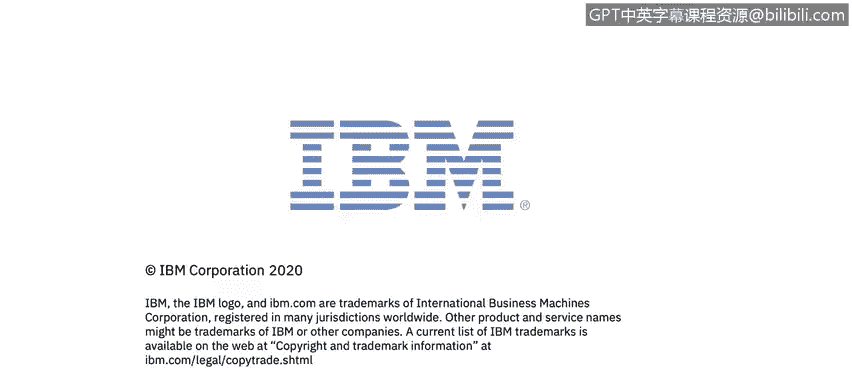

# 课程5：《渗透测试、事件响应与取证》：47：12_04_事件遏制、根除与恢复

在本节课中，我们将学习事件响应流程中的三个关键阶段：**遏制**、**根除**与**恢复**。我们将探讨如何选择遏制策略，理解备份与取证在其中的作用，并明确根除与恢复阶段的目标。课程最后，我们将回顾SANS研究所提供的相关检查清单。

## 遏制策略的选择

上一节我们介绍了事件响应的整体流程，本节中我们来看看**遏制**阶段。遏制至关重要，它能防止事件耗尽资源或造成更大损害。

遏制策略因事件类型而异。例如，遏制通过电子邮件传播的恶意软件感染，与遏制基于网络的拒绝服务攻击，策略截然不同。

遏制的核心目标是阻止威胁并减轻进一步损害。为此，需要做出关键决策。如果事先制定了策略和程序，决策会更容易。

美国国家标准与技术研究院列出了选择遏制策略时需考虑的几个因素：

以下是选择遏制策略时需要考虑的关键点：
*   **潜在损害与资源窃取**：评估事件可能造成的损害和资源损失程度。
*   **证据保存需求**：判断是否需要为后续法律或调查程序保存证据。
*   **服务可用性**：如果服务受影响，需要多快恢复？这对业务是否至关重要？
*   **实施策略所需的时间与资源**：是否需要跨团队协调？是否有足够资源？执行需要多长时间？
*   **策略的有效性**：该策略能否真正解决问题，还是仅仅临时缓解？投入的工作量是否值得？
*   **解决方案的持续时间**：这是永久性修复，还是为后续更彻底的解决方案争取时间的临时措施？

## 取证与证据保存

前面提到了证据保存的需求，这通过**取证**实现。证据收集必须遵循符合所有适用法律法规的程序，这些程序应基于事先与法律团队和执法机构的沟通制定，以确保证据在法庭上可被采纳。

为了做到这一点，必须立即执行以下操作：

以下是取证初期必须完成的步骤：
1.  **创建系统备份镜像**：在对系统进行任何更改之前，立即捕获系统的原始状态镜像。应仅在此克隆镜像上进行操作，以保证原始证据不被篡改。
2.  **从镜像中收集证据**：将捕获的镜像导入一个安全环境，并从中分析事件经过。
3.  **遵循监管链协议**：这意味着需要详细记录证据的流转过程。必须仔细记录谁有权访问证据、谁在何时访问过、证据是否被转移、转移至何处以及如何保管。在任何时候，都应有完整的纸质或电子记录，准确记载证据自捕获以来发生的一切。

我们将在下一课中更详细地探讨取证。目前只需了解，它在事件响应中扮演着至关重要的角色。

## 根除与恢复的目标

在事件得到遏制后，我们转向**根除**与**恢复**。NIST对此的总结是：根除旨在消除事件的组成部分，例如删除恶意软件、禁用被入侵的用户账户，以及识别并修复所有被利用的漏洞。

换句话说，我们的目标是：我已经检测到并遏制了威胁，现在需要彻底清除它。我需要清除这个威胁所触及的一切。

这可能包括多种操作，例如系统重装、关闭访问权限、禁用服务等。具体方法取决于威胁的影响范围，这也将影响恢复的进行。

因此，恢复可能涉及以下行动：

以下是恢复阶段可能采取的行动：
*   从干净的备份中恢复系统。
*   从头开始重建系统。
*   用干净版本替换被破坏的文件。
*   安装补丁。
*   更改密码。
*   加强网络边界安全，例如调整防火墙规则集、边界路由器访问控制列表等。

所有这些操作的具体细节会因系统环境和所发生事件的不同而变化，有太多可能性，超出了本演示的范围。但需要知道的是，根除和恢复通常密不可分，并且很少出现两次完全相同的情况。

无论采取何种措施，通常都需要进行高水平的测试和监控，以确保恢复后的系统不再受事件影响。这可能持续数周甚至数月。将受影响的系统重新投入生产环境通常是分阶段进行的，以便密切监控并确保一切正常运行。

## SANS检查清单

最后，我们来看一下SANS研究所提供的检查清单，它列出了关于遏制、根除与恢复的一系列问题。

以下是SANS关于遏制、根除与恢复的检查清单要点：
*   **遏制**：
    *   问题能否被隔离？
    *   所有受影响系统是否已与未受影响系统隔离？
    *   是否为深入分析创建了受影响系统的取证副本？
    *   如果以上任何一项答案为“否”，则需要深入探究原因。
*   **根除**：
    *   系统是否可以重装映像，并通过打补丁或采取其他对策进行加固，以预防或降低攻击风险？
    *   攻击者留下的所有恶意软件和其他痕迹是否已被清除？受影响系统是否已针对进一步攻击进行了加固？
*   **恢复**：
    *   你将使用什么工具来测试、监控和验证，正在恢复至生产环境的系统没有受到导致原始事件的相同方法的危害？

---

本节课中，我们一起学习了事件响应中**遏制**、**根除**与**恢复**三个阶段。我们了解了选择遏制策略的考量因素，认识了取证和证据保存的重要性，明确了根除与恢复的具体目标，并借助SANS检查清单来指导这三个关键阶段的实践操作。