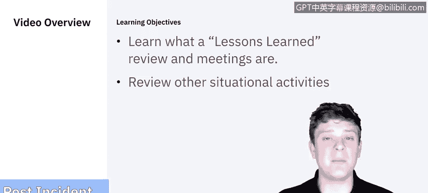
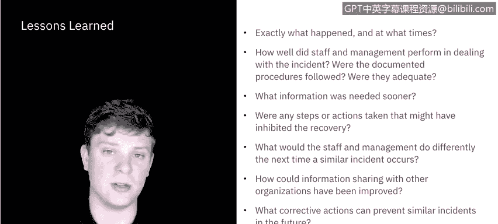
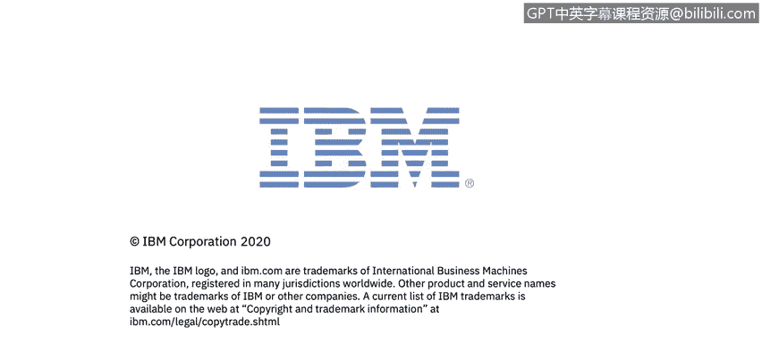

# 课程5：《渗透测试、事件响应与取证》：48：事件后活动

## 概述

在本节课中，我们将要学习事件响应流程的最后阶段——事件后活动。这一阶段的核心在于总结经验教训，并执行一系列必要的收尾工作，以确保组织能从事件中学习并持续改进。

## 事件后活动简介

上一节我们讨论了事件的恢复阶段。本节中，我们来看看事件处理流程的最后一步：事件后活动。这主要包括经验教训总结会议，以及一些根据具体情况需要执行的活动。

## 经验教训总结

经验教训总结本质上是一次回顾，旨在审视哪些方面可以做得更好，以便在未来进行迭代改进。

以下是需要在总结会议中提出的关键问题列表：

*   **事件详情**：具体发生了什么？发生在什么时间？
*   **人员表现**：员工和管理层在处理事件时表现如何？
*   **流程遵循**：是否遵循了已记录的流程？这些流程本身是否足够完善？如果遵循了流程，是否仍存在需要弥补的差距？
*   **信息时效性**：哪些信息本应更早获得？如果在遏制、根除或恢复阶段能更早获得某些信息，是否能加快处理进程？
*   **阻碍因素**：是否有任何已采取的步骤或行动阻碍了恢复过程？
*   **未来改进**：如果未来发生类似事件，员工和管理层会采取哪些不同的做法？
*   **信息共享**：与其他组织的信息共享如何能得到改进？例如，与需要协作但未能及时联系上的人员的沟通，是否可以更高效、更及时？
*   **预防措施**：可以采取哪些纠正措施来预防未来发生类似事件？
*   **预警指标**：未来应关注哪些前兆或指标，以便检测类似事件？

这些是通用问题，你需要根据具体的主要事件或一系列小事件中发现的趋势性问题，提出更具体的问题。此处的另一个关键是**文档化**，将发现的所有问题记录并更新到相关文档中，以便为下一次事件做好准备。

## 其他情境性活动

除了经验教训总结，根据具体情况，还可能需要进行其他几项活动。

一项普遍的活动是**利用收集到的数据**。你可以收集各种数据，从响应时间、受影响的数据，到问题解决时长、恢复时长，每一个步骤都可以被衡量。你需要决定哪些指标对你的组织最有价值，并观察这些指标在类似事件中的长期趋势。

另一项值得提及的活动是**证据保留**。对于收集到的所有信息和进行的取证分析结果，都需要以能够在法庭上使用的方式进行存储、归档和管理。我们之前讨论过使用证据监管链来确保所有证据的处理时间和方式都被妥善记录，但证据保留计划本身也需要被纳入整体规划。

此时也是**重新审视整个流程文档**的好时机。这包括你起草制定的**事件响应策略**、**事件处理文档**、**工单系统**以及**证据监管链**记录等。如果在整个过程中发现了任何文档上的缺失，现在就是解决它们的时候。

## 总结

本节课中，我们一起学习了事件响应的事件后活动阶段。我们了解了**经验教训总结会议**的重要性及其需要探讨的核心问题，并介绍了**数据分析**、**证据保留**和**文档更新**等其他关键活动。通过有效执行这些步骤，组织能够从每次安全事件中学习，不断完善其安全措施和事件处理流程。