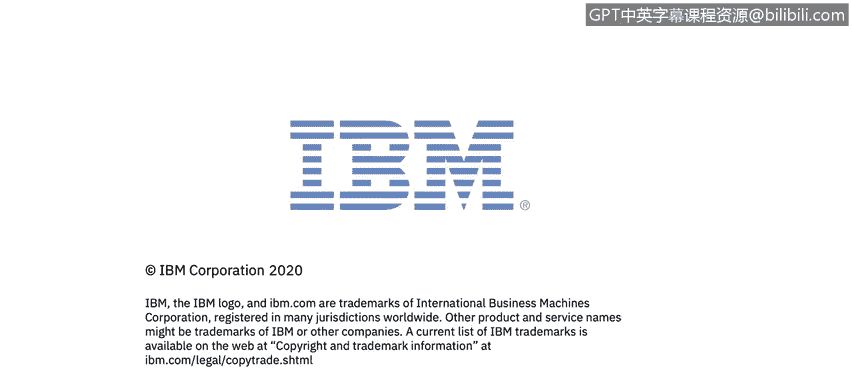

# 课程5：《渗透测试、事件响应与取证》：49：14_01_事件响应演示第一部分

在本节课中，我们将跟随IBM的演示，学习事件响应的基本流程。我们将回顾事件响应的核心概念，并通过一个名为QRadar的安全工具，观察实际的事件响应案例是如何被记录和处理的。请密切关注演示中提到的细节和提出的问题。

现在，让我们开始学习。

## 概述：安全威胁与事件响应

我是Tommy Patton，在网络安全领域有大约五年的工作经验。我使用过多种安全工具，并应对过无数安全威胁，其中许多都触发了事件响应流程。

在定义事件响应之前，我们首先需要了解日常面临的安全威胁。一些最常见的安全威胁包括：
*   **软件攻击**
*   **数据窃取**
*   **信息破坏**
*   **设备盗窃**

在识别了组织的常见安全威胁后，我们需要了解黑客可能利用的不同攻击向量来获取系统或网络的控制权。一个攻击向量的例子是：**一个托管恶意内容的网站，等待利用存在漏洞的用户或浏览器进行攻击**。

幸运的是，我们现在可以使用许多现代安全工具，例如IBM QRadar、McAfee Policy Auditor、下一代防火墙等。

## 核心安全工具介绍

上一节我们提到了常见的安全威胁，本节中我们来看看用于检测和防御这些威胁的核心工具。

### QRadar：安全信息与事件管理工具

QRadar是一个安全信息与事件管理工具。简单来说，它是一个日志收集工具，具备搜索、检测和告警的能力。

QRadar从我们网络上的设备或应用程序收集系统事件信息，包括来自操作系统、McAfee Policy Auditor、下一代防火墙以及大约400种其他来源的日志信息。

QRadar收集信息后，会处理并存储这些数据。它会将收集到的信息**规范化**，并使用一组规则**分析**数据。我们稍后将看到QRadar的实际操作。

### McAfee Policy Auditor：基于主机的安全系统

McAfee Policy Auditor是一个基于主机的安全系统。它在许多不同环境中用于检测、预防和移除恶意文件。

McAfee HBSS包含多个组件产品，包括McAfee Endpoint Security、McAfee Host Intrusion Prevention System等。今天我们将看到一个McAfee ENS发现恶意软件、移除恶意软件以及如何响应此类事件的例子。

### 下一代防火墙

下一代防火墙是网络的第一道防线之一。它们能够通过状态检测过滤网络数据包，进行签名匹配、数据包载荷检查等。

仅使用防火墙、EPO和QRadar，我们就可以对许多不同的安全威胁进行告警和响应。

## 事件响应流程详解

在开始调查安全事件之前，我们先来了解标准的事件响应流程。美国国家标准与技术研究院将事件响应流程定义为四个步骤。

以下是事件响应的四个核心阶段：

1.  **准备**：这是事件响应的第一步。准备阶段涉及收集响应事件所需的信息。首先，你需要收集一份资产清单，并根据其对组织的重要性和受损风险进行排序。同样重要的是，收集一份利益相关者和在发生攻击时需要联系的人员名单。最后，你需要确定哪些类型的事件会触发调查。
2.  **检测与分析**：当收到告警时，事件响应的检测与分析阶段就开始了。这个过程始于研究触发告警的事件，并尽可能收集与告警相关的信息。信息收集完毕后，我们开始分析数据，以确定攻击的入口点、影响范围和告警的有效性。
3.  **遏制、根除与恢复**：在识别出入侵点后，我们希望遏制威胁，防止其对我们的系统造成进一步损害。系统被遏制后，我们可以着手移除威胁，然后恢复任何受影响的系统，使业务恢复正常。
4.  **事后活动**：业务恢复正常后，应完成事件响应的最后一步。回顾在事件响应过程中采取的行动，将提供从不足中学习的机会。事后报告可用于记录所采取的行动，以使事件响应更高效。

## 总结

本节课中，我们一起学习了事件响应的基础知识。我们首先识别了常见的安全威胁和攻击向量，然后介绍了用于检测、监控和预防的核心安全工具，如QRadar、McAfee Policy Auditor和下一代防火墙。最后，我们详细讲解了由NIST定义的标准事件响应四步流程：准备、检测与分析、遏制/根除/恢复以及事后活动。

现在，我们已经了解了安全威胁、攻击向量、事件响应流程以及用于检测、监控和预防的一些安全工具，接下来可以开始查看我们QRadar中的一些安全事件了。

