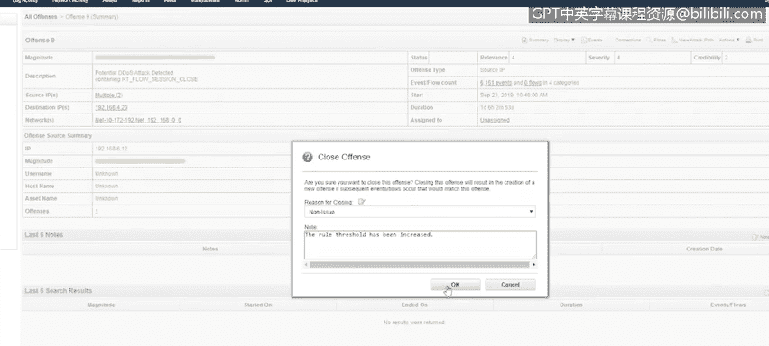
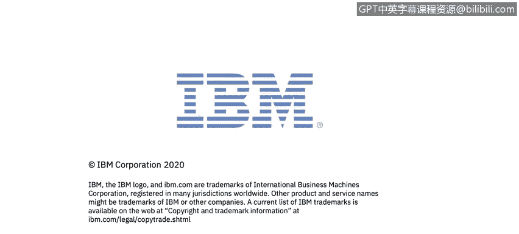

# 课程5：《渗透测试、事件响应与取证》：50：事件响应演示（第二部分）🚨

## 概述
在本节课程中，我们将继续学习事件响应的实际操作流程。我们将基于上一节课程中创建的QRadar事件，学习如何调查一个真实的网络安全事件，从分析警报、确认威胁，到执行响应步骤并最终关闭事件。我们将重点关注事件优先级判断、威胁情报验证以及响应决策的制定。

## 事件调查与优先级判断
上一节我们介绍了QRadar如何创建事件。本节中我们来看看如何调查这些事件并确定处理优先级。

在QRadar的Curator界面中，会列出所有由规则引擎触发的事件。判断优先级最快捷的方式是查看事件的“严重性”等级。

将鼠标悬停在条形图上即可查看严重性等级。例如，第一个事件的严重性为5，第二个为4，最后一个为3。因此，我们将首先调查严重性最高（等级5）的事件。

## 深入分析高优先级事件
点击进入严重性为5的事件后，我们会看到一个摘要页面。该页面提供了多种详细信息，包括：
*   **前五大源IP地址**
*   **目的IP地址**
*   事件涉及哪些日志源
*   用于创建此事件的事件类别

此页面一个需要关注的重点是“前五大注释”。第一条注释显示为“检测到恶意URL”。在这个QRadar实例中，我们配置了一条规则，用于将DNS查询与一个参考集进行比对，而该参考集中包含多个恶意URL。

为了进一步调查，我们可以点击“事件”选项卡，查看触发此事件的具体日志。我们看到这是一个“DNS查询进行中”的事件，指向一个DNS服务器。QRadar在发现此查询后，将其与参考集比对，从而创建了事件和警报。

## 威胁情报验证
既然我们已经看到了导致警报的事件，接下来让我们在外部威胁情报平台（如X-Force Exchange）上搜索这个DNS名称，以确认其是否为恶意域名。这应该是恶意的，因为它已被列入参考集。

在X-Force Exchange上，该URL被立即标记为风险等级10。情报显示，此URL被用作“通过NTLM攻击窃取凭据的恶意软件”的一部分，并且是其命令与控制服务之一。这证实了它是一个恶意DNS查询。

## 执行事件响应流程
确认是恶意DNS查询后，我们回到QRadar的事件详情中核实。可以立即注意到，目的IP地址不属于我们的私有网络。DNS查询请求被发出，并解析到了一个外部IP地址（例如192.203.230.10）。

此时，我将启动事件响应流程。由于我已经准备好了资产清单、需要联系的利益相关者以及需要关注的事件，我将从流程的第二步（识别与确认）开始执行。

以下是事件响应表单的填写示例（注：表单模板各异，此为示例）：
*   **事件类型**：`DNS查询至已知僵尸网络`
*   **检测来源**：`QRadar`
*   **环境**：`局域网`
*   **主机名**：`live-PC2`
*   **IP地址**：选择受影响的工作站IP（示例中显示“多个”是因为工作站查询了内部DNS服务器，后者又向外查询以解析该域名）
*   **系统类型**：`工作站`
*   **公网IP**：由于是实验室环境无真实公网IP，可填写一个示例地址（如Google的DNS服务器IP）

接下来，我们开始记录发现信息的时间线：
1.  **发现恶意DNS查询**：记录时间。
2.  **确认查询来源**：确定来自内部工作站（记录工作站IP和主机名）。
3.  **确认威胁**：通过威胁情报平台确认URL为恶意。
4.  **确认行为**：确认DNS查询请求已成功发出并被解析。

## 遏制、清除与恢复
确认威胁后，下一步是采取遏制措施。我们需要将该工作站与网络断开连接。这可以通过提交工单要求网络团队禁用该工作站连接的交换机端口来完成，或者如果是物理访问，可以直接拔掉网线，再通知网络团队禁用端口。

提交工单并确认端口被禁用后，我们可以开始进行杀毒扫描。即使杀毒扫描结果显示为“干净”，考虑到该工作站曾联系过僵尸网络控制服务器，为了彻底消除风险，最好的做法通常是直接对该工作站进行系统重装（Reimage）。

进行杀毒扫描的一个原因是，可能有些恶意软件未被实时防护检测到，但通过全盘扫描能够发现。在等待扫描结果和重装系统的过程中，我们可以完善事件响应文档。

## 事件关闭与归档
假设杀毒扫描结果为“干净”，但基于安全考虑，我们仍决定重装该工作站系统。因为它是已知的僵尸网络控制节点，我们不应冒险让其留在网络中，以免感染其他主机或成为僵尸网络的一部分。由于它只是一台普通工作站，重装操作快速且影响小。

完成所有响应步骤后，我们将此事件响应表单提交给上级或相关团队进行处理和归档。这样我们就有了完整的记录，知道在这台资产上发生了什么。

最后，我们可以在QRadar中关闭此事件。选择“响应”操作，将我们的事件响应表单内容粘贴进去，然后关闭该警报。关闭后，它将不再出现在“活跃事件”列表中。

## 处理其他事件与误报分析
处理完最高优先级事件后，我们可以转向其他严重性相同的事件。例如，我们查看另一个严重性为4的事件。摘要页面显示，源IP地址是一台工作站（与上一个事件是同一台），涉及的日志源包括QRadar和防火墙。

事件详情显示，用于创建此警报的是大量的“会话开启”和“会话关闭”事件。注释提示这可能是一次“DDoS攻击”。我们进入“事件”选项卡查看详情。

由于这是一个“内部到内部”的流量模式，通常相关性较低。仔细分析后发现，这实际上是用户在日常工作中，通过API与一台服务器进行应用开发所产生的正常、频繁的会话连接。因此，这个事件是一个**误报**。

误报是指虽然触发了警报，但相关事件实际上是正常流量。这可能是因为这是新出现的业务模式，或者新上线了服务器，而QRadar的规则尚未进行相应调整。

对于误报，我们可以在QRadar中直接关闭该事件，并标记为“非问题”或“误报”。同时，我们可能需要去调整（优化）触发此警报的规则，例如提高触发阈值以减少未来的误报。调整规则后，应在事件注释中说明“已提高阈值”等修改内容，然后点击“确定”关闭该事件。

## 总结
本节课中，我们一起学习了事件响应的后半部分实战流程。我们从分析QRadar中的高优先级警报开始，通过查看事件详情、利用外部威胁情报进行验证，确认了安全威胁。随后，我们模拟填写了事件响应表单，记录了关键信息与时间线，并执行了包含网络隔离、杀毒扫描和系统重装在内的响应措施。最后，我们学习了如何归档事件、在SIEM工具中关闭警报，并分析了如何识别和处理误报事件。整个过程强调了基于证据的调查、规范的记录以及根据威胁严重性做出适当响应决策的重要性。