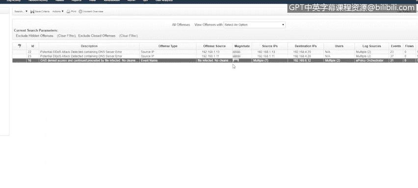
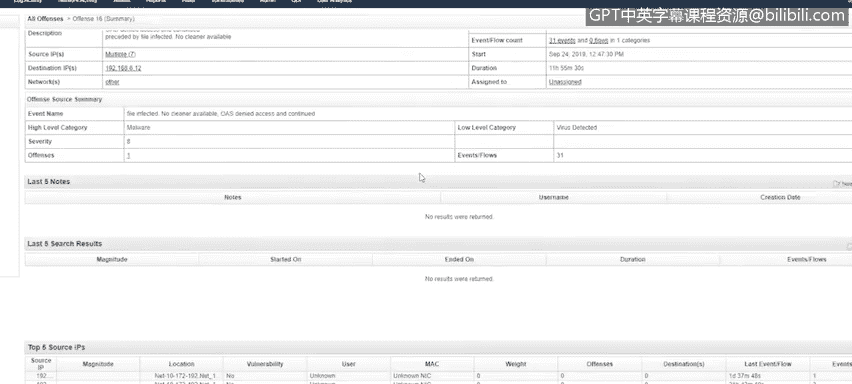
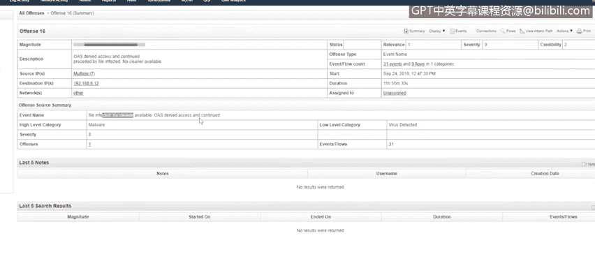
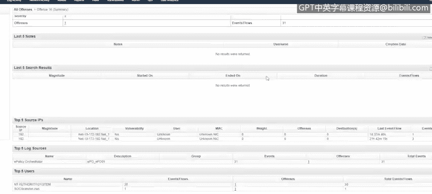
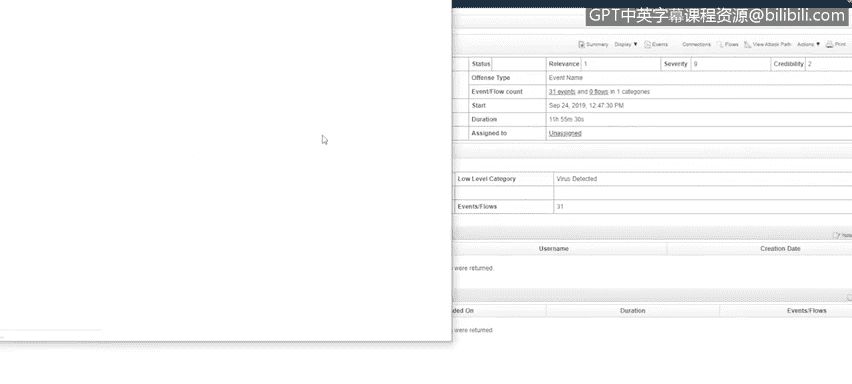
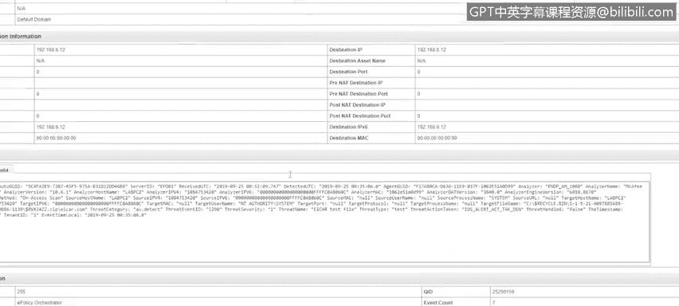
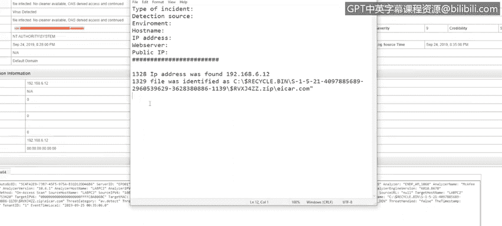
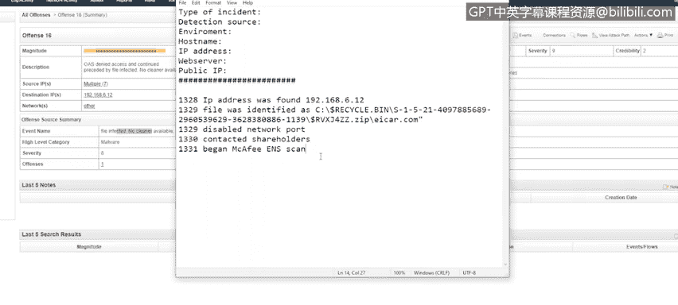

# 课程5：《渗透测试、事件响应与取证》：51：事件响应演示第三部分 🚨

在本节课中，我们将继续学习事件响应的实际操作流程，重点关注从分析警报到完成事件后报告的完整步骤。我们将通过一个具体的病毒检测案例，演示如何执行检测、分析、遏制、根除、恢复以及事件后复盘。

---

## 概述

上一节我们介绍了事件响应的准备阶段。本节中，我们来看看当安全警报触发后，如何执行检测、分析、遏制、根除、恢复以及事件后活动。我们将以一个具体的病毒检测事件为例，逐步演示整个响应流程。

## 检测与分析

首先，我们收到了一个安全警报。该警报严重性较高，但可信度较低。事件名称为“文件被感染，无可用清除工具”，并且系统被拒绝访问某个命令。

在警报摘要页面，可以看到有文件被感染且没有可用的清除工具。

以下是分析警报的关键步骤：

1.  **检查事件详情**：深入查看触发警报的具体事件日志。
2.  **定位感染源**：从事件日志中找出受感染的文件名和源IP地址。
3.  **确认感染状态**：在本案例中，发现病毒文件位于系统的回收站内。

分析完成后，我们确认了受影响的系统和具体的恶意文件。

## 遏制、根除与恢复

在识别出受感染系统和文件后，下一步是采取行动。

首先，立即联系网络团队，请求禁用该设备对应的交换机端口，以将其从网络中断开，防止威胁扩散。

提交网络端口禁用请求后，根据在准备阶段制定的利益相关者名单，通知相关人员进行协调。

接着，在受感染系统上启动全面的防病毒（AV）扫描，并等待扫描结果。在等待期间，可以继续填写事件响应表单的其他部分。

AV扫描完成后，返回查看结果。发现原病毒文件未被清除，并且扫描还检测到了其他可疑文件。因此，建议对该系统进行重新镜像（Reimage）处理。

我们将重新镜像的建议发送给IT资产管理（IAM）团队。获得批准后，系统被重新镜像，恢复到干净状态。

## 事件后活动

事件处理完毕后，需要编写事件后报告（After Action Report）。这份报告可以是一个持续更新的文档，用于记录在事件响应过程中出现的任何失误或可以改进的效率问题。

回顾我们处理过的两个事件：

*   **第一个DNS查询事件**：在查看事件后，我去查询了DNS记录以判断其是否可疑，但之后又需要返回事件日志确认攻击是否成功。一个提高效率的改进点是：在首次查看事件时，就应该先确认攻击是否已成功，如果DNS查询已被服务器拦截，那么查询IP地址的时间就被浪费了。此外，我也没有及时通知利益相关者。
*   **第二个暴力破解事件**：当时存在大量事件日志，我没有深入调查是否存在多个源IP地址，或者登录者是否并非预期的开发人员本人。这是一个需要更深入调查的方面。

进行事件后复盘非常重要，它能帮助你学习并显著提升未来的响应效率。

## 总结

本节课中我们一起学习了事件响应流程的核心步骤。让我们最后快速回顾一遍，确保涵盖了所有重要细节：

1.  **准备**：明确监控目标、资产和可能触发警报的事件类型，并制定好联系人名单。
2.  **检测与分析**：从接收警报开始，收集信息，研究触发事件，判断是真阳性还是假阳性，并评估事件影响范围。
3.  **遏制、根除与恢复**：
    *   **遏制**：将受感染系统与网络隔离。对于工作站可以物理断网，对于服务器或虚拟机则需要协调网络团队。
    *   **根除**：确保查找其他潜在威胁，例如文件是否被复制到共享位置，或系统是否存在异常网络通信。
    *   **恢复**：使系统恢复正常运行状态。通常需要管理层批准才能将系统重新接入网络，或决定是否需要重新镜像。
4.  **事件后活动**：在事件后报告中，记录任何可以改进的地方，以便让未来的事件响应更加高效。

感谢观看。