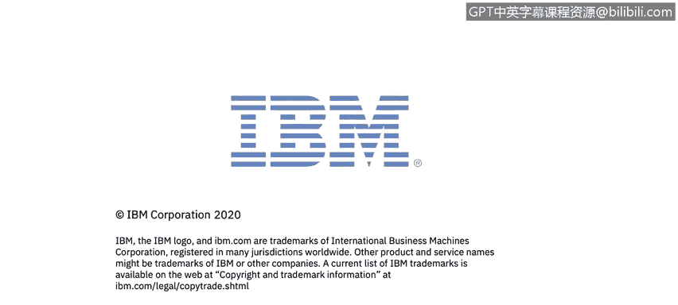

# 课程5：《渗透测试、事件响应与取证》：52：17_01_模块概述

在本节课中，我们将学习数字取证的基础知识。我们将了解什么是数字取证、取证的基本流程、证据保管链，并学习如何分析从数据文件、操作系统、应用程序和网络流量中收集到的数据。

---

上一节我们介绍了本模块的学习目标，本节中我们将深入探讨数字取证的具体内容。

数字取证是网络安全事件响应中的关键环节。它涉及对数字证据的系统性收集、保存和分析，以确定事件的根本原因、影响范围并支持法律行动。

以下是数字取证的核心组成部分：

1.  **取证流程**：这是一个结构化的方法，通常包括识别、收集、分析、记录和报告证据等阶段。
2.  **证据保管链**：这是一个记录证据从发现到呈堂全过程处理情况的正式文档。其核心公式可表示为：**证据完整性 = 记录 + 控制 + 验证**。任何环节的缺失都可能导致证据在法庭上不被采纳。
3.  **数据源分析**：取证人员需要从多种来源提取和分析数据，主要包括：
    *   **数据文件**：分析文件内容、元数据（如创建、修改时间）和已删除文件。
    *   **操作系统**：检查系统日志、注册表（Windows）或配置文件（Linux）、内存转储和用户活动痕迹。
    *   **应用程序**：审查应用程序日志、缓存数据和数据库记录。
    *   **网络流量**：分析网络数据包捕获文件（如PCAP文件），以重现网络活动。例如，使用 `tcpdump` 或 Wireshark 工具进行抓包和分析。

---

本节课中我们一起学习了数字取证的基本概念。我们明确了取证的目的是为了系统地调查数字事件，理解了标准化的**取证流程**和至关重要的**证据保管链**原则，并认识了需要分析的四大关键数据源：**数据文件**、**操作系统**、**应用程序**和**网络流量**。掌握这些基础知识是进行有效数字取证调查的第一步。