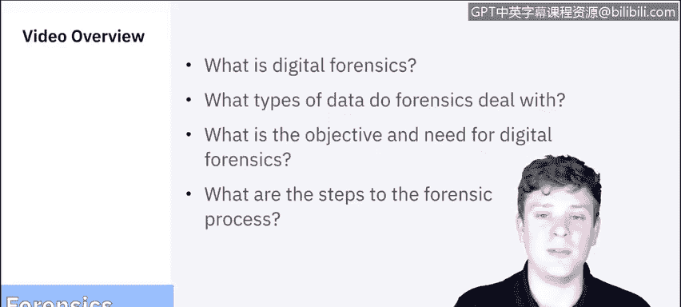
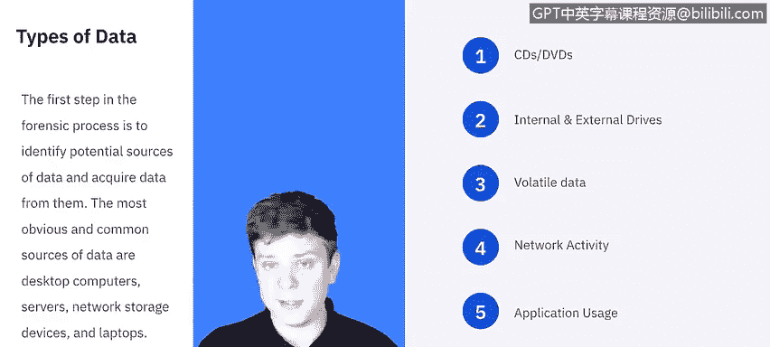
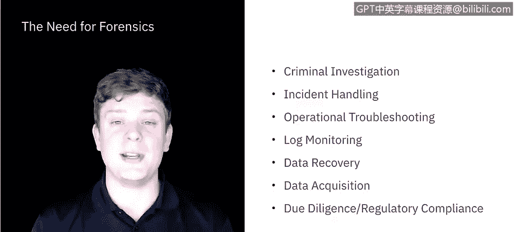
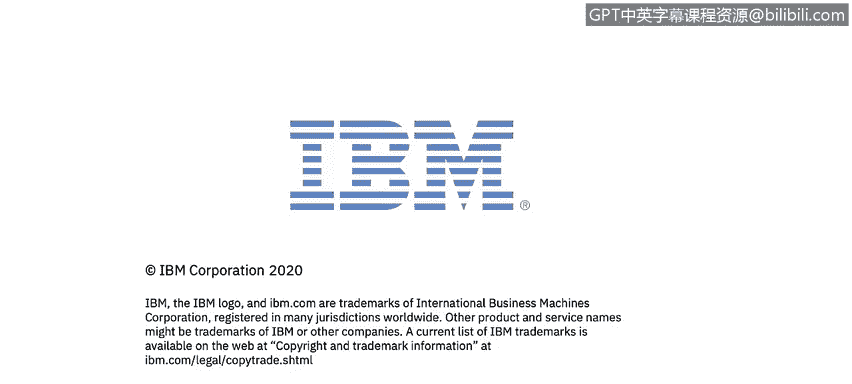

**课程5：《渗透测试、事件响应与取证》：53：什么是数字取证？🔍**

在本节课中，我们将学习数字取证的基础知识。我们将探讨数字取证的定义、处理的数据类型、其在网络安全行业中的目标和必要性，并概述取证过程的基本步骤。

---

数字取证，也称为计算机和网络取证，其定义众多。但一般而言，它被认为是**将科学应用于数据的识别、收集、检验和分析，同时保持信息的完整性，并为数据维护严格的监管链**。

在整个系列课程中，我们将频繁讨论“数据”。因此，首先明确“数据”的含义非常重要。

取证过程的第一步是识别潜在的数据源并从中获取数据。最常见的数据源包括台式电脑、服务器、网络存储设备和笔记本电脑。在这些设备中，你可能会找到CD或DVD、内部和外部驱动器（如固态硬盘、机械硬盘）、U盘、外置硬盘等。此外，还有**易失性数据**，即仅存在于特定时间点的数据。例如，断开网络连接、重启电脑、关闭应用程序或进程都会改变计算机的状态，因此这类数据具有很强的时间敏感性，必须立即捕获。

网络活动数据可以从互联网服务提供商处获取，也可以查看日志。应用程序使用数据也很有价值，它们通常存储着会话记录或项目文件。此外，便携式数字设备，如手机、录音笔、安全摄像头、数码相机等物理环境中的物品，都可能包含数据。我们必须意识到，数据可能不全是数字形式，也不全在电脑上，需要关注周围环境。这就是“数据”的广阔世界。

---

根据美国国家标准与技术研究院的说法，取证最常见的应用场景是刑事调查和事件响应。然而，取证实践和技术实际上可以应用于许多领域，包括操作故障排除、日志监控、数据恢复、数据获取、尽职调查以及法规遵从等。无论何种情况，取证都有广泛的应用。

---

上一节我们了解了取证的应用场景，本节我们来看看取证的具体目标。IBM常驻系统信息和事件管理器Raoul阐述了数字取证的目标：首先，需要一种有文档记录的方法从数字设备中获取所需信息，否则证据可能被破坏。因此，主要目标之一是**记录取证过程和证据本身**。其次，要推断事件动机（无论是犯罪还是事故）。取证程序的设计旨在帮助所有相关人员保护证据和程序本身。任何步骤的疏忽都可能导致调查人员被指控破坏证据。

此外，目标还包括确保数据获取和复制过程的安全，防止数据在复制过程中被更改；快速识别必要证据，因为过程具有时间敏感性；以清晰及时的方式撰写报告，确保非技术人员也能理解；以及**保存证据并记录监管链**。

---

NIST将取证过程分为四个步骤：**收集、检验、分析和报告**。我们将在后续视频中详细分解这些步骤，但在此先做概述：
*   **收集**：识别、标记、记录并从所有可能来源获取数据，同时保持数据完整性。
*   **检验**：处理大量收集到的数据，评估并提取特别感兴趣的数据。
*   **分析**：使用法律上可证明的方法和技术，分析检验结果。
*   **报告**：汇报分析结果。

---

本节课中，我们一起学习了数字取证的基本概念。我们明确了取证的定义，认识了其处理的各种数据类型，了解了取证在网络安全中的多种应用场景和核心目标，并初步了解了取证的四个关键步骤：收集、检验、分析和报告。

在下一个视频中，我们将深入探讨**收集和检验**这两个步骤。我们下节课见。