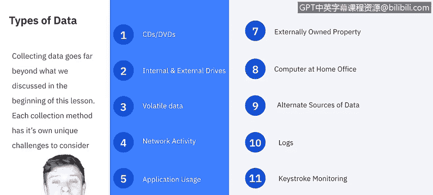
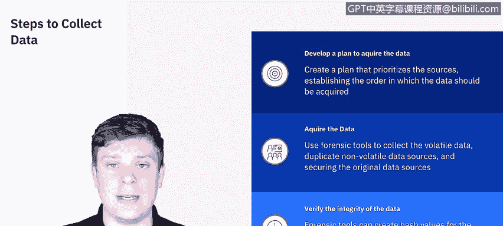

# 课程5：《渗透测试、事件响应与取证》：5：数据收集与检查 🔍

在本节课中，我们将学习数字取证过程中的数据收集与检查阶段。我们将探讨不同类型的数据、数据获取的三个步骤、保管链的作用，以及在数据检查过程中可能遇到的障碍。

## 数据收集的类型与挑战

在取证入门课程中，我们介绍了多种数据类型，例如CD/DVD、内外置驱动器、易失性数据、网络活动、应用程序使用记录以及物理空间中的便携式数字设备。

然而，数据收集的范围远不止于此。每种收集方法都有其独特的挑战需要考虑。例如，考虑外部拥有的财产：如果事件涉及员工个人拥有的电脑或手机，我们可能无法直接访问这些设备。

对于无法直接访问的设备，例如家庭办公室的电脑，我们需要思考替代的数据来源。是否存在备份？设备是否连接到某个服务器？我们必须跳出常规思维，因为无法直接接触物理设备。

日志数据也至关重要。为了数据保存和审计，建立一个集中的日志系统非常重要。如果得到组织和法律部门的同意，甚至可以使用键盘记录器等工具来监控计算机上的击键，尽管这在组织中并不常见。

## 数据获取的三个步骤

美国国家标准与技术研究院将数据收集过程分为三个主要类别。

以下是数据获取的三个核心步骤：

1.  **制定数据获取计划**：优先考虑收集哪些数据时，需要评估数据的潜在价值，以及它是否是易失性数据。易失性数据是仅在当前时刻可用的数据，一旦计算机状态改变（如关机、断网、需要认证等），数据就可能丢失。因此，这类数据应优先获取。同时，还需评估获取这些数据所需的工作量。

2.  **执行数据获取**：在此步骤中，我们将使用取证工具收集易失性数据，并复制非易失性数据源，以避免损害原始数据。之后，需要确保原始数据源的安全，防止在调查过程中被篡改。

3.  **验证数据完整性**：我们使用的取证工具可以为原始数据源生成哈希值。当我们创建镜像或备份时，也会生成对应的哈希值。通过比较原始数据与复制数据的哈希值，可以验证数据的完整性。如果原始数据发生任何改变，哈希值就会不同，从而证明两者不再一致。

## 保管链的重要性

进行数据收集时，最需要注意的事项之一是遵守保管链。遵循明确的保管链可以避免证据处理不当或被篡改的指控。

保管链涉及记录每一位经手证据的人员，记录他们对证据执行的操作，确保证据在未使用时存放在安全位置，制作副本以避免在原始证据上操作，并验证原始证据与复制证据的完整性。本质上，保管链是一个审计追踪，记录了证据接触的“人、事、时、地、因”，以便在法庭上证明证据处理过程没有漏洞。

保管链至关重要，我们将在后续视频中专门深入讨论。目前，只需记住在进行数据收集时，必须时刻将其放在首位。

## 数据检查的障碍

取证过程的下一步是检查。检查即对我们收集到的数据进行审查。

然而，在此过程中我们会面临许多障碍，且每个场景的障碍不尽相同。总的来说，以下是常见的需要克服的难关：

*   **绕过控制**：操作系统和应用程序可能采用数据压缩、加密或高级访问控制列表等技术，这使得检查收集到的数据变得非常困难。
*   **处理数据量**：硬盘可能包含数十万个文件，并非所有文件都与当前案件相关。因此，筛选出与案件最相关的数据非常耗时。

幸运的是，我们可以利用各种工具和技术来帮助过滤和排除搜索中的数据，从而加快检查过程。

## 总结

本节课中，我们一起学习了数字取证中数据收集与检查的核心环节。我们了解了数据的多样性及其收集挑战，掌握了数据获取的三个步骤：计划、获取与验证。我们认识到保管链对于维护证据法律效力的关键作用。最后，我们探讨了在数据检查阶段可能遇到的障碍，如绕过系统控制和处理海量数据。

完成数据收集与检查后，取证过程的后续两个步骤将是分析与报告，我们将在下一个视频中继续学习。