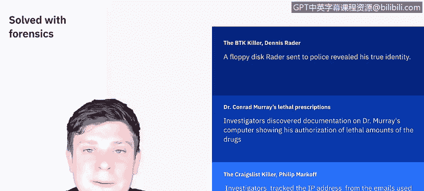

# 课程5：《渗透测试、事件响应与取证》：5：取证过程分析与报告撰写 📊

在本节课中，我们将学习取证过程中的分析与报告撰写环节。我们将回顾进行分析时需要考虑的因素，并了解构成一份取证报告的核心组成部分。

---

上一节我们介绍了取证的整体流程，本节中我们来看看具体的分析工作应该如何开展。分析工作应包括识别人员、地点、物品和事件，并确定这些元素之间的关联，从而得出最终结论。分析的本质是将所有线索拼凑起来，形成一个完整的事件图景。

协调来自多个数据源的信息对于完整还原事件经过至关重要。

以下是美国国家标准与技术研究院提供的一个例子，说明了如何关联不同数据源：
*   **入侵检测系统日志**：将事件关联到特定主机。
*   **主机审计日志**：将事件关联到特定用户账户。
*   **主机入侵检测系统日志**：显示该用户执行了哪些操作。

通过整合这些来源的数据，我们才能完成全面的分析。拥有尽可能完整的图景，是解决安全事件乃至重大犯罪的关键。

接下来，我们通过几个著名案例来了解数字取证的实际威力。

以下是几个通过数字取证解决的著名案件：
1.  **BTK杀手（丹尼斯·雷德）**：雷德在犯罪期间喜欢嘲弄警方，这最终导致了他的落网。他寄给警方的一张软盘被取证分析，暴露了他的真实身份，随后他被逮捕并认罪。
2.  **康拉德·默里医生（迈克尔·杰克逊的私人医生）**：在杰克逊于2009年意外去世后，调查人员在其电脑上发现了其授权使用致命剂量药物的记录，这成为定罪的关键证据。
3.  **“克雷格列表杀手”（菲利普·马可夫）**：警方通过追踪嫌疑人在克雷格列表上联系受害者时使用的电子邮件IP地址，锁定了一名23岁的医学生，从而迅速破案。

这些只是众多通过数字取证破获的案件中的几个例子。

---

上一节我们了解了分析的重要性，本节中我们将重点学习如何将分析结果整理成专业的报告。你的取证报告或案件总结旨在为你得出的观点提供依据。虽然关于专家报告的法律规定多样，但普遍遵循以下基本原则：
*   如果报告不是你写的，你就不能依据它作证。
*   你的报告需要详细说明所有结论的依据。
*   你需要详细记录进行的每一项测试、使用的方法和工具以及测试结果。

让我们来分解一下取证报告的不同组成部分，然后讨论SANS研究所提供的一些最佳实践。

一份取证报告通常包含四个主要部分：
1.  **概述**：说明调查人员最初如何介入此案，以及事件、请求或证据最初是如何提供给他们的。
2.  **取证获取与检查准备**：详细记录你与数字证据的交互过程，以及为保存取证获取的证据所采取的步骤。
3.  **发现与报告（即你的取证分析）**：详细记录你的分析过程、方法、工具和结果。
4.  **结论**：对所有发现和分析进行总结。

请注意，这份文件可能在法庭上使用，因此必须尽可能简洁和完整。

**取证获取与检查准备**部分非常重要，你必须详细说明与数字证据的交互过程，以及为保存取证获取的证据所采取的步骤。你所采取的任何额外步骤，例如对存储介质进行取证擦除，都应在此部分注明。这部分通常是你作为检查员或分析师首次接触数字证据并详细记录所做工作的地方，这对于维护数字证据的完整性和保管链至关重要。

一份专家报告必须首先详细说明使用了何种分析、专家如何进行检查和分析、使用了哪些工具、结果如何、被测试机器的详细信息、用于进行测试的机器以及测试进行的环境。报告中专家提出的任何主张都应得到内在、可靠来源的支持。例如，如果一份专家报告需要详细说明域名服务的工作原理以描述DNS投毒攻击，那么就应该引用关于域名服务细节的公认权威著作。

对于**发现与报告**部分，SANS研究所概述了一套最佳实践。

以下是SANS研究所建议的取证报告最佳实践：
*   **截取大量屏幕截图**。
*   **通过你选择的取证应用程序为证据添加书签**。
*   **利用取证工具内置的日志记录和报告选项**。
*   **将数据项高亮并导出为CSV或文本文件**，以便通用访问。
*   **必要时使用数字录音设备而非手写笔记**，以避免混淆。

---

最后，我们来总结报告的**结论**部分。结论部分应是你所有发现和分析的总结。它应该简洁，同时在技术上准确反映你在整个报告中提出的所有要点。虽然总结是好的，但结论不应过长，以至于掩盖了你实际进行的、承载着你大部分发现重量的分析工作。

在本节课中，我们一起学习了取证分析的核心方法、报告撰写的关键组成部分以及相关的行业最佳实践。我们了解到，全面的分析依赖于多源数据的关联，而一份严谨的报告则是调查结论的基石，并可能在法律程序中发挥关键作用。下一节视频中，我们将探讨如何利用从数据文件中获取的信息。我们下节课见。