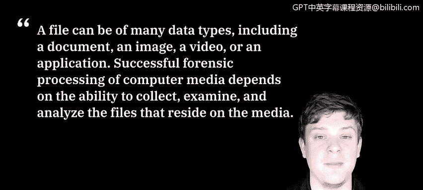
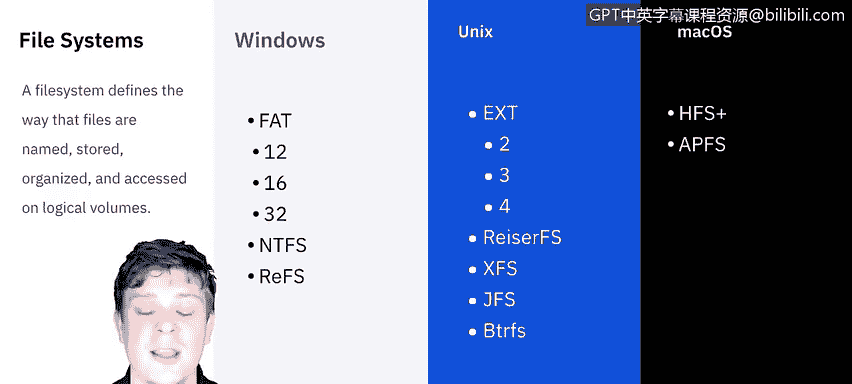
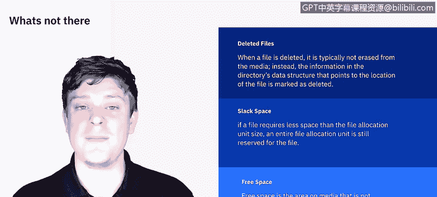

# 课程5：《渗透测试、事件响应与取证》：56：使用数据文件

欢迎学习由IBM带来的“使用数据文件”课程。在本节课中，我们将学习不同的文件系统。我们将了解用于收集和保护文件完整性的方法。我们将学习文件中的哪些元数据可能有用。最后，我们将了解取证工具可以执行哪些技术来进行数据分析。

让我们开始吧。根据美国国家标准与技术研究院的定义，文件可以是许多不同的数据类型，包括文档、图像、视频或应用程序。成功地对计算机介质进行取证处理，取决于收集、检查和分析驻留在介质上的文件的能力。为了本视频的目的，我们不会深入探讨每一个细节。然而，视频结束后，我强烈建议您寻找一个好的资源，尽可能多地了解不同的文件系统、它们的能力和局限性。

对于桌面系统，Windows、Unix和Mac OS，这些是存在的主要文件系统。还有更多，尤其是在Linux/Unix领域。虽然从文件中获取数据（如文档、电子表格、音频文件、视频文件）可能看起来很容易。

更难以捉摸的是那些不再存在的文件，无论是已删除的文件、松弛空间还是空闲空间。对于已删除的文件，当文件被删除时，它通常不会从介质（例如硬盘驱动器）上被擦除。相反，指向文件位置的目录数据结构中的信息被标记为已删除，因此它看起来不再存在。然而，文件仍然在硬盘上，只是看起来消失了。当您开始保存其他文件并占用驱动器上的空间时，它会覆盖任何具有已删除目录标记的内容。因此，在硬盘完全写满之前，肯定有办法恢复已删除的文件。

现在来看松弛空间。这与最小文件大小分配有关。根据文件类型，操作系统会有一个最小文件大小，规定至少为这种文件分配这么多空间，即使文件本身小于该分配空间。这个分配空间与实际文件大小之间的间隙被称为松弛空间，确实可以从中恢复数据。

最后一个是空闲空间。空闲空间是介质上未分配给任何分区的区域。然而，该空闲空间可能仍然包含已删除文件的数据片段。因此，我们删除了文件，看起来有了空闲空间，但实际上我们知道，在该空闲空间被占用之前，数据仍然可以恢复。

我们可以从文件中获取的另一类信息是MAC数据。不，我不是在谈论苹果的Macintosh。我指的是修改时间、访问时间和创建时间。这是文件被交互时捕获的所有元数据。因此，尽可能多地了解相关文件的信息非常重要。记录修改、访问和创建时间有助于分析人员建立事件的时间线。

修改时间是文件最后一次被更改的时间，不仅仅是打开，而是如果有任何内容被更改或修改然后保存，那就是一次修改。访问时间是文件最后一次被实际打开的时间。创建时间是文件实际被建立或创建的时间。因此，通过修改、访问和创建时间，分析人员可以描绘出该文件历史中发生事件的相当清晰的时间线。

现在我们问自己，如何获取这些数据？如何收集它？目前，收集文件主要有两种方式：逻辑备份和逐位镜像。

对于备份，它复制逻辑卷的目录和文件。它不捕获介质上可能存在的其他数据，例如已删除的文件或存储在松弛空间中的残留数据。可以把它想象成您只是插入一个外部硬盘驱动器并复制备份，或者如果您使用自动备份系统，该系统会定期（在发生更改时或在预定时间间隔）重新备份文件系统中的所有文件，这就是逻辑备份。

逻辑备份的一个好处是，如果使用标准备份软件，它可以在活动系统上使用。通常，该软件在发生更改时或在标准时间间隔进行备份，因此很容易在活动系统上完成，并且可以确信您正在获取这些更改。然而，它可能在时间和计算机资源方面都很耗费资源。

现在来看镜像。这会生成原始介质的逐位副本，包括空闲空间和松弛空间。位流镜像需要比逻辑备份更多的存储空间，并且执行时间可能更长。如果需要用于法律或人力资源方面的证据，则应获取完整的位流镜像，并且所有分析都应在副本上进行。大多数情况下，我们将进行镜像，这意味着它实际上只是某个时刻计算机状态的快照，您冻结了时间，创建了一个克隆，然后可以与那个克隆进行交互。

您可以通过磁盘到磁盘的方式进行，例如，我可以将Mac置于目标磁盘模式，这实质上将整个计算机变成了一个外部硬盘驱动器，然后将其上的所有内容克隆到另一台计算机上，以便进行交互。或者，我可以通过磁盘到文件的方式，将克隆创建为一个文件，然后可以将其放在外部介质上并根据需要传输。

镜像不应在活动系统上进行，因为数据总是在变化。如果在活动系统上进行，您将不再拥有准确的时间戳，因为易失性数据会随着时间的推移而不断变化。因此，逻辑备份在这种情况下更有意义。

既然我们已经讨论了可以从文件中获取的不同类型的数据以及如何收集它们，我想花一些时间谈谈我们使用取证工具辅助的技术。

许多取证产品允许分析人员执行广泛的过程来分析文件和应用程序，以及收集文件、读取磁盘镜像和从文件本身提取数据。

工具帮助实现的第一个技术是使用文件查看器。这样，您可以使用单一工具来审查每种类型的文件，而不是使用原始的应用程序源，这加快了搜索速度，并消除了为每种文件类型配备可用的原生应用程序的需要。

下一个是解压缩文件。您知道，压缩文件（如zip文件）非常常见。但在取证过程的早期，分析人员应该解压缩文件，以便将它们包含在搜索中。唯一需要注意的是有时所谓的“压缩炸弹”，这是由黑客或恶意人员设置的。它本质上有时是数十、数百、数千个文件相互压缩在一起。但保持您的防病毒或事件检测软件最新应该有助于缓解这个问题。

另一个是使用图形用户界面来显示目录结构。这种做法使分析人员更容易、更快地收集有关介质内容的一般信息，例如安装的软件类型以及创建数据的用户可能具备的技术能力。大多数产品可以显示Windows、Linux和Unix目录，有些则专门针对Mac OS。

另一个关键技术是识别已知文件。这看起来可能有点明显，但消除不重要的文件（如已知良好的操作系统和应用程序文件）是非常有益的。分析人员应验证哈希值，例如由NIST软件参考库项目创建的哈希值，或自己创建的哈希值。这再次有助于简化流程，并帮助您专注于所需的文件。

许多取证工具做的一件大事是执行字符串搜索和模式搜索。字符串搜索有助于处理大量数据以查找关键字或字符串。可以使用各种搜索工具，这些工具可以使用布尔逻辑、模糊逻辑、同义词和概念、词干提取和其他搜索方法。

最后一个是访问文件元数据，它可以为我们提供关于文件的许多上下文信息，以及关于作者的潜在信息。

因此，在本视频中，我们不会详细介绍所有单独的工具。但同样，视频结束后，将有一些课外活动，我鼓励您去查阅和复习许多现有的取证分析工具。

在本节课中，我们一起学习了文件系统的基础知识、从文件中提取不同类型数据（包括已删除文件、松弛空间和空闲空间）的方法，以及文件元数据（MAC时间）的重要性。我们还探讨了收集数据的两种主要方法：逻辑备份和逐位镜像，并了解了取证工具如何通过文件查看、解压缩、目录结构显示、已知文件识别、字符串搜索和元数据访问等技术来辅助分析过程。掌握这些概念是进行有效数字取证分析的基础。