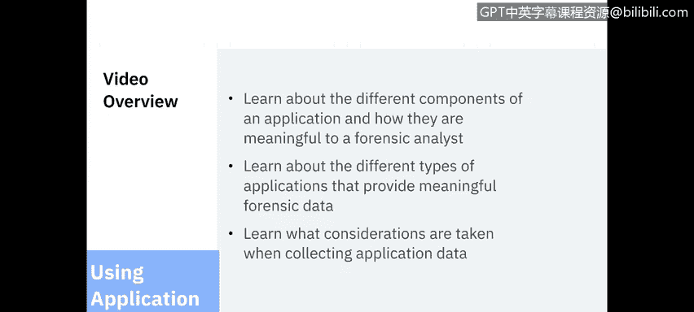
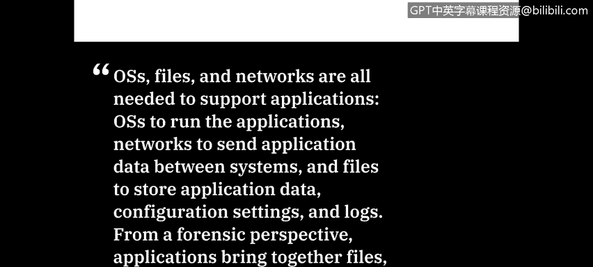
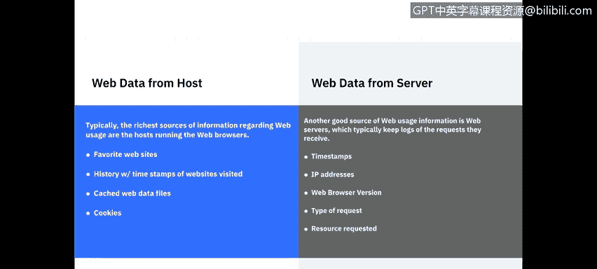

# 课程5：《渗透测试、事件响应与取证》：58：应用数据分析

欢迎学习由IBM带来的应用数据分析课程。在本节课中，我们将学习应用程序的不同组成部分，以及它们对取证分析师的意义。我们还将了解能提供有价值取证数据的应用程序类型，以及在收集应用数据时需要考虑的事项。

## 概述 📋

在本节中，我们将首先了解美国国家标准与技术研究院对应用数据的定义，然后深入探讨对取证分析至关重要的应用组件，接着分析几种关键的应用类型，最后回顾收集应用数据时的注意事项。

## 应用数据定义

美国国家标准与技术研究院将应用数据总结如下：操作系统、文件和网络都是支持应用程序所必需的。操作系统用于运行应用程序，网络用于在系统间传输应用数据，而文件则用于存储应用数据、配置设置和日志。从取证角度看，应用程序将文件、操作系统和网络整合在一起。

## 应用组件分析 🔍

上一节我们了解了应用数据的宏观定义，本节中我们来看看构成应用程序、对取证分析至关重要的具体组件。

以下是应用的核心组件：

*   **配置设置**：配置设置可能是临时的，在特定应用会话期间动态设置，也可能是永久的。许多应用程序既有适用于所有用户的设置，也支持一些用户特定的设置。这些设置可能通过以下三种方式存储：
    *   **配置文件**：通常是文本文件或具有专有二进制格式的文件。它可能与应用程序存储在同一主机上，也可能不。
    *   **运行时选项**：应用程序允许通过命令行在运行时指定某些配置设置。
    *   **源代码**：对于开源应用程序或脚本等提供源代码的应用，用户或管理员指定的配置设置可能直接写入源代码中。

*   **身份验证**：应用程序的身份验证方式多样，对取证至关重要。
    *   **外部身份验证**：身份验证在目录服务器等外部系统上进行，这种情况下外部系统可能比主机拥有更多信息。
    *   **专有身份验证**：最常见的是应用程序特定的用户名和密码，而非操作系统级。
    *   **传递身份验证**：应用程序直接使用操作系统的身份验证信息。
    *   **主机用户环境**：常见于企业环境，应用程序根据已批准用户域来检查身份验证。

*   **日志**：大多数应用程序会生成某种类型的日志，并记录到操作系统特定日志或专有日志中。最常见的日志类型包括：
    *   **事件日志**：记录执行的操作、每个操作发生的日期和时间以及每个操作的结果。
    *   **审计（安全）日志**：专门跟踪被审计的活动，例如身份验证尝试。
    *   **错误日志**：跟踪应用程序发生的错误及其时间戳。
    *   **安装日志**：跟踪应用程序安装或更新的时间。
    *   **调试日志**：通常仅对软件开发人员有意义。

*   **数据**：数据是一个广义术语，但几乎每个应用程序都专门设计以一种或多种方式处理数据，例如创建、显示、传输、接收或修改数据，以及保护和存储数据。应用数据文件可能是通用或专有文件格式，并可能存储在多个不同位置，例如数据库、内存或应用程序中的临时文件，或永久文件中。需要注意的是，临时文件可能因应用程序不当关闭而创建，这些文件可能位于应用程序内部或操作系统特定位置。

*   **支持文件**：在所有组件中，支持文件可能提供的关键信息最少，但当其他方法都失败时，它可以提供一些信息碎片，有助于更好地理解数据。许多应用程序附带安装的支持文档或用户手册，可以帮助分析师确定任何给定应用程序的用途以及应用程序可能存储支持文件的位置。
    *   **链接（快捷方式）**：正如许多Windows用户所知，链接是指向其他内容的指针。分析师可以确定链接运行的程序及其位置。
    *   **图形**：通常关注度较低，但如果恢复了图标图像，分析师有时可以确定正在运行的是哪些可执行文件。

## 应用架构与取证意义 🏗️

了解了应用的基本组件后，我们来看看应用架构。应用架构告诉我们应用程序如何在逻辑上分离组件，这反过来让分析师能更好地了解应用数据将存储在哪里。

应用程序构建为以下几种模式运行：本地、点对点、客户端-服务器或三者的组合。

*   **本地应用**：旨在将所有内容保留在主机本地。例如文本或图形编辑器以及办公生产力套件。
*   **客户端-服务器应用**：结构最为复杂，因为数据可能在本地主机、应用服务器和数据库服务器之间的2到4个位置存储。基于Web的应用程序用Web浏览器替代本地主机，并增加一个Web服务器。
*   **点对点应用**：设置为直接在主机之间共享信息，例如文件共享、即时消息或聊天应用程序。

## 关键应用类型分析 📧

某些类型的应用程序更可能成为取证分析的重点，包括电子邮件、网络使用、即时消息、文件共享、文档使用、安全应用程序和数据隐藏工具。让我们深入探讨其中几个以提供示例。

首先从电子邮件开始。电子邮件已成为人们进行电子通信的最主要方式之一。单封电子邮件包含大量表面可见和不可见的数据。在电子邮件消息的表面，我们有**邮件头**（通常详细说明收件人）和包含内容的**邮件正文**。

隐藏在邮件头中的信息包括发件人使用的电子邮件客户端类型、发送消息的邮件服务器、消息的重要性，以及是否存在特定内容类型（如附件或嵌入式图形）。从端到端来看，关于单封电子邮件的信息可能记录在多个位置：发件人系统、处理消息的每个电子邮件服务器、收件人系统，以及防病毒、垃圾邮件和内容过滤服务。

接下来是网络使用，它可以分为我们从主机和Web服务器收集的数据。我们可以从主机获取的Web数据通常位于Web浏览器应用程序中。分析师可以获取收藏的网站、带有时间戳的访问历史、缓存Web数据文件以及任何保存的Cookie。另一方面，我们有Web服务器，它通常会记录收到的请求日志。

这些日志将为我们提供每个请求的时间戳、IP地址、发出请求的Web浏览器、请求类型以及请求的资源。即使无法从主机访问数据，Web数据也能提供大量有意义的信息。

我想介绍的最后一种应用类型是交互式通信。这包括群聊、即时消息和音视频应用程序。群聊通常使用客户端-服务器架构。基于简单文本通信最流行的标准群聊协议是互联网中继聊天（IRC）。即时消息和应用程序配置设置可能包含用户信息、用户与之通信的用户列表、文件传输信息以及存档消息或聊天会话。最后，随着音视频技术（如IP语音）的不断融合，人们被允许通过互联网等网络进行电话通话，从而提供了更多基于媒体的数据。

## 应用数据收集 🛠️

在概述了应用数据之后，本视频的最后一部分将讨论这些数据的收集。这应该是对我们之前课程内容的复习，因此将是一个高层次的概述。

应用相关数据可能位于文件系统、易失性操作系统数据和网络流量中。

*   **易失性操作系统数据**：可能包含有关应用程序使用的网络连接、系统上运行的应用程序进程、每个进程使用的命令行参数、应用程序持有的打开文件以及其他类型的支持信息。鉴于易失性数据的性质，应首先考虑收集这些数据。
*   **网络流量数据**：最有价值的是用户到远程应用程序的连接，以及不同系统上应用程序组件之间的通信。其他网络流量记录也可能提供支持信息，例如应用程序远程打印的网络连接，以及应用程序客户端或其他组件为将应用程序组件的域名解析为IP地址而进行的DNS查询。

## 总结 ✨

本节课中我们一起学习了应用数据的核心概念。我们首先明确了应用数据的定义，然后拆解了对取证分析至关重要的应用组件，如配置、身份验证、日志和数据存储。接着，我们探讨了不同的应用架构及其对数据位置的影响，并深入分析了电子邮件、网络使用和即时通信等关键应用类型能提供的丰富取证信息。最后，我们回顾了从易失性内存、文件系统和网络流量中收集应用数据的方法和注意事项。理解这些内容，对于有效进行网络安全取证分析至关重要。