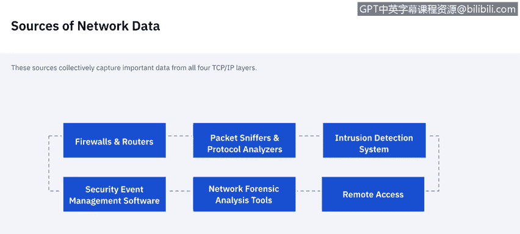
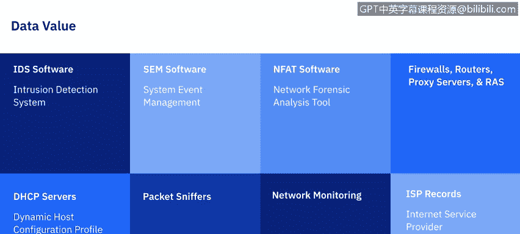
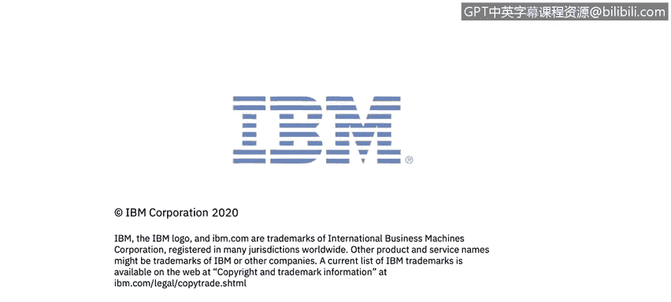

# 课程5：《渗透测试、事件响应与取证》：59：使用网络数据

## 概述
在本节课中，我们将学习网络数据的基础知识。我们将回顾TCP/IP协议栈及其与取证的关系，了解网络流量的不同来源，并学习如何检查和分析这些数据。

## TCP/IP协议栈与取证
在开始探讨如何收集网络数据之前，理解TCP/IP协议栈及其在取证中的意义至关重要。TCP/IP协议栈分为四层，每一层都包含对取证分析有价值的信息。

**应用层**：该层使应用程序能够在应用服务器和客户端之间传输数据。最常见的例子包括HTTP、DNS、FTP、SMTP。这些协议是应用服务进行通信的方式。

**传输层**：当我们谈论传输层时，通常会想到数据包。该层负责封装可在主机之间传输的数据。传输层最常用的两种协议是**TCP（传输控制协议）**和**UDP（用户数据报协议）**。在这两种情况下，数据包都包含源端口号和目的端口号，这对取证分析师非常有用。

**网络层（IP层）**：该层负责在网络间路由数据包。它是TCP/IP协议栈的基础网络层协议。网络层其他常用的协议包括**ICMP（互联网控制报文协议）**和**IGMP（互联网组管理协议）**。ICMP是一种无连接协议，不保证其错误或状态消息的传递。由于它并非设计用于传输应用数据，因此没有端口号，而是使用**消息类型**来指示每个ICMP消息的目的。

IP地址通常通过一层间接寻址来使用，最常见的是通过**DNS（域名服务）**。当人们需要访问网络上的资源（如网站）时，他们输入的是域名（如 `www.nist.gov`），而不是服务的IP地址。这样做既便于记忆，也解决了IP地址可能变更而服务器名称不变的问题。

**数据链路层（硬件层）**：该层处理物理网络组件上的通信。最著名的数据链路层协议是以太网。

美国国家标准与技术研究院的一篇文章很好地总结了这一点：TCP/IP协议栈的每一层都包含重要信息。硬件层提供有关物理组件的信息，而其他层则描述逻辑方面。例如，分析师可以将网络层中的IP地址映射到数据链路层中特定网卡的MAC地址（物理标识符），从而识别出感兴趣的主机。结合IP协议号（网络层字段）和端口号（传输层字段），可以告诉分析师最可能正在使用或成为目标的是哪个应用程序。

## 网络数据的主要来源
上一节我们介绍了网络数据的层次结构，本节中我们来看看网络数据的主要来源。

以下是网络数据的主要来源：

*   **防火墙和路由器**：基于网络的设备（如防火墙和路由器）以及基于主机的设备（如个人防火墙）会根据一组规则检查网络流量并允许或拒绝其通过。防火墙和路由器通常配置为记录大多数或所有被拒绝的连接尝试和无连接数据包的基本信息，有些甚至会记录每一个数据包。执行网络地址转换（NAT）的防火墙和路由器可能包含有关网络流量的额外有价值信息。一些防火墙还充当代理，并可能执行入侵检测和VPN等其他功能。
*   **数据包嗅探器**：数据包嗅探器旨在监视有线或无线网络上的网络流量并捕获数据包。通常，网络接口控制器只接受专门发送给它的传入数据包。但当NIC被置于**混杂模式**时，它会接受它看到的所有传入数据包，无论其预期目标是谁。大多数数据包嗅探器也是协议分析器，这意味着它们可以从单个数据包重组数据流，并解码使用数百或数千种不同协议中任何一种的通信。
*   **入侵检测系统（IDS）**：网络IDS在数据包嗅探之前分析网络流量，以识别可疑活动并记录相关信息。
*   **远程访问服务器**：远程访问服务器是VPN网关和调制解调器服务器等设备，它们促进网络之间的连接。这通常涉及外部系统通过远程访问服务器连接到内部系统，但也可能包括内部系统连接到外部或其他内部系统。除了远程访问服务器，组织通常还使用多个专门设计用于提供对特定主机操作系统远程访问的应用程序。虽然大多数与远程访问相关的日志记录发生在远程访问服务器或应用程序服务器上，但在某些情况下，客户端也会记录该信息。
*   **安全事件管理软件（SEM）**：SEM能够从各种与网络流量相关的安全事件数据源（如IDS日志、防火墙日志）导入安全事件信息，并在所有不同来源之间进行关联。它通常通过安全通道接收来自所有不同数据源的日志副本，将其转换为标准格式，然后通过匹配IP地址、时间戳和其他特征来识别相关事件。
*   **网络取证分析工具（NFAT）**：NFAT通常将数据包嗅探器、协议分析器和SEM软件的功能集成到单一产品中。与专注于所有现有数据源的SEM软件不同，NFAT软件主要侧重于收集、检查和分析所有网络流量，并提供许多其他附加功能。

## 不同数据源的价值
现在我们已经知道了要寻找哪些数据来源，但并非所有数据都具有同等价值。因此，我们需要谈谈不同数据源的价值。

*   **IDS软件数据**：IDS数据很重要，因为它通常是检查可疑活动的起点。IDS不仅尝试在所有TCP/IP层识别恶意网络流量，而且还记录许多数据字段，有时还会捕获数据包，这些对于验证事件并将其与其他数据源关联起来非常有用。
*   **SEM软件数据**：理想情况下，SEM对取证极其有用，因为它能自动关联多个不同数据源的事件，提取相关信息并呈现给用户。
*   **NFAT软件数据**：NFAT软件是专门为辅助网络流量分析而设计的，因此如果它监控到了感兴趣的事件，总是很有价值。
*   **防火墙、路由器、代理服务器、远程访问服务器数据**：这些数据源本身通常提供的信息有限。分析长时间段的数据可以指示总体趋势（如被阻止连接尝试的增加），但由于这些来源通常对每个事件记录的信息很少，因此数据本身对事件性质的洞察力有限。
*   **DHCP服务器数据**：DHCP服务器通常可以配置为记录每个IP地址分配及其关联的MAC地址和时间戳。这对于分析师识别哪个主机使用特定IP地址执行了活动非常有帮助。
*   **数据包嗅探数据**：在所有网络数据流量来源中，数据包嗅探收集的网络活动信息最多。然而，其缺点是包含了大量无关数据（数百万或数十亿个数据包），并且通常无法指示哪个数据包可能真正包含恶意活动。
*   **网络监控软件数据**：网络监控软件有助于识别与正常流量流的显著偏差，例如由分布式拒绝服务攻击引起的偏差，在此期间成百上千个系统同时对特定主机或网络发起攻击。
*   **互联网服务提供商记录**：这些信息的主要价值在于将攻击追溯回其源头，特别是在攻击使用伪造IP地址时。

## 识别攻击者
关于从网络获取数据，最后要讨论的一点是可能识别攻击者身份。

在分析大多数攻击时，识别攻击者通常不是当务之急。确保攻击已停止并恢复系统数据始终是主要关注点。

但可以采取以下措施：
*   **联系IP地址所有者**：有时可以帮助确定谁对某个IP地址负责，但这通常需要某种升级流程。
*   **寻求互联网服务提供商的协助**：这需要法院命令，通常只在最严重的攻击事件中才会进行。
*   **查看IP地址历史记录**：寻找可疑活动的趋势。
*   **分析数据包内容**：数据包可能包含有关攻击者身份的信息。

再次强调，我们的主要目标始终是阻止黑客攻击并恢复系统数据。

## 总结
本节课中，我们一起学习了网络数据的基础知识。我们回顾了TCP/IP协议栈的四层结构及其在取证分析中的重要性，探讨了防火墙、IDS、数据包嗅探器等多种网络数据来源及其各自的价值。最后，我们了解了在事件响应中识别攻击者的一些方法和注意事项。掌握这些知识是进行有效网络取证分析的基础。