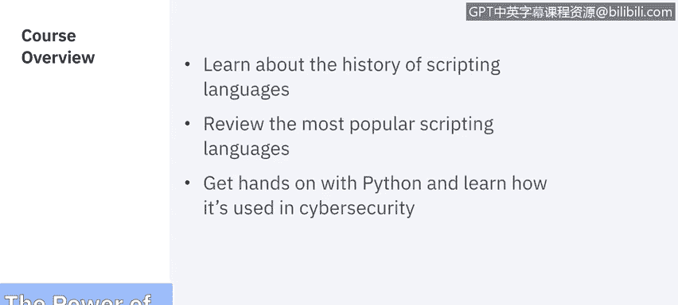

# 课程5：《渗透测试、事件响应与取证》：60：25_01：模块概述

在本模块中，我们将学习脚本编程的强大功能。我们将了解脚本编程的历史，回顾最流行的脚本语言，并动手实践Python，学习其在网络安全领域的应用。让我们开始吧。

## 脚本编程的历史与概述

上一节我们介绍了本模块的学习目标，本节中我们来看看脚本编程的起源与发展。

脚本编程的历史可以追溯到早期计算时代。最初，系统管理员需要手动执行重复性任务。为了提高效率，他们开始编写简单的命令序列，这些序列可以自动执行，这便是脚本的雏形。随着时间推移，专门的脚本语言被开发出来，它们语法更简单，专注于自动化特定任务，而非构建复杂的应用程序。

## 主流脚本语言简介

了解了脚本编程的起源后，我们接下来简要回顾几种在IT和网络安全领域广泛使用的主流脚本语言。

以下是几种常见的脚本语言及其特点：

*   **Bash/Shell**：主要用于Linux/Unix系统环境，擅长自动化文件操作和系统管理任务。
*   **PowerShell**：微软开发的强大脚本语言，深度集成于Windows系统，用于管理操作系统、应用程序和云服务。
*   **Python**：一种通用、高级的脚本语言，以其简洁的语法和丰富的库而闻名，在数据分析、网络编程和安全工具开发中应用极广。
*   **JavaScript**：最初为网页交互而设计，如今通过Node.js等环境也能用于服务器端脚本和自动化任务。

## Python在网络安全中的应用

在认识了多种脚本语言之后，本节我们将重点关注Python，并探讨它如何成为网络安全领域的利器。

Python因其易学性和强大的功能库，在网络安全中扮演着核心角色。安全专业人员利用Python来自动化繁琐任务、分析数据、开发安全工具和进行渗透测试。

以下是Python在网络安全中的几个关键应用场景：



*   **自动化扫描与枚举**：编写脚本自动扫描网络端口、识别服务或枚举Web目录。
    ```python
    # 示例：使用socket库进行简单的端口扫描
    import socket
    target_host = "example.com"
    target_ports = [80, 443, 22]
    for port in target_ports:
        sock = socket.socket(socket.AF_INET, socket.SOCK_STREAM)
        sock.settimeout(1)
        result = sock.connect_ex((target_host, port))
        if result == 0:
            print(f"Port {port} is open")
        sock.close()
    ```
*   **日志分析与事件关联**：处理和分析海量的系统日志、网络流量日志，以发现异常模式或安全事件。
*   **开发安全工具**：许多流行的安全工具，如SQLmap、Metasploit框架的某些模块，都使用Python开发或提供Python接口。
*   **取证与数据恢复**：编写脚本解析磁盘镜像、内存转储或网络数据包，提取取证信息。


## 总结

本节课中，我们一起学习了脚本编程的基本概念。我们回顾了脚本编程的发展历史，简要介绍了Bash、PowerShell、Python等主流脚本语言。最后，我们深入探讨了Python在网络安全中的实际应用，包括自动化任务、日志分析和工具开发等。掌握脚本编程，尤其是Python，将极大提升你在网络安全工作中解决问题的效率和能力。