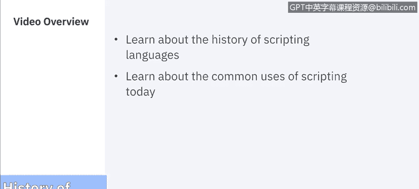

# 课程5：《渗透测试、事件响应与取证》：61：脚本语言的历史 📜

## 概述
在本节课程中，我们将追溯脚本语言的发展历程，并探讨其在当今计算机领域的常见用途。我们将从早期的大型机时代开始，一直讲到现代脚本语言如何实现自动化任务。

---

## 脚本的起源：批处理时代
上一节我们介绍了课程背景，本节中我们来看看脚本语言的起源。脚本自计算机诞生之初便已存在。事实上，在早期，脚本是使用计算机的唯一方式。

在20世纪50年代和60年代，程序员将穿孔卡片提交给大型机操作员，机器以批处理模式运行。IBM的作业控制语言（JCL）常被认为是首批脚本语言之一。

虽然这些脚本语言功能完备，但其响应速度远不及现代计算机，通常至少需要一天才能获得结果。

对于DOS和OS系统而言，工作的基本单位是作业本身。一个作业包含一个或多个步骤，每个步骤都是运行一个特定程序的请求。

例如，在关系数据库出现之前，一个为管理层生成打印报告的作业可能包含以下步骤：
1.  运行用户编写的程序，以选择适当的记录并将其复制到临时文件中。
2.  使用通用实用程序对临时文件进行排序，使其符合要求的顺序。
3.  运行用户编写的程序，以易于最终用户阅读的方式呈现信息，并包含小计等其他有用信息。
4.  运行用户编写的程序，为在监视器或终端上显示而格式化最终用户信息的选择页面。

最初，大型机系统主要面向批处理。许多批处理作业需要根据特定要求进行设置，例如主存储器、专用设备（如磁带）、私有磁盘卷以及使用特殊表格设置的打印机。

JCL的开发是为了确保在作业计划运行之前，所有必需的资源都可用。例如，许多系统（如Linux）允许在命令行上指定所需的数据集，因此可以由Shell进行替换或在程序运行时生成。

在这些系统上，操作系统的作业调度程序对作业的需求知之甚少。相比之下，JCL明确指定了所有必需的数据集和设备。调度程序可以在释放作业运行之前预分配/定位资源，这有助于避免某种形式的死锁。

---

## 交互式Shell与Unix的革新
上一节我们了解了批处理时代的脚本，本节中我们来看看交互式系统的出现如何改变了脚本的使用方式。第一个交互式Shell是在20世纪60年代开发的，用于实现对首批分时系统的远程操作。这些系统使用Shell脚本，即在称为Shell的计算机程序内控制运行计算机程序的脚本。

Calvin Mooers在他的TRAC语言中，通常被认为是发明了命令替换功能的人，即能够在脚本中嵌入命令，然后由脚本解释并将字符串插入到脚本中。

当这些交互式分时系统在20世纪60年代开始发展时，可编写脚本的Shell理念开始付诸实践。最早的例子之一是MULTICS项目。当几位贝尔实验室的程序员退出该项目后，他们决定实现自己的系统，并将其命名为Unix。

Unix Shell的一项创新是能够将一个程序的输出发送到另一个程序的输入，这使得用一行Shell代码完成复杂任务成为可能。随后，Unix世界中出现了其他脚本语言，例如用于处理文本的AWK和Sed。

---

## 现代脚本的用途：自动化
上一节我们回顾了脚本语言的技术演进，本节中我们将聚焦于脚本在现代的实际应用。为了讨论脚本当前的用途，我们将转向IBM Security的Raoul。

以下是脚本在现代计算中的主要用途：

**自动化任务**
我们使用脚本实现自动化。我们有一个任务，但不想每次都为每个任务编写命令。特别是因为编写一个程序可能需要10分钟到两周不等，具体取决于任务的复杂性。因此，我们需要编写一个程序，允许我们在每次需要执行特定任务时调用它，无论是针对某个数据库还是某组文件。所以，核心就是自动化。

**具体应用场景**
目前，我们主要在以下领域使用脚本：
1.  **商业应用**：例如，当我们在网页上看到图片轮播，你想查看某个商品的大图时，这背后就是脚本。
2.  **表单验证**：当我们被要求填写信用卡信息等表单时，如果尝试在卡号字段输入姓名，字段会提示“需要卡号”，这种验证就是由脚本完成的。
3.  **数据库备份**：我们不希望在需要执行备份时手动守在电脑旁。我们使用脚本在特定时间将备份执行到特定的硬盘上。
4.  **测试**：我们可能让人一遍又一遍地执行测试，但更高效的方式是使用脚本自动执行测试。

---

## 总结
本节课中，我们一起学习了脚本语言从大型机批处理时代到现代自动化工具的发展历史。我们了解到，脚本的核心价值在于**自动化**，它通过将重复性任务编写成可重复调用的程序，极大地提高了工作效率。从早期的JCL到现代的Shell、Python等脚本，它们始终是连接用户意图与计算机执行的关键桥梁。